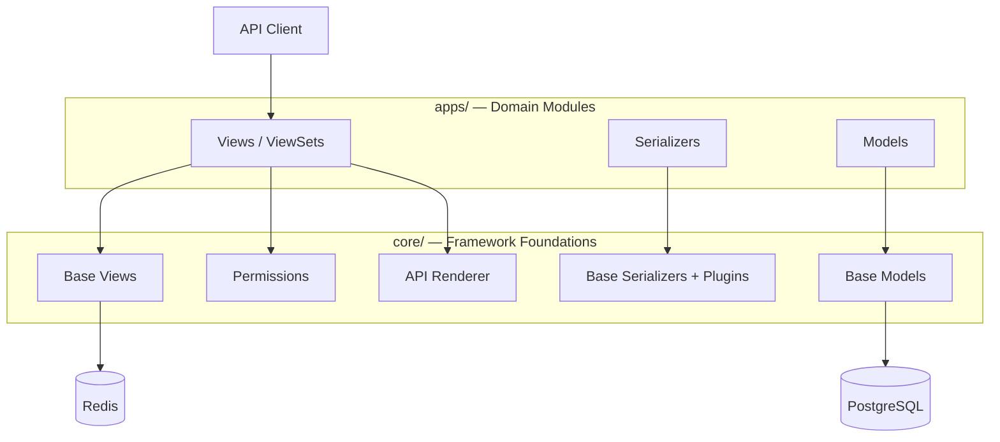

# DRF Enterprise Information Platform

[](https://github.com/camercadop/drf-enterprise-information-platform/actions/workflows/ci.yml)

Multi-tenant enterprise platform built with Django REST Framework. Provides tenant isolation, audit trails, JWT authentication, and role-based access control out of the box. Designed as a modular monolith with convention-over-configuration defaults, a plugin-based extensibility model, and security-first design — so domain teams can focus on business logic instead of reinventing infrastructure.

## Why This Exists

Enterprise applications share recurring infrastructure challenges: tenant isolation, consistent API contracts, audit trails, and authentication that scales across organizations. Building these from scratch for each project leads to inconsistent implementations, security gaps, and duplicated effort.

This platform solves these problems once — so domain teams can focus on business logic instead of reinventing infrastructure.

## Tech Stack

| Layer | Technology |
|-------|------------|
| Language | Python 3.14 |
| Framework | Django 6 + Django REST Framework |
| Database | PostgreSQL 16 |
| Cache | Redis 7 |
| Auth | JWT (simplejwt) with token blacklisting |
| Containers | Docker + Docker Compose |
| Quality | Ruff, mypy, pre-commit |
| Testing | Pytest, Factory Boy |
| CI | GitHub Actions |

## Key Features

### Data

- **Multi-tenancy** — shared database with tenant FK filtering, isolation at the permission layer
- **Soft-delete** — default deletion strategy with `deleted_at`/`deleted_by` fields
- **Audit trail** — automatic write-operation logging via `sys_audit` plugin
- **Tenant settings** — per-tenant configuration catalog with schema validation

### Architecture

- **Plugin system** — stateless plugins for cross-cutting concerns on serializers
- **Template methods** — `pre_*/do_*/post_*` hooks for per-class customization
- **Permission catalog** — declarative, JSON-based permission declarations synced via management command

### API & Auth

- **Standard API envelope** — consistent `{status, data}` response format
- **JWT authentication** — short-lived access tokens, rotating refresh tokens, tenant context in claims
- **IP filtering & lockout** — per-tenant IP allowlisting and brute-force lockout
- **Health check** — unauthenticated endpoint for infrastructure monitoring

## Project Structure

```
apps/           # Domain modules (iam_auth, iam_roles, iam_users, tenants)
core/           # Framework foundations (base classes, utils, shared infrastructure)
config/         # Django settings, URLs, ASGI/WSGI
docs/           # Documentation
tests/          # Test suite
```

## Architecture Overview



## Quick Start

### Prerequisites

- Python 3.14+
- Docker & Docker Compose
- [uv](https://docs.astral.sh/uv/) (package manager)

### Setup

```bash
# Start infrastructure (PostgreSQL + Redis)
docker compose up -d

# Install dependencies
uv sync

# Run migrations
uv run python manage.py migrate

# Start development server
uv run python manage.py runserver
```

## Code Quality

```bash
uv run ruff check .     # Lint
uv run ruff format .    # Format
uv run mypy .           # Type check
uv run pytest           # Tests
```

## Branching Strategy

- `main` — production-ready code, only receives merges from `dev`
- `dev` — active development, all feature/fix branches target `dev`

## Continuous Integration (CI)

GitHub Actions runs on every push to `main`/`dev` and PRs targeting either branch. Steps include lint, type check, permission catalog validation, OpenAPI schema validation, migrations, and tests. See [docs/ci.md](docs/ci.md).

## Documentation

- [Vision](docs/vision.md)
- [Architecture](docs/architecture.md)
- [C4 Context Diagram](docs/c4-context.md)
- [API Conventions](docs/api-conventions.md)
- [Error Codes](docs/error-codes.md)
- [Security](docs/security.md)
- [Code Style](docs/code-style.md)
- [Data Model](docs/data-model.md)
- [Development Guide](docs/development.md)
- [Deployment](docs/deployment.md)
- [Testing](docs/testing.md)
- [Continuous Integration](docs/ci.md)
- [Architecture Decision Records](docs/adr/README.md)
- [Development Guidelines](docs/guidelines/README.md)

## Contributing

See [CONTRIBUTING.md](CONTRIBUTING.md) for branching conventions, commit message format, PR guidelines, and how to add a new domain module.

## License

This project is licensed under the Apache License 2.0. See [LICENSE](LICENSE) for details.
