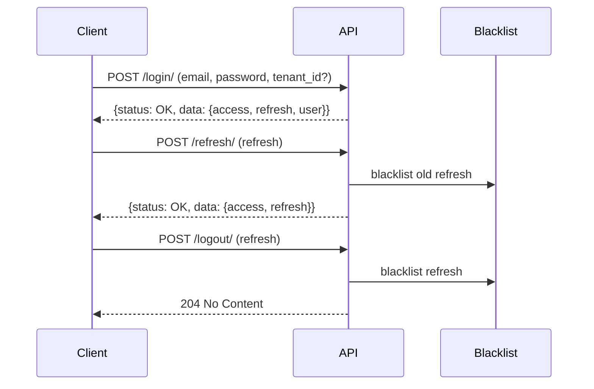

# Authentication

JWT-based authentication with token blacklisting, tenant context, password management, and session control.

## Endpoints

| Method | URL | Auth | Description |
|--------|-----|------|-------------|
| POST | `/api/auth/login/` | No | Returns access + refresh tokens and user info |
| POST | `/api/auth/refresh/` | No | Returns a new access token (rotates refresh token) |
| POST | `/api/auth/logout/` | Yes | Blacklists the provided refresh token |
| POST | `/api/auth/logout-all/` | Yes | Blacklists all outstanding refresh tokens for the user |
| POST | `/api/auth/password/change/` | Yes | Changes password and returns a new access token |

## Login

Request body:
- `email` (required)
- `password` (required)
- `tenant_id` (required if user belongs to multiple tenants)

Behavior:
- Single tenant membership → auto-resolved
- Multiple memberships without `tenant_id` → error with code `tenant_required` and `available_tenants` list
- Invalid `tenant_id` → error with code `invalid_tenant`
- No active memberships → error with code `no_tenant_membership`

The resolved `tenant_id` is stored in the JWT claims for downstream use.

## Response Format

All responses follow the platform envelope:

```json
// Success
{"status": "OK", "data": {"access": "...", "refresh": "...", "user": {...}}}

// Error
{"status": "ERROR", "code": "tenant_required", "data": {"tenant_id": "...", "available_tenants": [...]}}
```

## Token Lifecycle



- Access token: 30 minutes
- Refresh token: 7 days
- Refresh tokens rotate on each use — the previous one is automatically blacklisted
- Logout explicitly blacklists the refresh token server-side

## Password Change

Validations applied:
1. Old password must be correct
2. New password must pass complexity rules (configurable per tenant via `password_policy` setting)
3. New password must not match any of the last 5 passwords (`PASSWORD_HISTORY_LIMIT`)
4. Confirmation must match

On success, the current password hash is saved to `UserPasswordHistory` before updating.

## Models

- `UserPasswordHistory` — stores hashed passwords per user to enforce reuse prevention.

## Configuration

JWT settings are defined in `config/settings/base.py` under `SIMPLE_JWT`. Key values:

| Setting | Value |
|---------|-------|
| `ACCESS_TOKEN_LIFETIME` | 30 minutes |
| `REFRESH_TOKEN_LIFETIME` | 7 days |
| `ROTATE_REFRESH_TOKENS` | True |
| `BLACKLIST_AFTER_ROTATION` | True |
| `ALGORITHM` | HS256 |
| `AUTH_HEADER_TYPES` | Bearer |
