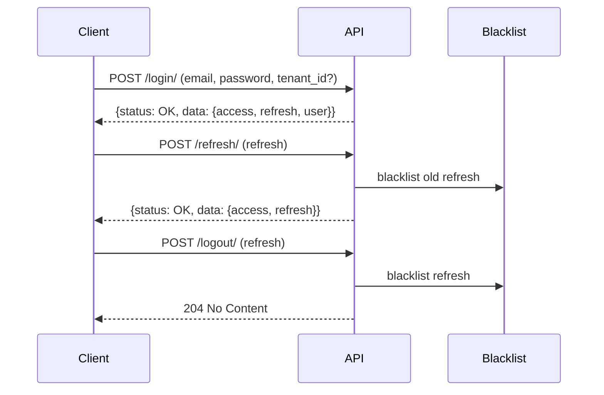

# Authentication

JWT-based authentication with token blacklisting, tenant context, password management, and session control.

## Endpoints

| Method | URL | Auth | Description |
|--------|-----|------|-------------|
| POST | `/api/auth/login/` | No | Returns access + refresh tokens and user info |
| POST | `/api/auth/refresh/` | No | Returns a new access token (rotates refresh token) |
| POST | `/api/auth/logout/` | Yes | Blacklists the provided refresh token |
| POST | `/api/auth/logout-all/` | Yes | Blacklists all outstanding refresh tokens for the user |
| POST | `/api/auth/password/change/` | Yes | Changes password and returns a new access token |

## Login

Request body:
- `email` (required)
- `password` (required)
- `tenant_id` (required if user belongs to multiple tenants)

Behavior:
- Single tenant membership → auto-resolved
- Multiple memberships without `tenant_id` → error with code `tenant_required` and `available_tenants` list
- Invalid `tenant_id` → error with code `invalid_tenant`
- No active memberships → error with code `no_tenant_membership`

The resolved `tenant_id` is stored in the JWT claims for downstream use.

## User Object

The `user` object returned on login:

| Field | Type | Description |
|-------|------|-------------|
| `id` | UUID | User primary key |
| `email` | string | User email address |
| `first_name` | string | First name |
| `last_name` | string | Last name |
| `tenant_id` | UUID | Resolved tenant for this session |

## Response Format

All responses follow the platform envelope:

```json
// Success
{
    "status": "OK", 
    "data": {
        "access": "...", 
        "refresh": "...", 
        "user": {...}
    }
}

// Error
{
    "status": "ERROR", 
    "code": "tenant_required", 
    "data": {}
}
```

## Token Lifecycle



- Access token: 30 minutes
- Refresh token: 7 days
- Refresh tokens rotate on each use — the previous one is automatically blacklisted
- Logout explicitly blacklists the refresh token server-side

## Refresh

Request body:
- `refresh` (required) — the current refresh token

On success, returns a new `access` and `refresh` token pair. The old refresh token is blacklisted automatically.

If the token is expired or already blacklisted, the response is:

```json
{
    "status": "ERROR", 
    "data": {
        "detail": "Token is invalid or expired.", 
        "code": "token_not_valid"
    }
}
```

## Password Change

Request body:
- `old_password` (required)
- `new_password` (required)
- `new_password_confirmation` (required)

Validations applied:
1. Old password must be correct
2. New password must pass complexity rules (configurable per tenant via `password_policy` setting)
3. New password must not match any of the last 5 passwords (`PASSWORD_HISTORY_LIMIT`)
4. Confirmation must match

On success, the current password hash is saved to `UserPasswordHistory` before updating.

## Password Complexity

The default policy applies when no tenant-level `password_policy` setting is configured:

| Rule | Default |
|------|---------|
| `min_length` | 8 |
| `require_uppercase` | true |
| `require_lowercase` | true |
| `require_digits` | true |
| `require_special` | true |
| `forbidden_words` | [] |

Tenants can override these by storing a JSON object under the `password_policy` tenant setting.

## Models

- `UserPasswordHistory` — stores hashed passwords per user to enforce reuse prevention.

## Error Responses

Beyond login errors (documented above), other endpoints return:

| Endpoint | Condition | Error |
|----------|-----------|-------|
| Refresh | Expired or blacklisted token | `{"detail": "Token is invalid or expired.", "code": "token_not_valid"}` |
| Logout | Invalid or expired refresh token | `{"refresh": ["Invalid or expired token."]}` |
| Password change | Wrong old password | `{"old_password": ["Current password is incorrect."]}` |
| Password change | Complexity failure | `{"new_password": ["Password must be at least 8 characters long.", ...]}` |
| Password change | History reuse | `{"new_password": ["Cannot reuse any of your last 5 passwords."]}` |
| Password change | Confirmation mismatch | `{"new_password_confirmation": ["Passwords do not match."]}` |
| Any authenticated endpoint | Missing or invalid access token | `{"detail": "...", "code": "not_authenticated"}` |

## JWT Claims

The access token payload includes:

| Claim | Description |
|-------|-------------|
| `user_id` | UUID of the authenticated user |
| `tenant_id` | UUID of the resolved tenant for this session |

Downstream views access the user via `request.user` (populated by `JWTAuthentication`). The `tenant_id` claim can be read from the token to scope queries to the active tenant.

## Configuration

JWT settings are defined in `config/settings/base.py` under `SIMPLE_JWT`. Key values:

| Setting | Value |
|---------|-------|
| `ACCESS_TOKEN_LIFETIME` | 30 minutes |
| `REFRESH_TOKEN_LIFETIME` | 7 days |
| `ROTATE_REFRESH_TOKENS` | True |
| `BLACKLIST_AFTER_ROTATION` | True |
| `ALGORITHM` | HS256 |
| `AUTH_HEADER_TYPES` | Bearer |
