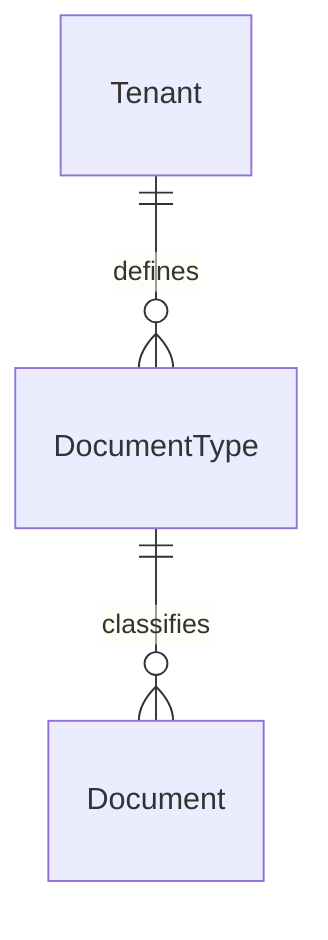

# DMS Document Types

Tenant-scoped document type classifications for the Document Management System.

## Relationships

## Models

### DocumentType

Represents a named type of documents within a tenant (e.g., Invoice, Contract, Report). Inherits from `TenantAwareModel` (soft-delete, tenant-scoped manager). Names are unique per tenant.

## API

`GET/POST api/dms/document-types/` — list and create document types.
`GET/PUT/PATCH/DELETE api/dms/document-types/<id>/` — retrieve and manage a single document type.

## Design Decisions

- Names are unique per tenant, enforced at both the database level (`UniqueConstraint`) and serializer level (`UniqueTogetherContextValidator`).
- `description` is optional — document types can be self-explanatory by name alone.
