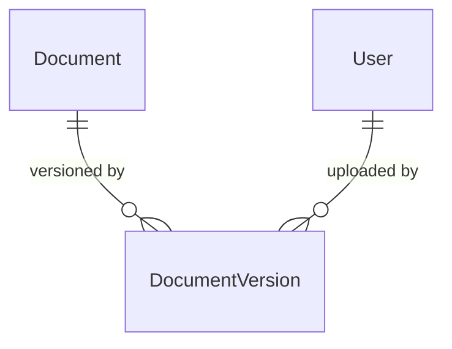

# DMS Document Versions

Versioned file snapshots for documents in the Document Management System.

## Relationships

## Models

### DocumentVersion

Represents a single versioned file upload attached to a `Document`. Inherits from `TenantAwareModel` (soft-delete, tenant-scoped manager). Version numbers are monotonically increasing per document and assigned automatically on create.

| Field | Description |
|---|---|
| `document` | FK to `Document`. Cascades on delete. |
| `version` | Auto-assigned monotonic integer scoped to the document. |
| `filename` | Original filename as uploaded. |
| `mime_type` | MIME type declared or detected at upload time. |
| `extension` | Derived from filename. Set automatically. |
| `checksum` | SHA-256 hex digest for integrity verification. |
| `size` | File size in bytes. |
| `storage_backend` | Backend used to store the file (default: `LOCAL`). |
| `storage_key` | Backend-specific path or key to retrieve the file. |
| `storage_state` | File availability: `UPLOADING`, `AVAILABLE`, `CORRUPTED`, `QUARANTINED`, `ARCHIVED`. |
| `created_by` | User who uploaded this version. Nullable (`SET_NULL`). |

## API

Versions are nested under documents:

`GET/POST api/dms/documents/<document_id>/versions/` — list and upload versions.
`GET api/dms/documents/<document_id>/versions/<id>/` — retrieve a single version.

Update and delete are not supported — versions are immutable once created.

## Design Decisions

- Version numbers are assigned in `pre_create` by querying the highest existing version for the document and incrementing by 1.
- All system fields (`version`, `extension`, `checksum`, `size`, `storage_backend`, `storage_key`, `storage_state`, `created_by`) are non-editable and set server-side.
- Nested routing is implemented manually via `parent_lookup_fields = {"document_id": "document_id"}` on the viewset — no third-party routing package.
- `DocumentVersion` cascades on `Document` delete — versions have no meaning without their parent document.
