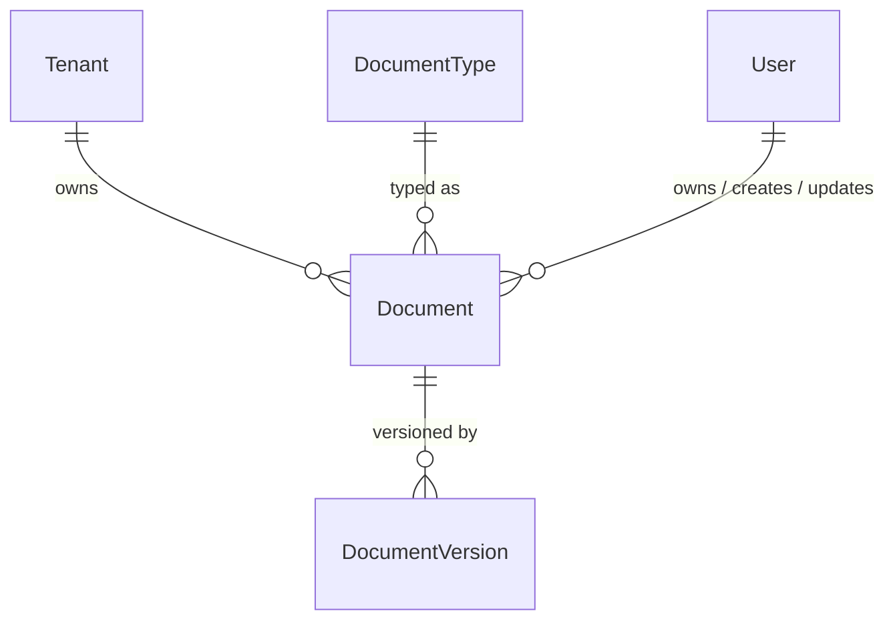

# DMS Documents

Tenant-scoped document records for the Document Management System.

## Relationships

## Models

### Document

Represents a document owned by a tenant. Inherits from `TenantAwareModel` (soft-delete, tenant-scoped manager). Titles are unique per tenant. Versioning is delegated to `dms_document_versions`.

| Field | Description |
|---|---|
| `document_type` | Optional FK to `DocumentType`. Nullable — documents may be untyped. |
| `title` | Human-readable name. Unique per tenant. |
| `description` | Optional long-form description. |
| `availability` | Lifecycle state: `ACTIVE` (default) or `ARCHIVED`. |
| `archived_at` | Timestamp set when the document is archived. |
| `owner` | User responsible for the document. Nullable (`SET_NULL`). |
| `created_by` | User who created the document. Nullable (`SET_NULL`). |
| `updated_by` | User who last updated the document. Nullable (`SET_NULL`). |

## API

`GET/POST api/dms/documents/` — list and create documents.
`GET/PUT/PATCH/DELETE api/dms/documents/<id>/` — retrieve and manage a single document.
`api/dms/documents/<id>/versions/` — nested versions endpoint (see `dms_document_versions`).

## Design Decisions

- `document_type` is nullable — documents can exist without a type classification.
- `category` is reserved for the future `dms_categories` module and is not present on this model.
- `current_version_id` was explicitly excluded — version promotion logic is deferred.
- All user FKs use `SET_NULL` to preserve document records when users are deleted.
- Titles are unique per tenant, enforced at the database level (`UniqueConstraint`).
