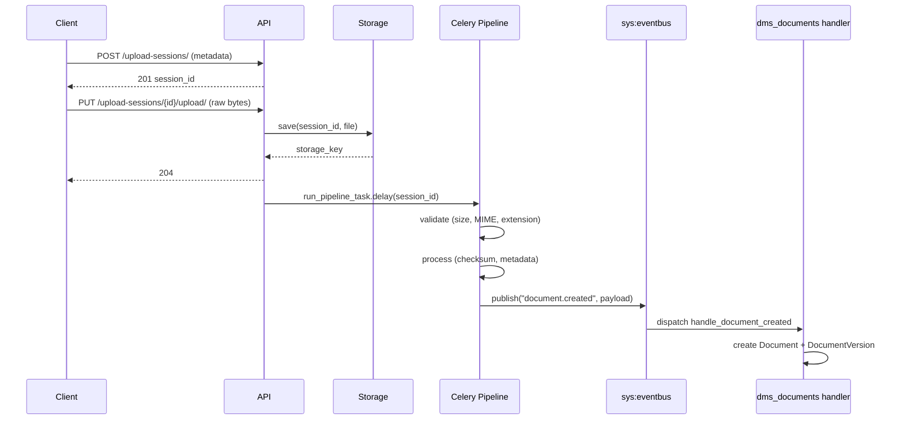
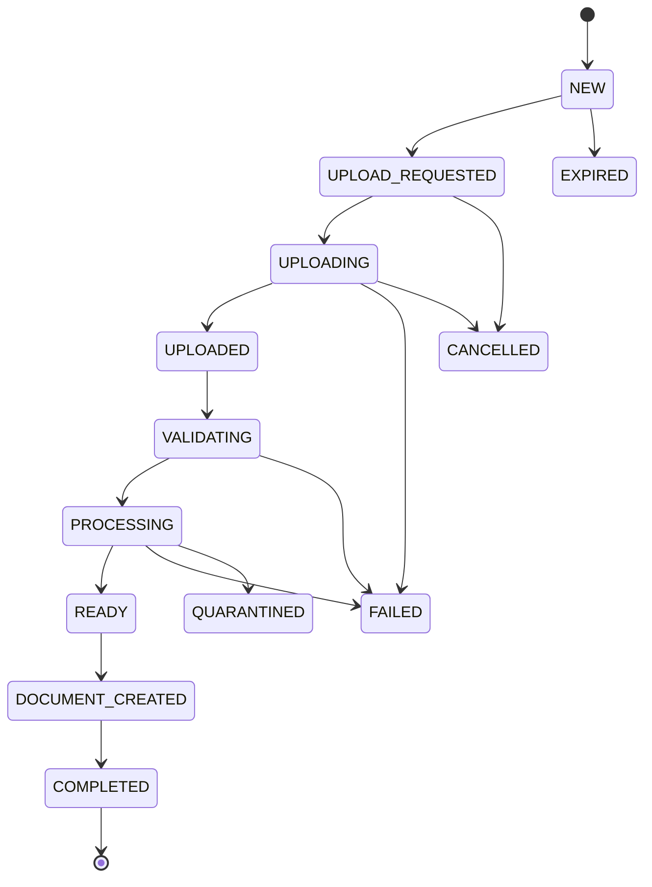

# DMS Ingestion

Owns the upload pipeline for the Document Management System — everything that happens before a `Document` exists. Clients create an upload session, upload a file, and the pipeline runs asynchronously to validate, process, and publish a `document.created` event that triggers document creation in `dms_documents`.

## Bounded Context

`dms_ingestion` has no FK to `Document`. It owns the session lifecycle up to the point the event is published. `dms_documents` owns document creation.

## Flow

1. Client creates an `UploadSession` with file metadata — session starts in state `NEW`.
2. Client uploads the raw file bytes — session transitions to `UPLOADED`, pipeline is enqueued.
3. Pipeline validates (file size, MIME type, extension), then processes (`ChecksumProcessor`, `MetadataProcessor`).
4. On success, a `document.created` event is published to the event bus with the full session payload.
5. The `dms_documents` event handler creates `Document` and `DocumentVersion` with `storage_state=AVAILABLE`.

## Models

### UploadSession

Tracks the lifecycle of a single file upload from creation to document creation.

| Field | Description |
|---|---|
| `title` | Human-readable name for the resulting document. |
| `document_type` | Optional document type name (validated against `DocumentType` at creation). |
| `filename` | Original filename as provided by the client. |
| `mime_type` | MIME type declared by the client. |
| `size` | File size in bytes declared by the client. |
| `checksum` | SHA-256 hex digest computed by the pipeline. |
| `extension` | File extension derived from filename by the pipeline. |
| `state` | Current lifecycle state (see state machine below). |
| `storage_key` | Backend-specific path assigned after the file is written. |
| `error_detail` | Human-readable failure reason. Set on transition to `FAILED`. |
| `created_by` / `updated_by` | User FKs. Nullable (`SET_NULL`). |

### State Machine

## API

`POST api/dms/ingestion/upload-sessions/` — create a session with file metadata.
`GET  api/dms/ingestion/upload-sessions/` — list sessions for the current tenant.
`GET  api/dms/ingestion/upload-sessions/<id>/` — retrieve a single session.
`PUT  api/dms/ingestion/upload-sessions/<id>/upload/` — upload the raw file bytes.

## Storage

Storage backends implement `BaseStorageBackend` and are resolved via `APP_DMS_INGESTION["STORAGE_BACKEND"]`. The filename is generated by the callable at `APP_DMS_INGESTION["STORAGE_NAME_GENERATOR"]`, defaulting to `generate_storage_name` which produces `<session_id>/<YYYYmmdd_HHMMSS>_<filename>`.

| Backend | Use |
|---|---|
| `LocalStorageBackend` | Local filesystem via `FileSystemStorage`. Default for development. |
| `InMemoryStorageBackend` | Dict-based, no filesystem dependency. For tests only. |

## Pipeline

Processors implement the `Processor` Protocol (`process(session, file) -> None`) and are resolved via `APP_DMS_INGESTION["PIPELINE_PROCESSORS"]`.

| Processor | Description |
|---|---|
| `ChecksumProcessor` | Computes SHA-256 digest of the file content and writes it to `session.checksum`. |
| `MetadataProcessor` | Derives the file extension from `session.filename` and writes it to `session.extension`. |

## Settings

All settings live under `APP_DMS_INGESTION` in `config/settings/base.py`.

| Key | Default | Description |
|---|---|---|
| `STORAGE_BACKEND` | `LocalStorageBackend` | Dotted path to the storage backend class. |
| `STORAGE_LOCATION` | `BASE_DIR/media/ingestion` | Filesystem path for `LocalStorageBackend`. |
| `STORAGE_NAME_GENERATOR` | `generate_storage_name` | Dotted path to the filename generator callable. |
| `MAX_FILE_SIZE_BYTES` | 20 MB | Maximum allowed file size. |
| `ALLOWED_MIME_TYPES` | `[]` (allow all) | Allowlist of accepted MIME types. |
| `ALLOWED_EXTENSIONS` | `[]` (allow all) | Allowlist of accepted file extensions. |
| `PIPELINE_PROCESSORS` | `[ChecksumProcessor, MetadataProcessor]` | Ordered list of processor dotted paths. |

## Design Decisions

- No FK to `Document` — `dms_ingestion` is decoupled from `dms_documents` by design. Communication is event-driven.
- The upload endpoint returns `204` immediately — pipeline result is not awaited.
- `document_type` is stored as a `CharField` on `UploadSession`, validated case-insensitively against `DocumentType.name` at session creation. The canonical name is stored.
- Storage backends inherit from `BaseStorageBackend`, which provides the `save()` template method. Subclasses implement `_save()`, `open()`, and `delete()`.
- The name generator is resolved at call time inside `save()` — swapping it requires only a settings change, no restart.
