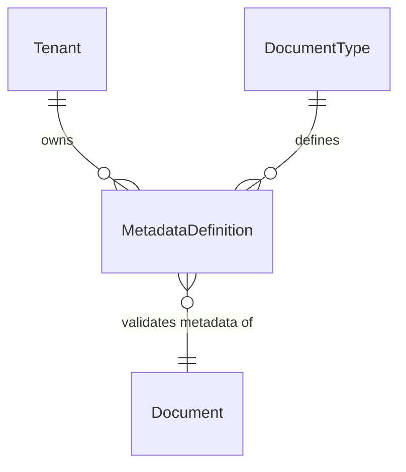

# DMS Metadata

Tenant-scoped metadata definitions for the Document Management System. Defines the schema of structured metadata fields that can be attached to documents of a given type.

## Relationships



## Models

### MetadataDefinition

Defines a single metadata field for a document type within a tenant. Inherits from `TenantAwareModel` (soft-delete, tenant-scoped manager). Codes are unique per tenant and document type.

| Field | Description |
|---|---|
| `code` | Programmatic identifier (e.g., `invoice_number`). Unique per tenant and document type. |
| `name` | Human-readable label (e.g., `Invoice Number`). |
| `document_type` | FK to `DocumentType`. Defines which type this field belongs to. |
| `data_type` | One of the `MetadataType` enum values (see below). |
| `required` | Whether the field must be present on documents of this type. |
| `searchable` | Whether the field is available for search queries. |
| `filterable` | Whether the field is available as a filter parameter. |
| `sortable` | Whether the field can be used for ordering. |
| `indexed` | Whether the field is indexed for faster lookups. |
| `default_value` | Optional default value. Validated against `data_type` and `validation_rules`. |
| `validation_rules` | Optional JSON constraints specific to the `data_type` (see below). |

### MetadataType

| Value | Expected Python/JSON type |
|---|---|
| `STRING` | `str` |
| `TEXT` | `str` |
| `INTEGER` | `int` (bool rejected) |
| `DECIMAL` | `int`, `float`, or `str` castable to `Decimal` |
| `BOOLEAN` | `bool` (1, 0, `"true"` rejected) |
| `DATE` | ISO 8601 date string (`YYYY-MM-DD`) |
| `DATETIME` | ISO 8601 datetime string |
| `TIME` | Time string (`HH:MM:SS`) |
| `UUID` | UUID string |
| `EMAIL` | Valid email string |
| `URL` | Valid URL string |
| `JSON` | `dict` |
| `ENUM` | `str` (choices enforced via `validation_rules`) |

### Validation Rules Schema

`validation_rules` is a JSON object whose allowed keys depend on `data_type`:

| data_type | Allowed keys |
|---|---|
| `STRING`, `TEXT` | `min_length` (int), `max_length` (int), `pattern` (regex string) |
| `INTEGER`, `DECIMAL` | `min` (number), `max` (number); `DECIMAL` also accepts `precision` (non-negative int) |
| `DATE`, `DATETIME` | `min` (date string), `max` (date string) |
| `ENUM` | `choices` (non-empty list of strings) — required |
| `URL` | `allowed_schemes` (list of strings) |

## API

`GET/POST api/dms/document-types/<id>/metadata-definitions/` — list and create metadata definitions for a document type.
`GET/PUT/PATCH/DELETE api/dms/document-types/<id>/metadata-definitions/<id>/` — retrieve and manage a single definition.

## Services

### MetadataValidationService

Single entry point for validating a document's `metadata` dict against all `MetadataDefinition` records for its document type.

```python
from apps.dms_metadata.services import MetadataValidationService

MetadataValidationService.validate(
    document_type=invoice_type,
    metadata={"invoice_number": "INV-001", "amount": "1500.00"},
)
```

Raises `ValidationError` if any field is missing (and required), has the wrong type, violates a rule, or is not declared in any definition. Use this service from serializers, management commands, background jobs, and imports — do not duplicate validation logic elsewhere.

## Design Decisions

- `MetadataDefinition` is `TenantAwareModel` — it has a direct `tenant` FK in addition to `document_type`, enabling tenant-level isolation independent of the document type.
- `validation_rules` and `default_value` are validated at the API level (serializer `do_validate`) and at the model level (`clean()`).
- `MetadataValidationService.validate` rejects metadata keys not declared in any definition — unknown fields are treated as errors, not silently ignored.
- `Document.metadata` is a `JSONField` — it stores values only. `MetadataDefinition` is the authoritative and strict schema: it is the single source of truth for what fields are valid, their types, constraints, and defaults. Unknown keys are rejected, required fields are enforced, and no value is accepted unless it satisfies the definition's type and rules.
