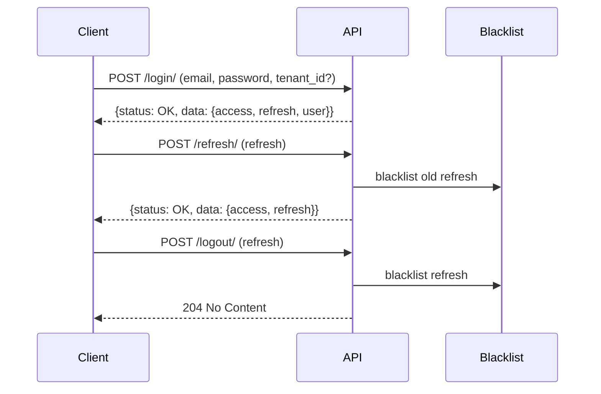

# Authentication

JWT-based authentication with token blacklisting, tenant context, password management, and session control.

## Endpoints

| Method | URL | Auth | Description |
|--------|-----|------|-------------|
| POST | `/api/auth/login/` | No | Returns access + refresh tokens and user info |
| POST | `/api/auth/refresh/` | No | Returns a new access token (rotates refresh token) |
| POST | `/api/auth/logout/` | Yes | Blacklists the provided refresh token |
| POST | `/api/auth/logout-all/` | Yes | Blacklists all outstanding refresh tokens for the user |
| POST | `/api/auth/password/change/` | Yes | Changes password and returns a new access token |
| POST | `/api/auth/unlock/{email}/` | Yes | Unlocks a locked account (tenant admin or superuser only) |

## Account Lockout

Accounts are locked after a configurable number of consecutive failed login attempts. Lockout state is stored in Redis with no DB writes.

| Scope | Default |
|-------|---------|
| Max attempts | 5 |
| Lockout duration | 900 seconds (auto-unlock). Set to `0` for manual unlock only |

When locked, returns `400 Bad Request` with code `account_locked`. Set `MAX_ATTEMPTS` to `0` to disable lockout entirely.

Locked accounts can be manually unlocked via `POST /api/auth/unlock/{email}/` by a tenant admin or superuser.

See [Security — Login Protection](../../docs/security.md#login-protection) for the full flow, Redis key details, and configuration.

Implementation: `apps/iam_auth/lockout.py`, `apps/iam_auth/signals.py`.

## IP Allowlist / Blocklist

Tenants can restrict login access by IP address using CIDR-based allowlists and blocklists. Both settings are optional and independent.

| Setting | Type | Default | Description |
|---------|------|---------|-------------|
| `ip_allowlist` | JSON array of CIDR strings | `[]` | If non-empty, only IPs matching an entry are allowed |
| `ip_blocklist` | JSON array of CIDR strings | `[]` | IPs matching any entry are denied regardless of allowlist |

Evaluation order (blocklist wins):
1. If the IP matches any blocklist entry — deny
2. If the allowlist is non-empty and the IP matches no entry — deny
3. Otherwise — allow

An empty allowlist means no restriction. Both IPv4 and IPv6 CIDR ranges are supported. Invalid CIDR entries are silently skipped.

When blocked, returns `403 Forbidden` with code `ip_blocked`.

See [Security — IP Access Control](../../docs/security.md#ip-access-control) for the full flow.

Implementation: `apps/iam_auth/ip_filter.py`.

## Rate Limiting

Login attempts are throttled independently by IP address and by email before credentials are validated.

| Scope | Default |
|-------|---------|
| IP | 10/minute |
| Email | 5/minute |

When exceeded, returns `429 Too Many Requests` with code `rate_limit_exceeded`. Set a rate to `"0"` to disable that scope.

See [Security — Rate Limiting](../../docs/security.md#rate-limiting) for configuration, flow, and cache key details.

Implementation: `apps/iam_auth/throttling.py`.

## Login

Request body:
- `email` (required)
- `password` (required)
- `tenant_id` (required if user belongs to multiple tenants)

Behavior:
- Single tenant membership → auto-resolved
- Multiple memberships without `tenant_id` → error with code `tenant_required` and `available_tenants` list
- Invalid `tenant_id` → error with code `invalid_tenant`
- No active memberships → error with code `no_tenant_membership`

The resolved `tenant_id` is stored in the JWT claims for downstream use.

## User Object

The `user` object returned on login:

| Field | Type | Description |
|-------|------|-------------|
| `id` | UUID | User primary key |
| `email` | string | User email address |
| `first_name` | string | First name |
| `last_name` | string | Last name |
| `tenant_id` | UUID | Resolved tenant for this session |

## Response Format

All responses follow the platform envelope:

```json
// Success
{
    "status": "OK", 
    "data": {
        "access": "...", 
        "refresh": "...", 
        "user": {...}
    }
}

// Error
{
    "status": "ERROR", 
    "code": "tenant_required", 
    "data": {}
}
```

## Token Lifecycle



- Access token: 30 minutes
- Refresh token: 7 days
- Refresh tokens rotate on each use — the previous one is automatically blacklisted
- Logout explicitly blacklists the refresh token server-side

## Refresh

Request body:
- `refresh` (required) — the current refresh token

On success, returns a new `access` and `refresh` token pair. The old refresh token is blacklisted automatically.

If the token is expired or already blacklisted, the response is:

```json
{
    "status": "ERROR", 
    "data": {
        "detail": "Token is invalid or expired.", 
        "code": "token_not_valid"
    }
}
```

## Password Change

Request body:
- `old_password` (required)
- `new_password` (required)
- `new_password_confirmation` (required)

Validations applied:
1. Old password must be correct
2. New password must pass complexity rules (configurable per tenant via `password_policy` setting)
3. New password must not match any of the last 5 passwords (`PASSWORD_HISTORY_LIMIT`)
4. Confirmation must match

On success, the current password hash is saved to `UserPasswordHistory` before updating.

## Password Complexity

The default policy is applied when no tenant-level `password_policy` setting has been saved. It is declared in `apps/iam_auth/tenant_settings.json` and returned by `get_tenant_setting()` as the catalog default:

| Rule | Default |
|------|---------|
| `min_length` | 8 |
| `require_uppercase` | true |
| `require_digit` | true |
| `require_special` | false |

Tenants can override these by storing a JSON-encoded object under the `password_policy` tenant setting (type: `json`, declared in `apps/iam_auth/tenant_settings.json`).

Example value sent to the API:

```json
{
  "key": "password_policy",
  "value": "{\"min_length\": 12, \"require_uppercase\": true}"
}
```

## Password Expiry

Passwords can expire in two ways:

1. Natural expiry — based on the `password_expiry_days` tenant setting. When set to a value greater than `0`, the age of the user's password is checked at login. Age is calculated from the most recent `UserPasswordHistory` entry, or `User.created_at` if the user has never changed their password.
2. Admin-forced expiry — a tenant admin sets a `password_expires_at` attribute on the user via `UserTenantAttribute` with a past ISO 8601 timestamp. This takes precedence over natural expiry.

When a password is expired, login returns `400 Bad Request` with code `password_expired`. The user must call `POST /api/auth/password/change/` to set a new password, then log in again.

After a successful password change, the `password_expires_at` attribute is automatically deleted.

| Setting | Type | Default | Description |
|---------|------|---------|-------------|
| `password_expiry_days` | integer | `0` | Days before a password expires. `0` = disabled |

Implementation: `_enforce_password_expiry()` in `apps/iam_auth/serializers.py`.

## Models

- `UserPasswordHistory` — stores hashed passwords per user to enforce reuse prevention.

## Signals

Defined in `apps/iam_auth/signals.py`:

| Signal | Arguments | Description |
|--------|-----------|-------------|
| `login_failed` | `email: str` | Sent when a login attempt fails due to invalid credentials. The lockout receiver is connected to this signal. |
| `password_changed` | `email: str` | Sent when a user successfully changes their password. The lockout clear receiver is connected to this signal. |

## Error Responses

Beyond login errors (documented above), other endpoints return:

| Endpoint | Condition | Error |
|----------|-----------|-------|
| Login | Account locked | `{"detail": "Account is locked due to too many failed login attempts."}` with code `account_locked` |
| Login | Rate limit exceeded | `{"detail": "Too many login attempts. Please try again later."}` with code `rate_limit_exceeded` |
| Unlock | Requester targets their own account | `{"detail": "You cannot unlock your own account."}` with code `self_unlock_forbidden` |
| Refresh | Expired or blacklisted token | `{"detail": "Token is invalid or expired.", "code": "token_not_valid"}` |
| Logout | Invalid or expired refresh token | `{"refresh": ["Invalid or expired token."]}` |
| Password change | Wrong old password | `{"old_password": ["Current password is incorrect."]}` |
| Password change | Complexity failure | `{"new_password": ["Password must be at least 8 characters long.", ...]}` |
| Password change | History reuse | `{"new_password": ["Cannot reuse any of your last 5 passwords."]}` |
| Password change | Confirmation mismatch | `{"new_password_confirmation": ["Passwords do not match."]}` |
| Login | Password expired | `{"detail": "Your password has expired. Please change it to continue."}` with code `password_expired` |
| Any authenticated endpoint | Missing or invalid access token | `{"detail": "...", "code": "not_authenticated"}` |

## JWT Claims

The access token payload includes:

| Claim | Description |
|-------|-------------|
| `user_id` | UUID of the authenticated user |
| `tenant_id` | UUID of the resolved tenant for this session |

Downstream views access the user via `request.user` (populated by `JWTAuthentication`). The `tenant_id` claim can be read from the token to scope queries to the active tenant.

## Session Concurrency

Limits the number of active sessions a user can hold simultaneously. When a new login exceeds the limit, the oldest sessions are silently blacklisted to make room.

| Setting | Env var | Default | Description |
|---------|---------|---------|-------------|
| `MAX_CONCURRENT_SESSIONS` | `AUTH_MAX_CONCURRENT_SESSIONS` | `0` | Max active sessions per user. `0` = disabled |

Enforcement happens at login time, after the new token is issued, so the incoming session is counted. Pre-blacklisted tokens are excluded from the active count.

Implementation: `_enforce_session_limit()` in `apps/iam_auth/serializers.py`.

## Configuration

JWT settings are defined in `config/settings/base.py` under `SIMPLE_JWT`. Key values:

| Setting | Value |
|---------|-------|
| `ACCESS_TOKEN_LIFETIME` | 30 minutes |
| `REFRESH_TOKEN_LIFETIME` | 7 days |
| `ROTATE_REFRESH_TOKENS` | True |
| `BLACKLIST_AFTER_ROTATION` | True |
| `ALGORITHM` | HS256 |
| `AUTH_HEADER_TYPES` | Bearer |
