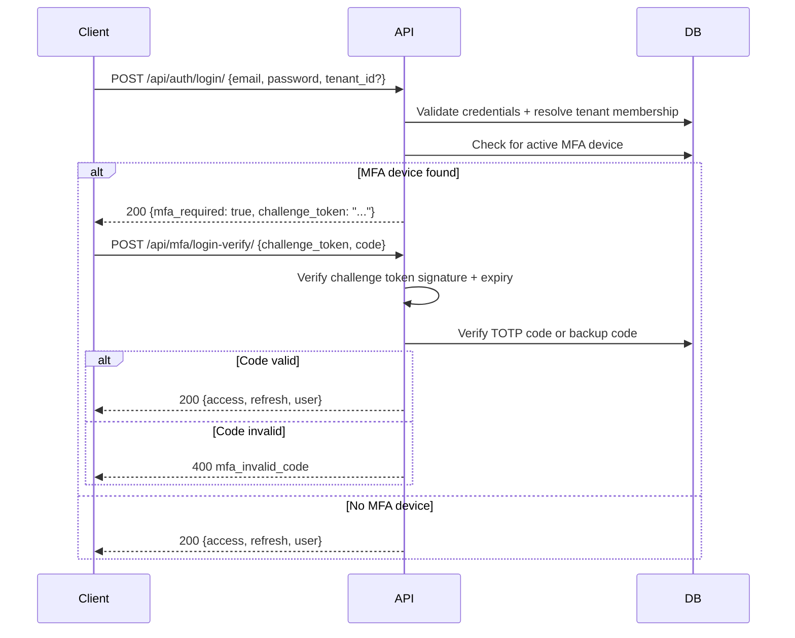
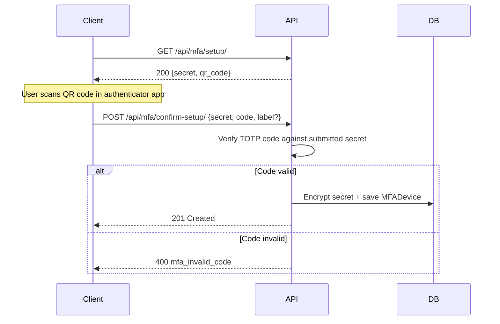

# MFA (Multi-Factor Authentication)

TOTP-based MFA with per-tenant enforcement, encrypted secrets, backup codes, and a challenge token login flow.

## Endpoints

| Method | URL | Auth | Description |
|--------|-----|------|-------------|
| GET | `/api/mfa/setup/` | Yes | Generate a TOTP secret and QR code for enrollment |
| POST | `/api/mfa/confirm-setup/` | Yes | Confirm enrollment by verifying a TOTP code against the client-held secret |
| POST | `/api/mfa/verify/` | Yes | Verify a TOTP code against the active device |
| POST | `/api/mfa/disable/` | Yes | Disable MFA after verifying a TOTP code |
| POST | `/api/mfa/backup-codes/` | Yes | Generate new backup codes (replaces existing ones) |
| GET | `/api/mfa/status/` | Yes | Return the user's MFA status for the current tenant |
| POST | `/api/mfa/login-verify/` | No | Complete login by verifying a TOTP or backup code against a challenge token |

## Login Flow with MFA

When a user has an active MFA device, `POST /api/auth/login/` does not return tokens. Instead it returns a challenge token that must be exchanged at `/api/mfa/login-verify/`.

### Challenge Token

The challenge token is a short-lived signed JWT (5 minutes, HS256) with the following claims:

| Claim | Description |
|-------|-------------|
| `user_id` | UUID of the pre-authenticated user |
| `tenant_id` | UUID of the resolved tenant |
| `type` | Always `mfa_challenge` — distinguishes it from real access tokens |

The challenge token cannot be used to authenticate API requests. It is only accepted by `/api/mfa/login-verify/`.

## Enrollment Flow

MFA enrollment is a two-step process. The secret is generated server-side, returned to the client, and only saved after the user confirms with a valid TOTP code.

The secret is held by the client between the two steps. The server never stores it until confirmation succeeds.

## Backup Codes

Backup codes are single-use recovery codes generated when requested. They are returned in plaintext once and stored as hashes — they cannot be retrieved again.

- Generating new codes replaces all existing unused codes
- Each code can only be used once — it is marked `is_used=True` after consumption
- Backup codes are accepted at `/api/mfa/login-verify/` as a fallback when the TOTP code is unavailable

## Tenant Enforcement

MFA behavior is controlled per tenant via `TenantSetting`:

| Key | Type | Default | Description |
|-----|------|---------|-------------|
| `mfa_enabled` | boolean | `false` | Whether MFA is available for this tenant |
| `mfa_enforcement` | string | `optional` | `optional` — users may enroll; `required` — users without a device are blocked at login |

When `mfa_enforcement` is `required` and the user has no active device, login returns `400 Bad Request` with code `mfa_setup_incomplete`.

## Secret Encryption

TOTP secrets are encrypted at rest using Fernet (AES-128-CBC + HMAC-SHA256). The encryption key is derived from `AUTH_MFA["ENCRYPTION_KEYS"]` — a list of strings where the first key encrypts and all keys attempt decryption, enabling zero-downtime key rotation.

See `apps/iam_mfa/encryption.py` for implementation. See `config/settings/base.py` under `AUTH_MFA` for configuration.

## Models

- `MFADevice` — a TOTP device enrolled by a user within a tenant. Stores the encrypted secret, label, and active state.
- `MFABackupCode` — a single-use backup code linked to a device. Stores the hashed code and used state.

## Signals

Defined in `apps/iam_mfa/signals.py`:

| Signal | Arguments | Description |
|--------|-----------|-------------|
| `mfa_enabled` | `user_id`, `tenant_id` | Sent when a user successfully enrolls a device |
| `mfa_disabled` | `user_id`, `tenant_id` | Sent when a user disables their MFA device |
| `mfa_verified` | `user_id`, `tenant_id` | Sent when a user successfully verifies a TOTP code during login |
| `backup_codes_generated` | `user_id`, `tenant_id`, `count` | Sent when new backup codes are generated |

## Error Codes

| Code | Endpoint | Description |
|------|----------|-------------|
| `mfa_required` | Login | User has an active device — challenge token returned instead of tokens |
| `mfa_setup_incomplete` | Login | Tenant requires MFA but user has no enrolled device |
| `mfa_invalid_code` | login-verify, verify, disable, confirm-setup | TOTP or backup code is incorrect |
| `mfa_not_setup` | login-verify, verify, disable | No active MFA device found for the user |
| `mfa_backup_code_invalid` | login-verify | Backup code not found or already used |
| `mfa_challenge_expired` | login-verify | Challenge token has expired (TTL: 5 minutes) |
| `mfa_challenge_invalid` | login-verify | Challenge token signature is invalid or has wrong type |

## Configuration

Defined in `config/settings/base.py` under `AUTH_MFA`:

| Setting | Description |
|---------|-------------|
| `ENCRYPTION_KEYS` | List of strings used to derive Fernet keys. First key encrypts; all keys attempt decryption. Required. |
| `issuer` | Issuer name shown in authenticator apps. Default: `"Enterprise Platform"` |
| `backup_code_count` | Number of backup codes generated per request. Default: `10` |
| `backup_code_length` | Character length of each backup code. Default: `10` |
