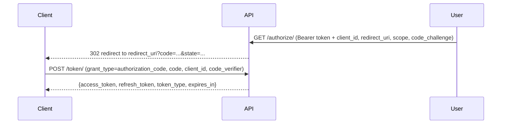
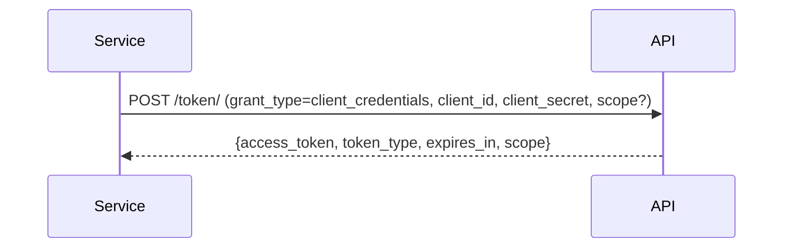

# OAuth2

OAuth2 authorization server for the platform. Issues JWTs for three grant types: Authorization Code (user-facing), Client Credentials (service-to-service), and Refresh Token (token renewal). All tokens are tenant-scoped and consistent with the platform's existing JWT claims format.

## Endpoints

| Method | URL | Auth | Description |
|--------|-----|------|-------------|
| GET/POST | `/api/oauth/authorize/` | Bearer (user JWT) | Issues an authorization code and redirects to `redirect_uri` |
| POST | `/api/oauth/token/` | No (client credentials in body) | Exchanges a code or rotates a refresh token for a token pair |
| POST | `/api/oauth/revoke/` | No (client credentials in body) | Revokes a refresh token and its entire rotation chain |

## Grant Types

### Authorization Code

Used for user-delegated access. Requires the user to be authenticated via `TenantJWTAuthentication` before hitting `/authorize/`.

Flow:



Authorization request parameters:

| Parameter | Required | Description |
|-----------|----------|-------------|
| `response_type` | Yes | Must be `code` |
| `client_id` | Yes | Registered client identifier |
| `redirect_uri` | No | Must match a registered URI; defaults to first registered URI |
| `scope` | No | Space-separated requested scopes |
| `state` | No | Opaque value echoed back in the redirect |
| `code_challenge` | Required for public clients | PKCE code challenge |
| `code_challenge_method` | Required for public clients | `S256` or `plain` |

Token request parameters:

| Parameter | Required | Description |
|-----------|----------|-------------|
| `grant_type` | Yes | `authorization_code` |
| `code` | Yes | The authorization code from the redirect |
| `client_id` | Yes | Must match the client that requested the code |
| `redirect_uri` | No | Must match the URI used in the authorization request |
| `code_verifier` | Required for public clients | PKCE code verifier |

### Client Credentials

Used for service-to-service token issuance. No user is involved. Only confidential clients are allowed.



Token request parameters:

| Parameter | Required | Description |
|-----------|----------|-------------|
| `grant_type` | Yes | `client_credentials` |
| `client_id` | Yes | Registered confidential client identifier |
| `client_secret` | Yes | Client secret |
| `scope` | No | Subset of the client's allowed scopes; defaults to full client scope |

No refresh token is issued for this grant type.

### Refresh Token

Rotates an existing refresh token and issues a new access + refresh token pair. Scope downscoping is supported.

Token request parameters:

| Parameter | Required | Description |
|-----------|----------|-------------|
| `grant_type` | Yes | `refresh_token` |
| `refresh_token` | Yes | The current refresh token JWT |
| `client_id` | Yes | Must match the client the token was issued to |
| `client_secret` | Required for confidential clients | Client secret |
| `scope` | No | Must be a subset of the original granted scope |

## Token Revocation (RFC 7009)

`POST /api/oauth/revoke/` accepts a refresh token and revokes it along with its entire rotation chain. Always returns `200 OK` regardless of whether the token is valid, unknown, or already revoked.

Request parameters:

| Parameter | Required | Description |
|-----------|----------|-------------|
| `token` | Yes | The refresh token JWT to revoke |
| `client_id` | Yes | Must match the client the token was issued to |
| `client_secret` | Required for confidential clients | Client secret |

## PKCE

PKCE is required for all public clients (`is_confidential=False`). Confidential clients may optionally use PKCE.

| Method | Description |
|--------|-------------|
| `S256` | SHA-256 hash of the verifier, base64url-encoded (recommended) |
| `plain` | Verifier sent as-is (not recommended) |

## JWT Claims

Access tokens issued by this app include:

| Claim | Description |
|-------|-------------|
| `sub` | User ID (Authorization Code / Refresh Token) or `client_id` (Client Credentials) |
| `tenant_id` | UUID of the tenant context |
| `scope` | Space-separated granted scopes |
| `token_type_hint` | `client_credentials` for Client Credentials tokens; absent otherwise |
| `jti` | References the `OAuth2RefreshToken.token` field for refresh/authorization_code tokens |

## Models

- `OAuth2Client` — registered client application belonging to a tenant. Stores `client_id`, `client_secret` (confidential only), allowed `redirect_uris`, `grant_types`, `response_types`, and `scope`.
- `AuthorizationCode` — single-use code issued at `/authorize/`. Expires after `AUTHORIZATION_CODE_LIFETIME` seconds (default: 600). Stores PKCE challenge and the authorizing user.
- `OAuth2RefreshToken` — persisted refresh token record. Supports rotation via `replaced_by` self-FK and explicit revocation via `is_revoked`. Used as the source of truth for revocation and chain-walking.

## Configuration

OAuth2 settings are defined in `apps/iam_oauth/settings.py` under `DEFAULTS`. Override any value in Django settings via the `OAUTH2` dict:

```python
OAUTH2 = {
    "AUTHORIZATION_CODE_LIFETIME": 300,  # seconds
}
```

| Setting | Default | Description |
|---------|---------|-------------|
| `AUTHORIZATION_CODE_LIFETIME` | `600` | Authorization code expiry in seconds |
| `ACCESS_TOKEN_LIFETIME_MINUTES` | `30` | Access token lifetime in minutes |
| `REFRESH_TOKEN_LIFETIME_DAYS` | `7` | Refresh token lifetime in days |
| `PKCE_REQUIRED_FOR_PUBLIC_CLIENTS` | `True` | Enforce PKCE for public clients |
| `SUPPORTED_GRANT_TYPES` | `[authorization_code, client_credentials, refresh_token]` | Allowed grant types |
| `SUPPORTED_RESPONSE_TYPES` | `[code]` | Allowed response types |
| `TOKEN_FORMAT` | `JWT` | Token format |

## Multi-Tenancy

Every `OAuth2Client` belongs to a `Tenant`. The `client_id` resolves to a tenant at authorization time, and all issued tokens carry `tenant_id` in their claims. Authorization codes and refresh token records are also tenant-scoped.

## Refresh Token Rotation

Every use of a refresh token issues a new `OAuth2RefreshToken` record and marks the old one as revoked with a `replaced_by` pointer to the new record. If a revoked token is presented again, it is rejected — this is a signal of potential token theft and is logged as a warning.

Revoking a token via `/revoke/` walks the entire `replaced_by` chain forward and revokes all descendants, ensuring that a stolen-and-rotated token cannot be used after the legitimate owner revokes it.
