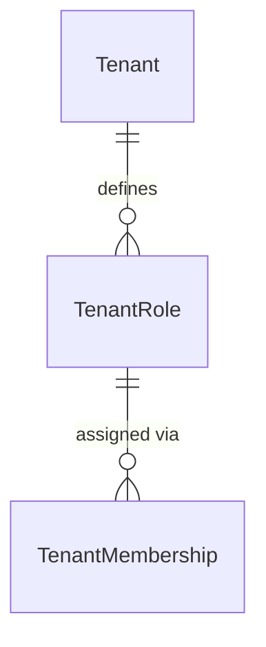

# IAM Roles

Tenant-scoped role definitions for RBAC.

## Relationships

## Models

### TenantRole

Tenant-specific role definitions. Inherits from `TenantAwareModel` (soft-delete, tenant-scoped manager). Default roles (Owner, Admin, Member, Viewer) are seeded on tenant creation. `kind` is immutable after creation and drives business rule enforcement.

## Design Decisions

- Roles are defined per tenant independently — no shared global roles.
- `kind` identifies the role's semantic type regardless of display name. Business rules check `kind`, not `name`.
- Supports soft-delete via `TenantAwareModel`.
