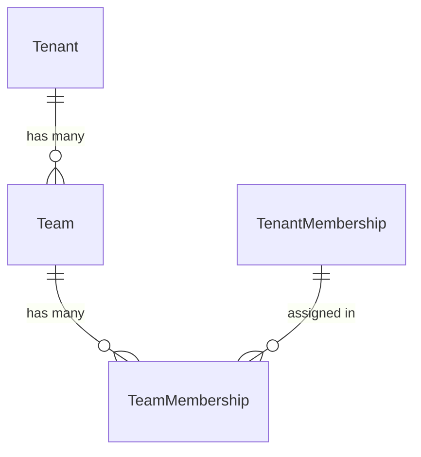

# IAM Teams

Tenant-scoped teams for organizing members into logical groups (departments, projects, squads). A tenant member can belong to multiple teams.

## Models

### Team

A group within a tenant for organizing members into logical units (departments, projects, squads). A tenant member can belong to multiple teams. Inherits from `TenantAwareModel`.

| Field | Type | Description |
|-------|------|-------------|
| name | VARCHAR(255) | Display name |
| description | TEXT | Optional description of the team's purpose |
| is_active | BOOLEAN | Whether the team is currently active |

**Constraints:**

| Constraint | Fields |
|-----------|--------|
| unique_team_per_tenant | (tenant, name) |

### TeamMembership

Links a tenant member to a team. Uses FK to `TenantMembership` (rather than `User`) to enforce at the DB level that only active tenant members can be assigned. Inherits from `TenantAwareModel`.

| Field | Type | Description |
|-------|------|-------------|
| team_id | FK → Team | The team |
| membership_id | FK → TenantMembership | The tenant membership being added |

**Constraints:**

| Constraint | Fields |
|-----------|--------|
| unique_member_per_team | (team, membership) |

## Relationships

`TenantMembership` is defined in `apps.iam_users.models`.

## API Endpoints

Base path: `/api/teams/`

| Method | Path | Action | Description |
|--------|------|--------|-------------|
| GET | `/api/teams/` | list | List teams in the tenant |
| POST | `/api/teams/` | create | Create a new team |
| GET | `/api/teams/{id}/` | retrieve | Get team detail |
| PUT | `/api/teams/{id}/` | update | Full update |
| PATCH | `/api/teams/{id}/` | partial_update | Partial update |
| DELETE | `/api/teams/{id}/` | destroy | Soft-delete a team |
| GET | `/api/teams/memberships/` | list | List team memberships |
| POST | `/api/teams/memberships/` | create | Add a member to a team |
| DELETE | `/api/teams/memberships/{id}/` | destroy | Remove a member from a team (hard delete) |

## Validation Rules

| Field | Constraint |
|-------|------------|
| Team.name | Required, max 255 chars, unique per tenant |
| TeamMembership.team_id | Must exist in the same tenant |
| TeamMembership.membership_id | Must be an active membership in the same tenant |
| TeamMembership (team, membership) | Unique — cannot add the same member twice |
