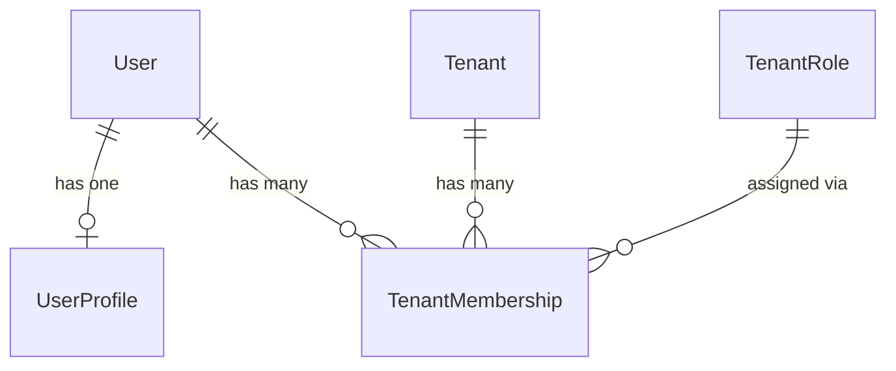

# IAM Users

Platform-level user identity, profiles, and tenant membership.

## Relationships

## Models

### User

Authentication identity. Uses email as login credential. Platform-level (not scoped to any tenant). Inherits from `AbstractBaseUser` and `PermissionsMixin`.

### UserProfile

One-to-one extension for non-auth personal data (phone, avatar, bio). Separated from `User` to reduce migration churn on the auth table.

### TenantMembership

Links a user to a tenant with exactly one role (from `iam_roles.TenantRole`). `is_admin` provides a fast-path privilege check without querying role permissions. Deleting a role with active memberships is blocked (`PROTECT`).

## Endpoints

| Method | URL | Description |
|--------|-----|-------------|
| GET | `/api/users/` | List users. Superusers see all; others see only users in their active tenant. |
| GET | `/api/users/{id}/` | Retrieve a user. Superusers can retrieve any; others are scoped to their tenant. |
| GET | `/api/users/me/` | Retrieve the authenticated user's own profile including `personal_info`. |
| PATCH | `/api/users/me/` | Update `first_name`, `last_name`, and `personal_info`. Email is read-only. |

## Design Decisions

- A user can belong to multiple tenants via separate memberships.
- `User`, `UserProfile`, and `TenantMembership` use hard-delete.
- Email is immutable via the API. A dedicated verified-change flow is required to update it.
- `personal_info` is a free-form JSON field on `UserProfile`. Subfield schema is pending definition.
