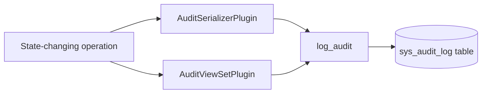

# sys_audit

System audit trail — append-only record of all state-changing operations.

## Purpose

Implements ADR-009 (Auditability by Design). Every create, update, and delete operation produces an immutable audit record identifying the actor, action, target resource, tenant boundary, and timestamp.

## How It Works



- **AuditSerializerPlugin** — a `SerializerPlugin` registered globally in `REST_FRAMEWORK["DEFAULT_SERIALIZER_PLUGINS"]`. Hooks into `on_post_create` and `on_post_update` lifecycle boundaries.
- **AuditViewSetPlugin** — a `ViewSetPlugin` registered globally in `REST_FRAMEWORK["DEFAULT_VIEWSET_PLUGINS"]`. Hooks into `on_post_destroy` at the viewset level.
- **log_audit()** — helper function in `services.py`. Single entry point for writing audit records. Used by both plugins and available for direct use in background tasks or management commands.

## Model: AuditLog

| Field | Type | Description |
|-------|------|-------------|
| `id` | UUID | Primary key |
| `actor` | FK (User) | Who performed the action |
| `action` | CharField (free-form) | Operation name (e.g., `create`, `update`, `delete`, `login`, `password_change`, `state_change`) |
| `target_type` | CharField | Model label (e.g., `tenants.team`) |
| `target_id` | UUID | PK of the affected resource |
| `tenant` | FK (Tenant, nullable) | Tenant boundary context |
| `changes` | JSONField | Full payload (create), field diff (update), empty (delete) |
| `created_at` | DateTimeField | When the operation was recorded |

## Append-Only Enforcement

- `AuditLog.save()` raises `NotImplementedError` on update attempts
- `AuditLog.delete()` raises `NotImplementedError`
- `AuditLogManager` blocks `update()` and `delete()` at the queryset level

## Usage

### Automatic (via plugin)

All CRUD operations through `BaseSerializer` and `BaseViewSet` are automatically audited. No action required. Create and update are captured by `AuditSerializerPlugin`; destroy is captured by `AuditViewSetPlugin`.

### Manual (via helper)

For non-CRUD operations (login, password change, state transitions, etc.), call `log_audit()` directly from the view or service:

```python
from apps.sys_audit.services import log_audit

# CRUD example
log_audit(
    actor=user,
    action="create",
    target_type="tenants.team",
    target_id=team.pk,
    tenant_id=tenant.pk,
    changes={"name": "Engineering"},
)

# Non-CRUD example
log_audit(
    actor=user,
    action="password_change",
    target_type="users.user",
    target_id=user.pk,
    tenant_id=tenant.pk,
)
```

## Scope

This module records **state-changing operations** for compliance and incident investigation. It does not cover user activity tracking — that belongs in `sys_user_event`.
