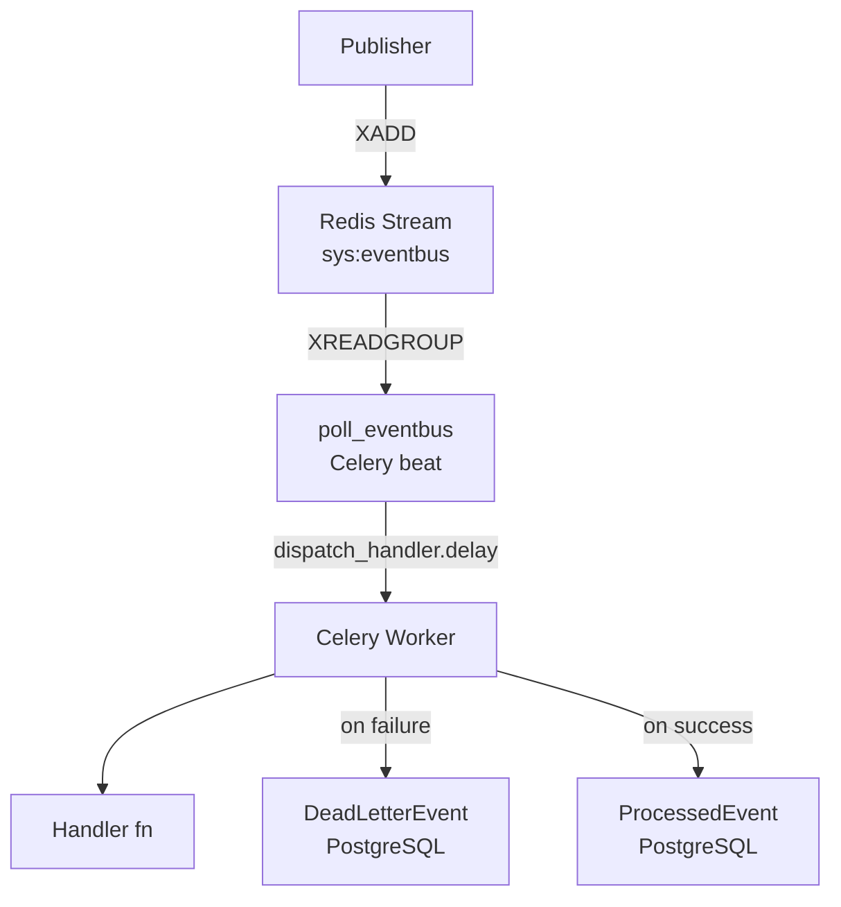

# sys_eventbus

Platform-wide asynchronous event bus. Provides publish/subscribe infrastructure for domain events across all apps — decoupling producers from consumers without direct imports between modules.

## Overview

Events are published to a Redis Stream (`sys:eventbus`). A Celery beat task polls the stream on a configurable interval and dispatches each message to all registered handlers as independent Celery tasks. Handlers register via the `@event_handler` decorator in their app's `event_handlers.py` file, which is auto-discovered at startup.



## Models

### ProcessedEvent

Records successfully processed stream message IDs for idempotency enforcement.

| Field | Type | Description |
|-------|------|-------------|
| `id` | UUID PK | Auto-generated primary key |
| `message_id` | VARCHAR unique | Redis Stream message ID (e.g. `1700000000000-0`) |
| `event_type` | VARCHAR | Dot-namespaced event type (e.g. `document.created`) |
| `processed_at` | DATETIME | Timestamp when the message was successfully processed |

### DeadLetterEvent

Records messages that exhausted all retry attempts. Never deleted by application logic — operators resolve entries manually.

| Field | Type | Description |
|-------|------|-------------|
| `id` | UUID PK | Auto-generated primary key |
| `message_id` | VARCHAR | Original Redis Stream message ID |
| `event_type` | VARCHAR | Dot-namespaced event type |
| `payload` | JSON | Full envelope fields preserved for inspection |
| `tenant_id` | UUID nullable | Tenant context — null for platform-level events |
| `error` | TEXT | Last exception message before exhausting retries |
| `retries` | INT | Number of dispatch attempts made |
| `failed_at` | DATETIME | Timestamp when the message was moved to the DLQ |

## Public API

### `publisher.publish_event_from_request()`

Convenience wrapper for use at view and serializer lifecycle boundaries. Extracts `tenant_id` and `actor_id` from the DRF request automatically:

```python
from apps.sys_eventbus.publisher import publish_event_from_request

publish_event_from_request(
    event_type="document.created",
    payload={"document_id": str(document.pk)},
    request=request,
)
```

### `publisher.publish()`

```python
from apps.sys_eventbus.publisher import publish

publish(
    event_type="document.created",
    payload={"document_id": str(document.pk)},
    tenant_id=str(tenant.pk),
    actor_id=str(request.user.pk),
)
```

Writes an `EventEnvelope` to the Redis Stream. Non-blocking — returns the Redis message ID. Raises `redis.RedisError` if the write fails. Use `publish_event_from_request()` at view boundaries; use `publish()` directly from tasks or non-request contexts.

### `registry.event_handler()`

```python
# apps/dms_documents/event_handlers.py
from apps.sys_eventbus.registry import event_handler
from apps.sys_eventbus.envelope import EventEnvelope


@event_handler("document.created")
def on_document_created(envelope: EventEnvelope) -> None:
    """Handle document.created events."""
    document_id = envelope.payload["document_id"]
    ...
```

Registers a callable as a handler for the given event type. Must be defined in `event_handlers.py` — auto-discovered at startup. The handler receives the full `EventEnvelope` and must return `None`. Exceptions propagate to the Celery retry mechanism.

### `envelope.EventEnvelope`

Standard envelope shape for all events on the bus:

| Field | Type | Description |
|-------|------|-------------|
| `id` | str | Auto-generated UUID |
| `type` | str | Dot-namespaced event type |
| `tenant_id` | str or None | Tenant boundary context |
| `actor_id` | str or None | Identity that triggered the event |
| `payload` | dict | Domain-specific event data |
| `published_at` | str | ISO 8601 UTC timestamp |

## Handler Convention

Each app that subscribes to events must define an `event_handlers.py` file at its root:

```
apps/
  dms_documents/
    event_handlers.py   # Handler registrations for this app
    models.py
    ...
```

`sys_eventbus` auto-imports every `event_handlers.py` from installed apps during `AppConfig.ready()`. No manual wiring is needed.

## Delivery Guarantee

At-most-once: messages are acknowledged (`XACK`) before handler execution. A handler that crashes mid-execution will not be re-delivered. Idempotency is enforced by `ProcessedEvent` — a handler that has already written a `ProcessedEvent` for a given `message_id` will skip execution on any subsequent call.

## Settings

Configured via `APP_SYS_EVENTBUS` in `config/settings/base.py`. All values are env-configurable.

| Key | Default | Description |
|-----|---------|-------------|
| `STREAM_NAME` | `sys:eventbus` | Redis Stream key |
| `DLQ_STREAM_NAME` | `sys:eventbus:dlq` | Dead letter stream key (reserved) |
| `CONSUMER_GROUP` | `sys_eventbus_group` | Redis consumer group name |
| `CONSUMER_NAME` | `sys_eventbus_consumer` | Redis consumer name |
| `POLL_INTERVAL_SECONDS` | `5` | Celery beat poll frequency |
| `MAX_RETRIES` | `3` | Handler retry attempts before DLQ |
| `BATCH_SIZE` | `100` | Messages read per poll cycle |

## Notes

- Do not call `publish()` from inside model methods, validators, or serializer `validate_*` methods. Call it from declared lifecycle boundaries (post-save hooks, view plugins, service functions) per ADR-008.
- `event_handlers.py` is the only auto-discovered filename. Any other filename requires manual import.
- `DeadLetterEvent` records are never purged automatically — operators must resolve them manually.
