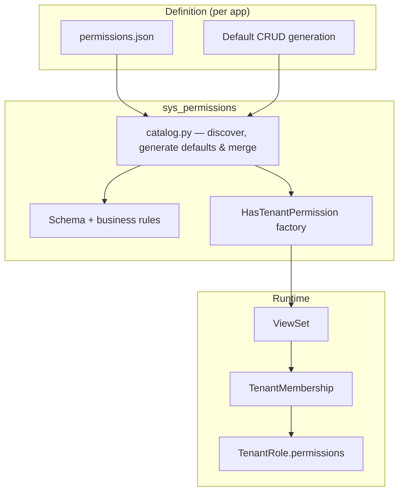
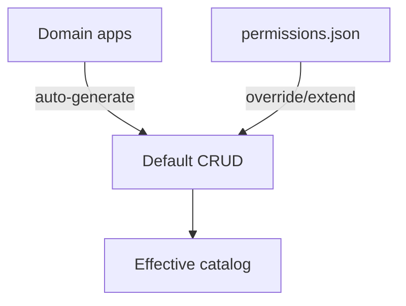
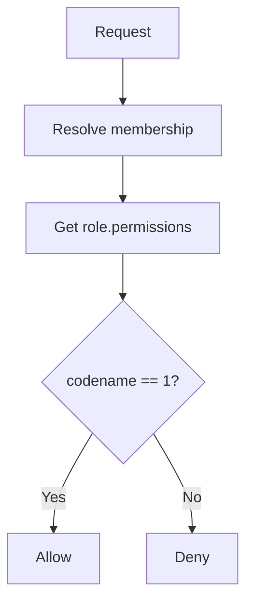

# sys_permissions

RBAC permission catalog system — declarative, config-driven permission enforcement for tenant-scoped operations.

## Purpose

Defines what actions exist in the system and enforces whether a user's role grants access to them. Permissions are declared in config files, merged with auto-generated defaults, and checked at runtime via DRF permission classes.

## How It Works

1. Every domain app gets default CRUD permissions (view, create, update, delete) derived from its app label
2. If `permissions.json` exists, it merges with the defaults (override, extend, or disable)
3. `catalog.py` discovers all catalogs, generates defaults, merges, and validates
4. `HasTenantPermission` generates permission classes that check codenames at runtime
5. On tenant creation, default roles are seeded with permissions from the merged catalog

## Key Concepts

- **Codenames** — formatted as `app.resource.action` (e.g., `tenants.tenants.view`, `users.members.invite`). Must be unique across all apps.
- **Access gate** — every domain app gets an `app.access` permission. If denied or missing, all actions within that app are blocked.
- **Storage** — `TenantRole.permissions` is a JSONField: `{"tenants.access": 1, "tenants.tenants.view": 1, "tenants.teams.create": 0}`. `1` = granted, `0` = denied, missing = denied.
- **Enforcement** — `is_admin` bypasses all checks. Otherwise: check `app.access` first, then `app.resource.action`.

## Contents

### Catalog (`catalog.py`)

The catalog is the source of truth for what permissions exist. It discovers all domain apps, generates default CRUD permissions for each, and merges any explicit `permissions.json` overrides on top.

### Permission Enforcement (`permissions.py`)

`HasTenantPermission(codename)` is a factory that returns a DRF permission class. At request time it resolves the user's tenant membership, finds their role, and checks whether the codename is granted.

`is_admin` on the membership short-circuits this flow and always allows.

### Schema Validation (`permissions_schema.json`)

JSON Schema that defines the allowed structure of `permissions.json` files. Enforces snake_case naming, required fields (`label`, `readonly`, `default_roles`), and valid role values (`0` or `1`).

### Command (`check_permission_catalog`)

Management command that loads all catalogs and runs the full validation pipeline (schema + business rules + cross-app uniqueness). Designed to run in CI alongside linting and type checking — catches catalog errors before they reach production.

## Further Reading

- [Access Control guideline](../../docs/guidelines/access-control.md) — full reference on catalog format, field definitions, validation rules, enforcement flow, default role seeding, and usage examples.
