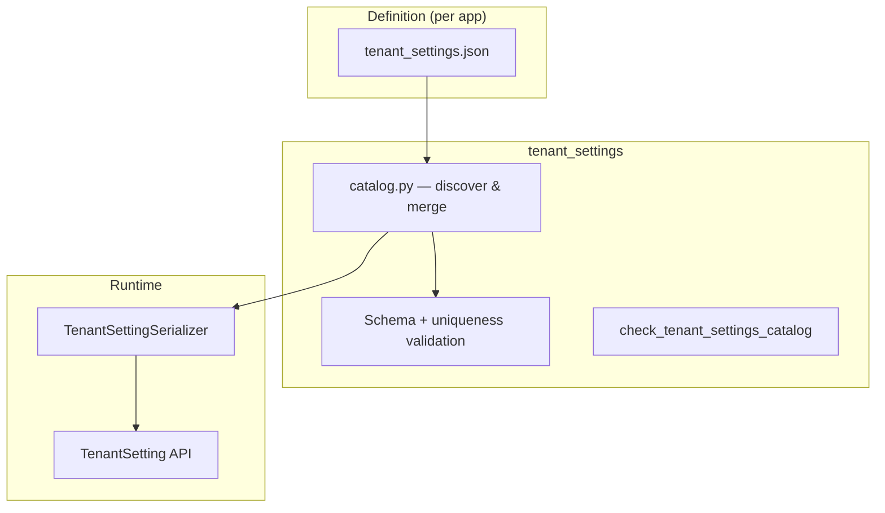

# tenant_settings

Tenant settings catalog engine — declarative, config-driven registry of valid tenant-configurable settings.

## Purpose

Defines what settings keys exist in the system, their types, defaults, and validation rules. Apps declare the settings they own via `tenant_settings.json` files. The catalog engine discovers, validates, and merges them into a single registry used at runtime by the `TenantSetting` API.

## How It Works



1. Each app declares its settings in a `tenant_settings.json` file
2. `catalog.py` discovers all catalogs and merges them into a flat registry
3. `TenantSettingSerializer` validates keys and values against the registry at runtime
4. Private settings are excluded from all API responses and write operations
5. `get_tenant_setting()` and `get_tenant_settings()` merge catalog defaults with DB records — the catalog is the source of truth for what keys exist

## Catalog Format (`tenant_settings.json`)

```json
{
  "settings": {
    "my_setting_key": {
      "label": "Human-readable label",
      "namespace": "group_name",
      "type": "string",
      "default": "default_value",
      "private": false,
      "schema": {
        "type": "string",
        "minLength": 1
      }
    }
  }
}
```

### Entry Fields

| Field | Required | Description |
|-------|----------|-------------|
| `label` | yes | `string` — Human-readable name |
| `namespace` | yes | `string` — Grouping key (snake_case) |
| `type` | yes | `string` — One of `string`, `integer`, `boolean`, `json` |
| `default` | yes | `string` — Default value stored as text |
| `private` | no | `boolean` — If `true`, excluded from API (default: `false`) |
| `schema` | no | `object` — JSON Schema object — value is coerced then validated against it |

### Key Naming

Keys must match `^[a-z][a-z0-9_]*$`. They must be unique across all apps.

### Value Storage and Coercion

All values are stored as `TextField` in the database. On write, the API coerces the submitted string to the declared `type` before JSON Schema validation:

| Type | Accepted input | Coerced to |
|------|---------------|------------|
| `string` | any string | string |
| `integer` | `"8"` | `8` |
| `boolean` | `"true"`, `"1"`, `"false"`, `"0"` | `True` / `False` |
| `json` | any valid JSON string | parsed Python object |

`json` type pairs with any `schema.type` — the shape of the parsed value is unconstrained at the catalog level and validated entirely by the `schema` field.

For `string`, `integer`, and `boolean` types, if a `schema` field is present its top-level `type` must match the declared `type`. Mismatches are caught by `check_tenant_settings_catalog`.

### Private Settings

Settings with `"private": true` are:
- Excluded from list and retrieve API responses
- Rejected on create/update via the API
- Still accessible internally via `get_tenant_setting()` / `get_tenant_settings()`

## Management Command

```bash
uv run python manage.py check_tenant_settings_catalog
```

Validates all `tenant_settings.json` files for schema compliance, key uniqueness, and `type`/`schema.type` consistency. Runs in CI.

## API Endpoints

Base path: `/api/tenant-settings/`

| Method | Path | Action | Description |
|--------|------|--------|-------------|
| GET | `/api/tenant-settings/` | list | List all non-private catalog keys, merged with saved DB values (unpaginated) |
| GET | `/api/tenant-settings/{key}/` | retrieve | Get setting by key — returns catalog default if no DB record exists |
| PATCH | `/api/tenant-settings/{key}/` | partial_update | Update setting value (tenant admin only) |

### Response fields

- **List:** `key`, `namespace`, `value`
- **Detail / Write:** `key`, `namespace`, `value`

### Permissions

| Action | Requirement |
|--------|-------------|
| Read (list, retrieve) | Authenticated user with active tenant membership |
| Write (partial_update) | Authenticated + tenant admin (`is_admin=True`) |


```python
from apps.tenants.utils import get_tenant_setting, get_tenant_settings

# Returns saved value or catalog default — never None for a known key
value = get_tenant_setting(tenant_id, "password_policy")

# Returns all settings matching prefix, filling in catalog defaults for missing keys
settings = get_tenant_settings(tenant_id, prefix="password")
```
