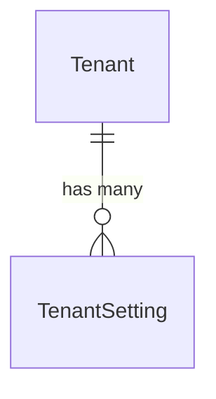

# Tenants

Top-level organizational unit for the platform. All domain resources are scoped to a tenant.

## Models

### Tenant

| Field | Type | Description |
|-------|------|-------------|
| id | UUID | Primary key |
| name | VARCHAR | Display name |
| code | VARCHAR (unique) | Internal identifier for programmatic reference |
| is_active | BOOLEAN | Whether the tenant is currently active |
| details | JSON | General tenant metadata (description, industry, contact info) |
| created_at | DATETIME | Auto-set on creation |
| updated_at | DATETIME | Auto-set on save |

### TenantSetting

Key-value store for configurable tenant behavior.

| Field | Type | Description |
|-------|------|-------------|
| id | UUID | Primary key |
| tenant_id | FK → Tenant | Owning tenant |
| key | VARCHAR | Setting identifier (e.g., `password_min_length`) |
| value | TEXT | The setting value stored as text |
| created_at | DATETIME | Auto-set on creation |
| updated_at | DATETIME | Auto-set on save |

**Constraints:**

| Constraint | Fields |
|-----------|--------|
| unique_setting_per_tenant | (tenant, key) |

## Relationships

## Design Decisions

- Tenants are the isolation boundary — all domain data belongs to exactly one tenant.
- `details` stores general metadata about the tenant (not behavioral configuration).
- `TenantSetting` stores configurable behavior (password policies, feature flags, rate limits) as queryable key-value rows.
- Multi-tenancy uses a shared database with FK filtering, not schema-per-tenant.
