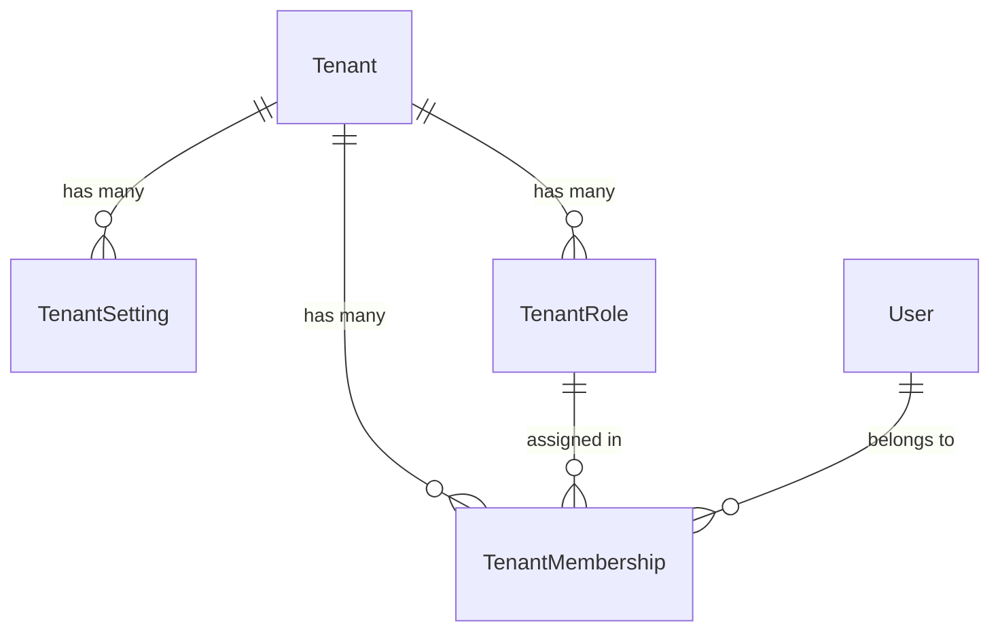

# Tenants

Top-level organizational unit for the platform. All domain resources are scoped to a tenant.

## Models

### Tenant

| Field | Type | Description |
|-------|------|-------------|
| id | UUID | Primary key |
| name | VARCHAR | Display name |
| code | VARCHAR (unique) | Internal identifier for programmatic reference |
| is_active | BOOLEAN | Whether the tenant is currently active |
| details | JSON | General tenant metadata (description, industry, contact info) |
| created_at | DATETIME | Auto-set on creation |
| updated_at | DATETIME | Auto-set on save |

### TenantSetting

Key-value store for configurable tenant behavior.

| Field | Type | Description |
|-------|------|-------------|
| id | UUID | Primary key |
| tenant_id | FK → Tenant | Owning tenant |
| key | VARCHAR | Setting identifier |
| value | TEXT | The setting value stored as text |
| created_at | DATETIME | Auto-set on creation |
| updated_at | DATETIME | Auto-set on save |

**Constraints:**

| Constraint | Fields |
|-----------|--------|
| unique_setting_per_tenant | (tenant, key) |

## Relationships



`TenantRole` is defined in `apps.iam_roles.models` and `TenantMembership` in `apps.iam_users.models`, both scoped to a tenant.

## API Endpoints

Base path: `/api/tenants/`

| Method | Path | Action | Description |
|--------|------|--------|-------------|
| GET | `/api/tenants/` | list | List tenants the user has access to |
| POST | `/api/tenants/` | create | Create a new tenant |
| GET | `/api/tenants/{id}/` | retrieve | Get tenant detail |
| PUT | `/api/tenants/{id}/` | update | Full update |
| PATCH | `/api/tenants/{id}/` | partial_update | Partial update |
| DELETE | `/api/tenants/{id}/` | destroy | Delete tenant |

### Response fields

- **List:** `id`, `name`, `code`, `is_active`
- **Detail / Write:** `id`, `name`, `code`, `is_active`, `details`, `created_at`, `updated_at`

## Permissions

| Action | Requirement |
|--------|-------------|
| Read (list, retrieve) | Authenticated user; non-superusers only see tenants they have an active membership in |
| Write (create, update, delete) | Authenticated + superuser |

## Validation Rules

| Field | Constraint |
|-------|------------|
| name | Required, max 255 characters |
| code | Required, max 100 characters, unique across all tenants |
| is_active | Defaults to `true` |
| details | Defaults to `{}`, accepts any valid JSON object |

## Soft-Delete

`Tenant` does **not** use soft-delete. It inherits from `models.Model` directly (not from `BaseModel`/`SoftDeletableModel`). Deleting a tenant is a hard delete with cascading removal of related settings, roles, and memberships.

## Utilities (`utils.py`)

### `get_tenant_id(request)`

Extract `tenant_id` from JWT claims.

```python
from apps.tenants.utils import get_tenant_id

tenant_id = get_tenant_id(request)  # "a1b2c3d4-..."
```

### `get_tenant_setting(tenant_id, key, default=None)`

Fetch a single `TenantSetting` value.

```python
from apps.tenants.utils import get_tenant_setting

min_length = get_tenant_setting(tenant_id, "password_min_length", default="8")
```

### `get_tenant_settings(tenant_id, prefix="")`

Fetch all settings for a tenant, optionally filtered by key prefix.

```python
from apps.tenants.utils import get_tenant_settings

# All settings
all_settings = get_tenant_settings(tenant_id)
# {"password_min_length": "8", "password_require_uppercase": "true", "feature_dark_mode": "enabled"}

# Filtered by prefix
password_settings = get_tenant_settings(tenant_id, prefix="password_")
# {"password_min_length": "8", "password_require_uppercase": "true"}
```

## Tenant Injection Plugin (`plugins.py`)

Global serializer plugin that enforces ADR-004 (Data Boundary Isolation) and ADR-005 (Explicit Over Implicit Failure) for write operations on tenant-scoped models.

Registered globally via `settings.SERIALIZER_PLUGINS`. Applies automatically to any serializer whose model has a `tenant_id` field.

### Behavior

| Hook | Action |
|------|--------|
| `on_pre_create` | Injects `tenant_id` from JWT into `validated_data`. Raises `PermissionDeniedError` if no tenant claim is present. |
| `on_pre_update` | Strips `tenant_id` from `validated_data` if it matches the instance. Raises `PermissionDeniedError` if client attempts tenant reassignment. |

Models without a `tenant_id` field are skipped (no-op).

### Opting out

```python
from apps.tenants.plugins import TenantInjectionSerializerPlugin

class PlatformWideSerializer(BaseSerializer):
    class Meta:
        model = PlatformModel
        fields = ["id", "name"]
        extensions_exclude = [TenantInjectionSerializerPlugin]
```

## Tenant Filter Backend (`filters.py`)

Automatic queryset-level tenant isolation (ADR-003, ADR-004). Registered globally via `DEFAULT_FILTER_BACKENDS` in DRF settings.

### Behavior

| Scenario | Result |
|----------|--------|
| Model has `tenant_id` field + JWT has `tenant_id` claim | Queryset filtered to that tenant |
| Model has `tenant_id` field + no `tenant_id` claim | Empty queryset (denial) |
| Model has no `tenant_id` field | No-op |
| View sets `tenant_scoping = False` | No-op (explicit bypass) |

### Opting out

Set `tenant_scoping = False` on any viewset that needs cross-tenant access:

```python
class TenantViewSet(BaseViewSet):
    tenant_scoping = False
```

This is required for platform-level models (like `Tenant` itself) and superuser admin views.

