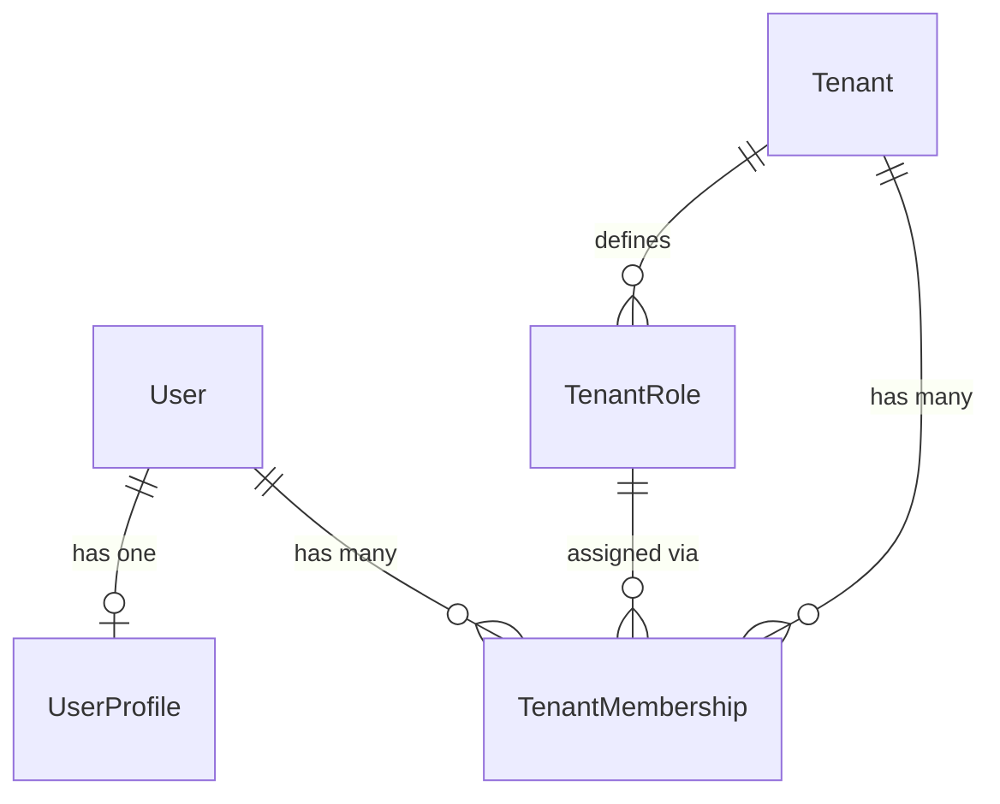

# Users

Platform-level user identity, profiles, and tenant membership.

## Relationships

## Models

### User

Authentication-critical fields only. Uses email as the login credential. Inherits from `AbstractBaseUser` and Django's `PermissionsMixin`, which provides `is_superuser`, `groups`, and `user_permissions` fields.

| Field | Type | Description |
|-------|------|-------------|
| id | UUID | Primary key |
| email | VARCHAR (unique) | Login credential |
| first_name | VARCHAR | Given name |
| last_name | VARCHAR | Family name |
| password | VARCHAR | Hashed password |
| is_active | BOOLEAN | Whether the user can log in |
| is_superuser | BOOLEAN | Platform-level admin flag |
| created_at | DATETIME | Auto-set on creation |
| updated_at | DATETIME | Auto-set on save |

### UserProfile

One-to-one extension for non-auth attributes.

| Field | Type | Description |
|-------|------|-------------|
| id | UUID | Primary key |
| user_id | FK → User | Owning user |
| personal_info | JSON | Flexible store for phone, avatar, bio, etc. |

### TenantRole

Tenant-specific role definitions.

| Field | Type | Description |
|-------|------|-------------|
| id | UUID | Primary key |
| tenant_id | FK → Tenant | Owning tenant |
| name | VARCHAR | Role name (e.g., Owner, Admin, Member) |
| kind | VARCHAR | Internal semantic type (owner, admin, member, viewer, custom) |
| description | TEXT | What this role grants |
| permissions | JSON | Dict mapping permission codenames to grant values |
| created_at | DATETIME | Auto-set on creation |

### TenantMembership

Links a user to a tenant with a role.

| Field | Type | Description |
|-------|------|-------------|
| id | UUID | Primary key |
| user_id | FK → User | The member |
| tenant_id | FK → Tenant | The tenant |
| role_id | FK → TenantRole | Assigned role |
| is_admin | BOOLEAN | Fast-path admin check |
| is_active | BOOLEAN | Whether membership is active |
| joined_at | DATETIME | Auto-set on creation |

## Constraints

| Constraint | Fields | Effect |
|------------|--------|--------|
| `unique_role_per_tenant` | (tenant, name) on TenantRole | No duplicate role names within a tenant |
| `unique_user_tenant` | (user, tenant) on TenantMembership | A user can only have one membership per tenant |
| PROTECT on TenantMembership.role | role_id FK | Cannot delete a TenantRole while memberships reference it |

## UserManager

Custom manager on `User` with two methods:

- `create_user(email, password, **extra_fields)` — normalizes email, hashes password, saves.
- `create_superuser(email, password, **extra_fields)` — sets `is_superuser=True`, then delegates to `create_user`.

## Soft-Delete

Although the platform default is soft-delete via `deleted_at`/`deleted_by`, this module does not implement it yet. All deletions are currently hard-deletes.

## Design Decisions

- `User` is platform-level — not scoped to any tenant. A user can belong to multiple tenants.
- Tenant association is modeled via `TenantMembership` (not a direct FK on User).
- Each membership has exactly one `TenantRole`. Roles are defined per tenant independently.
- `is_admin` on membership avoids querying role permissions for the most common privilege check.
- `UserProfile` separates mutable personal data from the auth table to reduce migration churn.
- Deleting a `TenantRole` that has active memberships is blocked (`PROTECT`) to prevent orphaned references.
- `kind` is an internal, immutable field that identifies the role's semantic type regardless of display name. Business rules (e.g., viewer can't have write permissions) check `kind`, not `name`.
