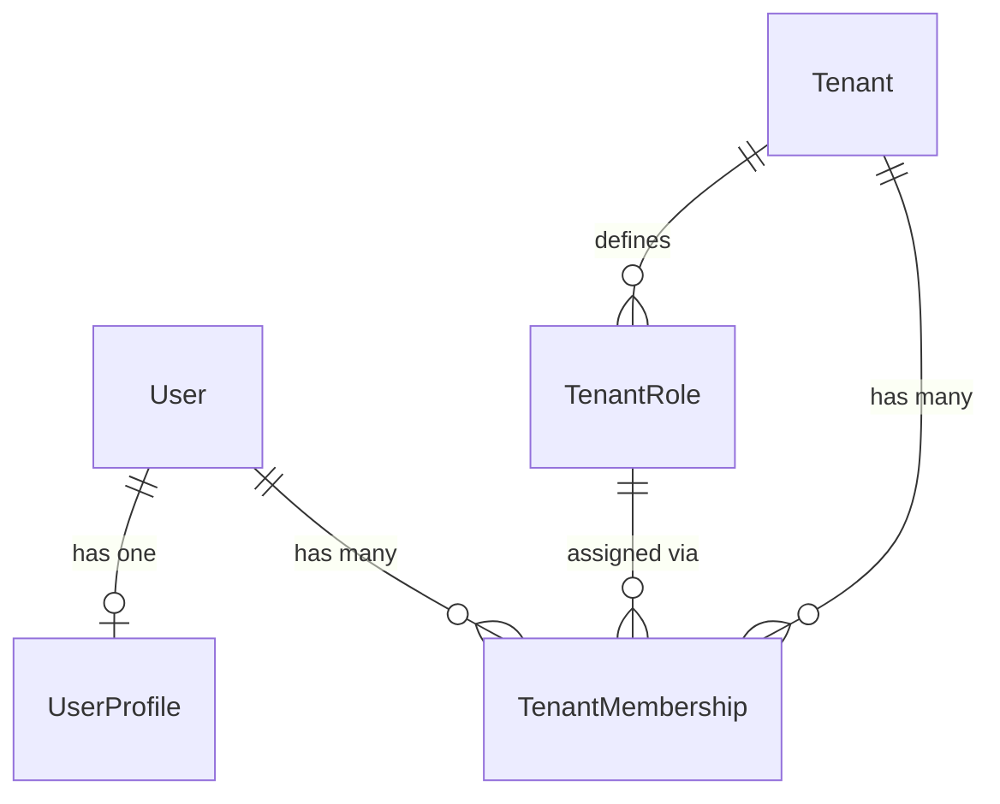

# Users

Platform-level user identity, profiles, and tenant membership.

## Relationships

## Models

### User

Authentication-critical fields only. Uses email as the login credential.

| Field | Type | Description |
|-------|------|-------------|
| id | UUID | Primary key |
| email | VARCHAR (unique) | Login credential |
| first_name | VARCHAR | Given name |
| last_name | VARCHAR | Family name |
| password | VARCHAR | Hashed password |
| is_active | BOOLEAN | Whether the user can log in |
| is_superuser | BOOLEAN | Platform-level admin flag |
| created_at | DATETIME | Auto-set on creation |
| updated_at | DATETIME | Auto-set on save |

### UserProfile

One-to-one extension for non-auth attributes.

| Field | Type | Description |
|-------|------|-------------|
| id | UUID | Primary key |
| user_id | FK → User | Owning user |
| personal_info | JSON | Flexible store for phone, avatar, bio, etc. |

### TenantRole

Tenant-specific role definitions.

| Field | Type | Description |
|-------|------|-------------|
| id | UUID | Primary key |
| tenant_id | FK → Tenant | Owning tenant |
| name | VARCHAR | Role name (e.g., Owner, Admin, Member) |
| description | TEXT | What this role grants |
| created_at | DATETIME | Auto-set on creation |

### TenantMembership

Links a user to a tenant with a role.

| Field | Type | Description |
|-------|------|-------------|
| id | UUID | Primary key |
| user_id | FK → User | The member |
| tenant_id | FK → Tenant | The tenant |
| role_id | FK → TenantRole | Assigned role |
| is_admin | BOOLEAN | Fast-path admin check |
| is_active | BOOLEAN | Whether membership is active |
| joined_at | DATETIME | Auto-set on creation |

## Design Decisions

- `User` is platform-level — not scoped to any tenant. A user can belong to multiple tenants.
- Tenant association is modeled via `TenantMembership` (not a direct FK on User).
- Each membership has exactly one `TenantRole`. Roles are defined per tenant independently.
- `is_admin` on membership avoids querying role permissions for the most common privilege check.
- `UserProfile` separates mutable personal data from the auth table to reduce migration churn.
