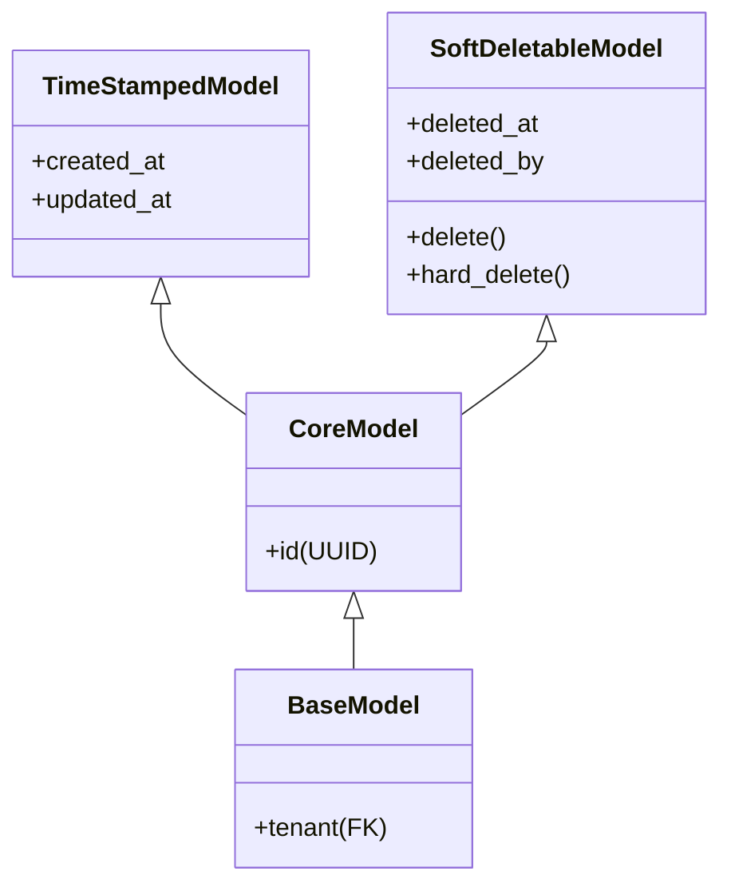
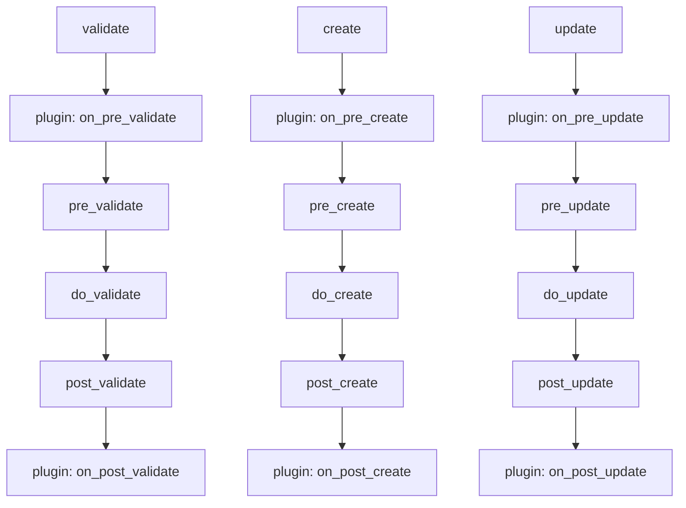

# Core

Framework foundations shared by all domain apps. Provides base classes, utilities, and cross-cutting infrastructure.

## Model Inheritance

## Serializer Lifecycle

## Modules

### base/

Abstract base classes for models, serializers, and views.

- `TimeStampedModel` — `created_at`, `updated_at`
- `SoftDeletableModel` — `deleted_at`, `deleted_by`, soft-delete logic
- `CoreModel` — UUID PK + timestamps + soft-delete (platform-level entities)
- `BaseModel` — CoreModel + tenant FK (tenant-scoped entities)
- `BaseSerializer` — plugin system + template method lifecycle (`pre_create`/`do_create`/`post_create`, same for update and validate)
- `BaseViewSet` — per-action serializer/queryset dispatch, lifecycle hooks, `tenant_scoping` attribute for opt-out of automatic tenant filtering

### exceptions/

Centralized exception hierarchy and error handling.

- `APIException` — base class for all custom exceptions (extends DRF's `APIException`)
- `ValidationError` (400)
- `AuthenticationError` (401)
- `PermissionDeniedError` (403)
- `NotFoundError` (404)
- `ThrottlingError` (429)
- `exception_handler` — custom handler that wraps errors in `{status, code, data}`

### renderers/

Custom DRF response rendering.

- `APIRenderer` — wraps successful responses in `{status: "OK", data: ...}`

### filters/

Shared filter backends and filtersets.

- `SoftDeleteFilterBackend` — DRF filter backend that excludes soft-deleted records by default (applied globally via `DEFAULT_FILTER_BACKENDS`)
- `BaseFilterSet` — common filters (id, created_at, updated_at)
- `SoftDeleteFilter` — django-filters FilterSet for toggling inclusion of soft-deleted records

### pagination/

Pagination strategies and page metadata.

- `CustomPagination` — enriched response with page metadata (default: 10 per page)
- `StandardResultsSetPagination` — standard response (default: 20 per page)
- `LargeResultsSetPagination` — optimized for large datasets (default: 100 per page)
- `OptimizedPagination` — lightweight response with minimal overhead (default: 50 per page)

### permissions/

Permission classes for access control.

- `BasePermission` — ownership and tenant ownership checks
- `IsOwnerOrReadOnly` — write access restricted to object owner
- `IsTenantOwner` — access restricted to tenant owners
- `IsTenantAdmin` — access restricted to tenant admins
- `IsTeamMember` — access restricted to team members
- `IsSuperUser` — access restricted to platform superusers

### utils/

General-purpose utility functions.

- `formatting` — string and data formatting helpers (dates, numbers, display values)
- `request` — HTTP request inspection and data extraction
- `security` — cryptographic operations, secrets handling, and data protection
- `validators` — reusable field-level and cross-field validation logic
