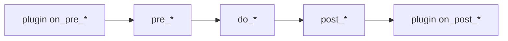

# Base

Abstract base classes that all domain models, serializers, and viewsets inherit from. Provides UUID primary keys, timestamps, soft-delete, a plugin-based serializer lifecycle, and template-method hooks at the view layer.

## API

### Models

- `TimeStampedModel` — abstract model with `created_at` and `updated_at` fields
- `SoftDeletableModel` — abstract model with `deleted_at`/`deleted_by` and soft-delete override
- `CoreModel` — UUID pk + timestamps + soft-delete for platform-level (non-tenant) models
- `BaseModel` — extends `CoreModel` with a tenant FK for tenant-scoped resources

Use `CoreModel` for platform-wide entities that exist outside tenant scope (e.g. `Tenant` itself). Use `BaseModel` for everything else.

### Serializers

- `SerializerPlugin` — base class for stateless serializer plugins (hooks: `on_pre_create`, `on_post_create`, `on_pre_update`, `on_post_update`, `on_pre_validate`, `on_post_validate`)
- `BaseSerializer` — `ModelSerializer` with plugin dispatch and `pre_*/do_*/post_*` template methods for create, update, and validate
- `SoftDeletableSerializerMixin` — adds `is_deleted` flag and hides delete fields on active records
- `DefaultModelSerializer` — combines `SoftDeletableSerializerMixin` + `BaseSerializer`; use as the default parent for concrete serializers

### Views

- `SoftDeleteFilterBackend` — excludes soft-deleted objects unless `?include_deleted=true`
- `BaseViewSet` — `ModelViewSet` with per-action serializer/queryset dispatch, data cleaning hooks, and `pre_*/post_*` lifecycle methods for create, update, and destroy
- `clean_create_data(data)` — view-level hook to transform raw request data before serializer instantiation on create
- `clean_update_data(data)` — view-level hook to transform raw request data before serializer instantiation on update

## Lifecycle Execution Order

Plugins wrap around template methods. The same pattern applies to create, update, and validate.



## Soft-Delete Behavior

- Calling `delete()` sets `deleted_at` to now; it does not remove the row
- `hard_delete()` performs actual database deletion
- `get_active()` and `get_deleted()` are class-level convenience querysets
- Soft-delete does not cascade — related objects are not automatically soft-deleted

## Usage

```python
from django.db import models

from core.base.models import BaseModel
from core.base.serializers import DefaultModelSerializer, SerializerPlugin
from core.base.views import BaseViewSet


# --- Model ---

class Project(BaseModel):
    name = models.CharField(max_length=255)

    class Meta:
        db_table = "projects"


# --- Plugin ---

class AuditLogPlugin(SerializerPlugin):
    def on_post_create(self, serializer, instance):
        # Log creation event
        pass


# --- Serializer ---

class ProjectSerializer(DefaultModelSerializer):
    class Meta(DefaultModelSerializer.Meta):
        model = Project
        fields = ["id", "name", "created_at", "updated_at"]
        extensions = [AuditLogPlugin]


# --- Per-action serializer dispatch ---

class ProjectListSerializer(DefaultModelSerializer):
    class Meta(DefaultModelSerializer.Meta):
        model = Project
        fields = ["id", "name"]


# --- ViewSet ---

class ProjectViewSet(BaseViewSet):
    queryset = Project.objects.all()
    serializer_class = ProjectSerializer
    serializer_classes = {"list": ProjectListSerializer}
```
