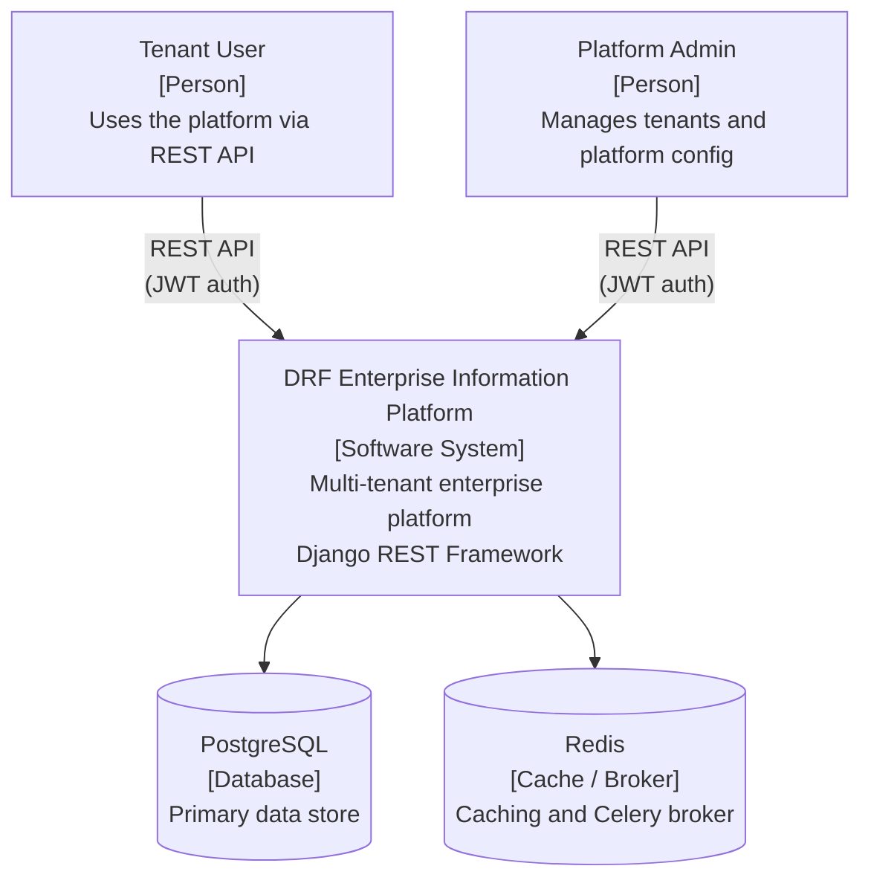

# C4 Level 0 — System Context

```mermaid
flowchart TB
    User["Tenant User\n[Person]\nUses the platform via REST API"]
    Admin["Platform Admin\n[Person]\nManages tenants and platform config"]

    System["DRF Enterprise Information Platform\n[Software System]\nMulti-tenant enterprise platform\nDjango REST Framework"]

    PostgreSQL[("PostgreSQL\n[Database]\nPrimary data store")]
    Redis[("Redis\n[Cache / Broker]\nCaching and Celery broker")]

    User -->|"REST API\n(JWT auth)"| System
    Admin -->|"REST API\n(JWT auth)"| System
    System --> PostgreSQL
    System --> Redis
```
