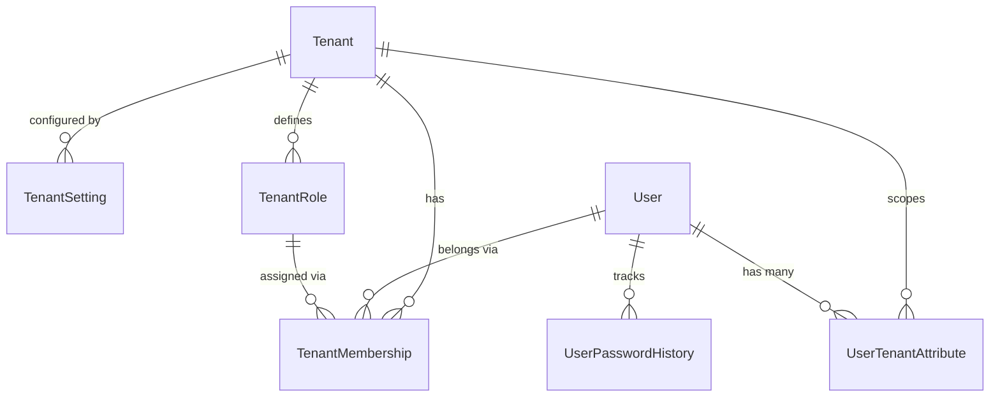
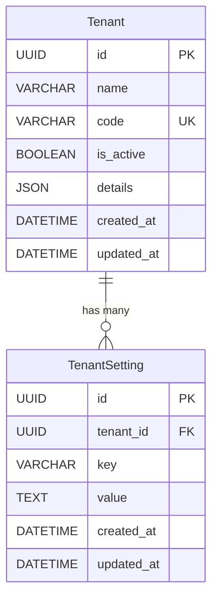
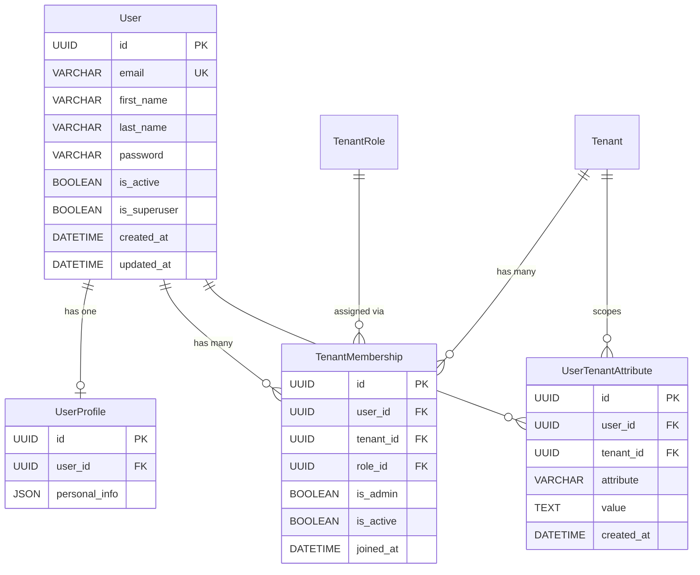
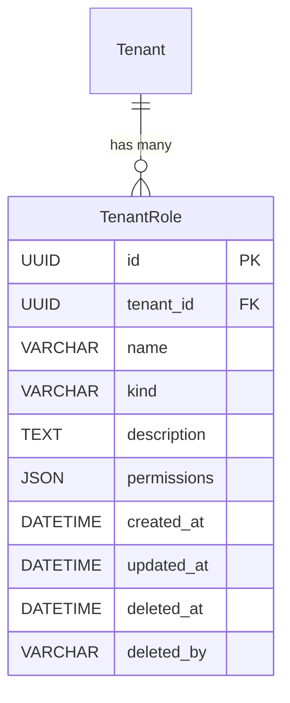
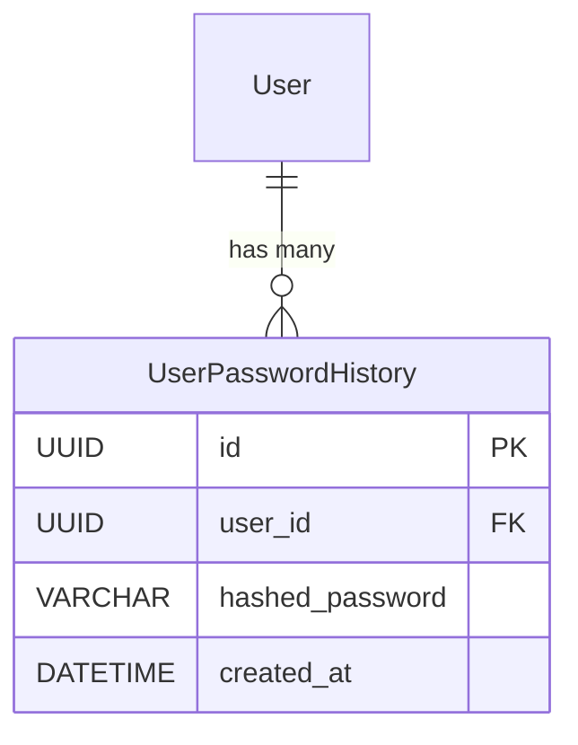

# Data Model

This document describes the platform's data model organized by domain. Each section includes the schema, relationships, constraints, and design notes.

## Overview



---

## Base Layer

All models inherit from a composable abstract hierarchy:

```
UUIDPrimaryKeyModel (abstract)
    └── id (UUID, PK)

TimeStampedModel (abstract)
    ├── created_at
    └── updated_at

SoftDeletableModel (abstract)
    ├── deleted_at
    └── deleted_by

BaseModel (abstract) ← UUIDPrimaryKeyModel + TimeStampedModel + SoftDeletableModel

TenantAwareModel (abstract) ← BaseModel
    └── tenant (FK → Tenant)
```

`UUIDPrimaryKeyModel` is listed first in the MRO so that `id` appears as the first field in generated migrations.

Apps inherit from the appropriate level:
- `BaseModel` — platform-level entities (no tenant scope)
- `TenantAwareModel` — tenant-scoped domain entities (inherits `BaseModel` + adds tenant FK + `TenantManager`)

Models that define their own schema but have a `tenant` FK also use `TenantManager` directly for ORM-level isolation (e.g., `Team`, `TenantSetting`, `TenantRole`, `TenantMembership`).

---

## Tenants



**Constraints:**

| Model | Constraint | Fields |
|-------|-----------|--------|
| TenantSetting | unique_setting_per_tenant | (tenant, key) |

**Design decisions:**
- `details` stores general tenant metadata (description, industry, contact info) — not behavioral configuration.
- `TenantSetting` stores configurable behavior as queryable key-value rows (password policies, feature flags, rate limits).
- Unique constraint on (tenant, key) ensures no duplicate settings per tenant.

---

## Users (iam_users)



**Tables:** `iam_users`, `iam_users_profiles`, `iam_users_memberships`, `iam_users_tenant_attributes`

**Constraints:**

| Model | Constraint | Fields |
|-------|-----------|--------|
| TenantMembership | unique_user_tenant | (user, tenant) |
| UserTenantAttribute | unique_user_tenant_attribute | (user, tenant, attribute) |

**Design decisions:**
- `User` exists at the platform level — not scoped to any tenant. A user can belong to multiple tenants.
- Tenant association is modeled through `TenantMembership`, which assigns exactly one `TenantRole` per membership.
- `UserProfile` separates mutable personal data from the auth-critical `User` table.
- `is_admin` on `TenantMembership` provides a fast-path check — admins bypass permission checks entirely.
- `UserTenantAttribute` stores arbitrary per-user, per-tenant state as text key-value rows. Delete the row to clear an attribute.

---

## Roles (iam_roles)



**Table:** `iam_roles`

**Constraints:**

| Model | Constraint | Fields |
|-------|-----------|--------|
| TenantRole | unique_role_per_tenant | (tenant, name) |

**Design decisions:**
- `TenantRole` inherits from `TenantAwareModel` (soft-delete, tenant-scoped manager).
- Defined per tenant — each tenant manages its own role definitions independently.
- `kind` is an internal, immutable semantic type (owner, admin, member, viewer, custom). Business rules check `kind`, not `name`, so users can rename roles freely.
- `permissions` stores a dict mapping codenames to grant values (e.g., `{"tenants.tenants.view": 1, "tenants.teams.create": 0}`). Codenames are defined in app-level `permissions.json` catalogs. Missing codename = denied.
- Default roles (Owner, Admin, Member, Viewer) are seeded automatically when a tenant is created.

---

## Authentication (iam_auth)



**Table:** `iam_auth_password_history`

**Design decisions:**
- Stores the hashed password (never plaintext) each time a user changes their password.
- On password change, the current hash is saved to history before the new password is set.
- Validation rejects any new password that matches the last 5 entries (configurable via `PASSWORD_HISTORY_LIMIT`).


