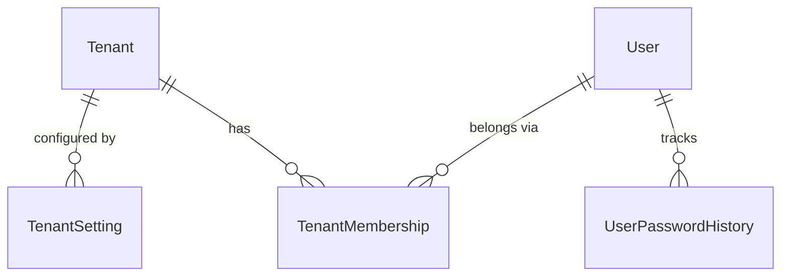
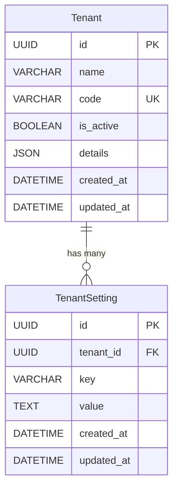
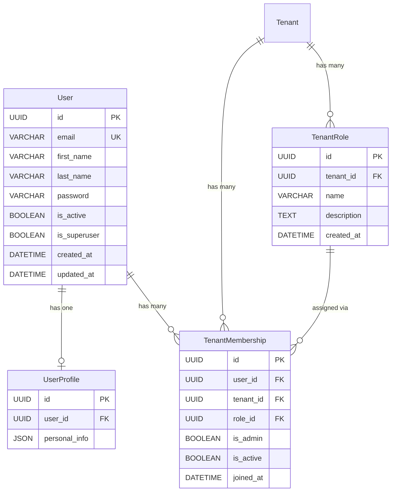
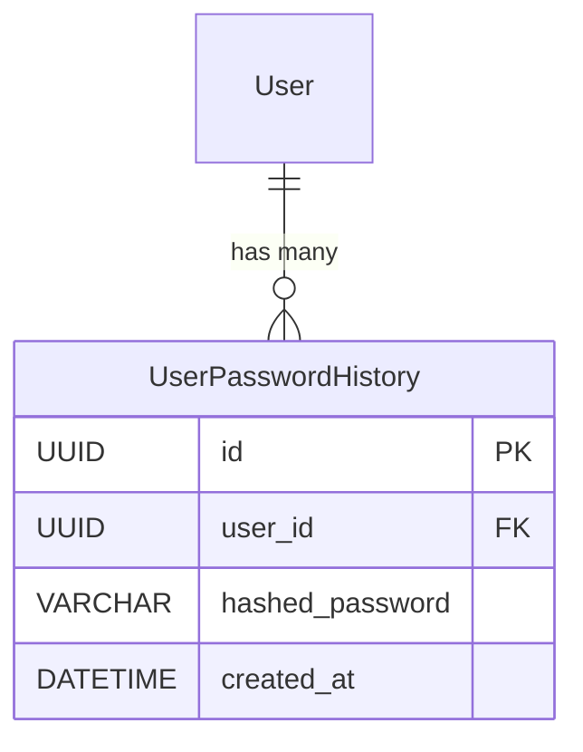

# Data Model

This document describes the platform's data model organized by domain. Each section includes the schema, relationships, constraints, and design notes.

## Overview



---

## Base Layer

All models inherit from a composable abstract hierarchy:

```
TimeStampedModel (abstract)
    ├── created_at
    └── updated_at

SoftDeletableModel (abstract)
    ├── deleted_at
    └── deleted_by

BaseModel (abstract) ← TimeStampedModel + SoftDeletableModel
    └── id (UUID, PK)

TenantAwareModel (abstract) ← BaseModel
    └── tenant (FK → Tenant)
```

Apps inherit from the appropriate level:
- `BaseModel` — platform-level entities (no tenant scope)
- `TenantAwareModel` — tenant-scoped domain entities (inherits `BaseModel` + adds tenant FK + `TenantManager`)

Models that define their own schema but have a `tenant` FK also use `TenantManager` directly for ORM-level isolation (e.g., `Team`, `TenantSetting`, `TenantRole`, `TenantMembership`).

---

## Tenants



**Constraints:**

| Model | Constraint | Fields |
|-------|-----------|--------|
| TenantSetting | unique_setting_per_tenant | (tenant, key) |

**Design decisions:**
- `details` stores general tenant metadata (description, industry, contact info) — not behavioral configuration.
- `TenantSetting` stores configurable behavior as queryable key-value rows (password policies, feature flags, rate limits).
- Unique constraint on (tenant, key) ensures no duplicate settings per tenant.

---

## Users



**Constraints:**

| Model | Constraint | Fields |
|-------|-----------|--------|
| TenantRole | unique_role_per_tenant | (tenant, name) |
| TenantMembership | unique_user_tenant | (user, tenant) |

**Design decisions:**
- `User` exists at the platform level — not scoped to any tenant. A user can belong to multiple tenants.
- Tenant association is modeled through `TenantMembership`, which assigns exactly one `TenantRole` per membership.
- `UserProfile` separates mutable personal data from the auth-critical `User` table.
- `TenantRole` is defined per tenant — each tenant manages its own role definitions independently.
- `is_admin` on `TenantMembership` provides a fast-path check without querying the role's permissions.

---

## Authentication



**Design decisions:**
- Stores the hashed password (never plaintext) each time a user changes their password.
- On password change, the current hash is saved to history before the new password is set.
- Validation rejects any new password that matches the last 5 entries (configurable via `PASSWORD_HISTORY_LIMIT`).


