# Data Model

This document describes the platform's data model organized by domain. Each section includes the schema, relationships, constraints, and design notes.

## Overview

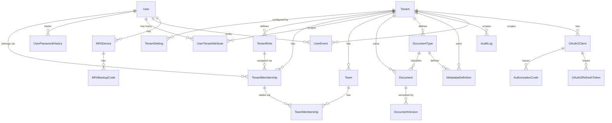
```mermaid
erDiagram
    Tenant ||--o{ TenantSetting : "configured by"
    Tenant ||--o{ TenantRole : "defines"
    Tenant ||--o{ TenantMembership : "has"
    Tenant ||--o{ UserTenantAttribute : "scopes"
    Tenant ||--o{ Team : "has"
    Tenant ||--o{ Document : "owns"
    Tenant ||--o{ DocumentType : "defines"
    Tenant ||--o{ MetadataDefinition : "owns"
    Tenant ||--o{ AuditLog : "scopes"
    Tenant ||--o{ UserEvent : "scopes"
    User ||--o{ TenantMembership : "belongs via"
    User ||--o{ UserPasswordHistory : "tracks"
    User ||--o{ UserTenantAttribute : "has many"
    User ||--o{ UserEvent : "emits"
    User ||--o{ MFADevice : "has"
    MFADevice ||--o{ MFABackupCode : "has"
    TenantRole ||--o{ TenantMembership : "assigned via"
    TenantMembership ||--o{ TeamMembership : "added via"
    Team ||--o{ TeamMembership : "has"
    DocumentType ||--o{ Document : "classifies"
    DocumentType ||--o{ MetadataDefinition : "defines"
    Document ||--o{ DocumentVersion : "versioned by"
    Tenant ||--o{ OAuth2Client : "has"
    OAuth2Client ||--o{ AuthorizationCode : "issues"
    OAuth2Client ||--o{ OAuth2RefreshToken : "issues"
```

---

## Base Layer

All models inherit from a composable abstract hierarchy:

```
UUIDPrimaryKeyModel (abstract)
    └── id (UUID, PK)

TimeStampedModel (abstract)
    ├── created_at
    └── updated_at

SoftDeletableModel (abstract)
    ├── deleted_at
    └── deleted_by

BaseModel (abstract) ← UUIDPrimaryKeyModel + TimeStampedModel + SoftDeletableModel

TenantAwareModel (abstract) ← BaseModel
    └── tenant (FK → Tenant)
```

`UUIDPrimaryKeyModel` is listed first in the MRO so that `id` appears as the first field in generated migrations.

Apps inherit from the appropriate level:
- `BaseModel` — platform-level entities (no tenant scope)
- `TenantAwareModel` — tenant-scoped domain entities (inherits `BaseModel` + adds tenant FK + `TenantManager`)

Models that define their own schema but have a `tenant` FK also use `TenantManager` directly for ORM-level isolation (e.g., `Team`, `TenantSetting`, `TenantRole`, `TenantMembership`).

---

## Conventions

### Table Names

Every model sets `db_table` explicitly — Django's default naming is never used.

Pattern: `{app_label}_{entity}` using snake_case.

| Example | App | Entity |
|---------|-----|--------|
| `iam_users` | `iam_users` | users |
| `iam_roles` | `iam_roles` | roles |
| `sys_audit_log` | `sys_audit` | audit log |
| `dms_documents` | `dms_documents` | documents |

### Primary Keys

All models use `UUIDField(primary_key=True, default=uuid.uuid4, editable=False)` — including models that do not inherit from `BaseModel`. Auto-increment integer PKs are not used.

### Constraint Names

Pattern: `unique_{description}` using snake_case.

Examples: `unique_user_tenant`, `unique_role_per_tenant`, `unique_member_per_team`.

### Index Names

Pattern: `idx_{table_short}_{fields}` using snake_case. Maximum 30 characters (PostgreSQL identifier limit).

Examples: `idx_audit_tenant_time`, `idx_oauth_rt_user_revoked`, `idx_auth_attempt_email_time`.

### FK vs. Plain UUIDField

Use a plain `UUIDField` instead of a FK when the referenced entity may be deleted and the record must survive:

- `AuthorizationCode.user_id` — authorization codes outlive users
- `OAuth2RefreshToken.user_id` — refresh tokens outlive users
- `DeadLetterEvent.tenant_id` — DLQ entries are never deleted by application logic

Use a proper FK when referential integrity must be enforced.

### `on_delete` Choices

| Strategy | When to use |
|----------|-------------|
| `CASCADE` | Tenant-owned resources — deleting the tenant removes all its data |
| `PROTECT` | Role assignments — prevents orphaned memberships |
| `SET_NULL` | Actor references on event/audit records — preserves history after user deletion |

### Nullable `tenant` FK

Platform-level models that may record non-tenant-scoped operations declare `tenant` as nullable (`null=True, blank=True`). This applies to `AuditLog`, `UserEvent`, and `AuthAttemptLog`.

Tenant-scoped domain models (`TenantAwareModel` subclasses) never have a nullable `tenant`.

### Denormalization

Denormalize only to preserve identity context after a referenced entity is deleted. The pattern is: store the FK with `SET_NULL` and duplicate the human-readable identifier as a plain field.

Example: `UserEvent.actor` (FK, `SET_NULL`) + `UserEvent.user_email` (plain field) — the email is preserved even after the user is deleted.

### Append-Only Models

Models that must be immutable block `update` and `delete` at both the manager and instance level by raising `NotImplementedError`. Convention alone is not sufficient — enforcement must be in code.

Current append-only models: `AuditLog`.

### Standard Field Names

**Timestamps** — use consistent suffixes across all lifecycle fields.

| Field | Type | Usage |
|-------|------|-------|
| `created_at` | `DateTimeField(auto_now_add=True)` | Set on insert |
| `updated_at` | `DateTimeField(auto_now=True)` | Set on every save |
| `deleted_at` | `DateTimeField` | Soft-delete timestamp; null means active |
| `*_at` | `DateTimeField` | Any lifecycle transition (e.g. `expires_at`, `revoked_at`, `consumed_at`) |

**Boolean flags** — always use the `is_` prefix.

| Field | Usage |
|-------|-------|
| `is_active` | Whether the record is currently active |
| `is_*` | Any binary state (e.g. `is_revoked`, `is_consumed`, `is_admin`) |

**Actors / ownership**

| Field | Usage |
|-------|-------|
| `created_by` | Who created the record |
| `updated_by` | Who last updated the record |
| `deleted_by` | Who deleted the record (plain `CharField`, not FK) |
| `actor` | Who performed the action on audit/event models (`SET_NULL`) |
| `owner` | Resource owner when distinct from creator |

**Identifiers**

| Field | Usage |
|-------|-------|
| `name` | Human-readable display name |
| `code` | Programmatic identifier (slugs, internal keys) |
| `kind` | Internal semantic type driving business logic (`TextChoices`) |
| `state` | Lifecycle state (`TextChoices`) |

---

## Tenants

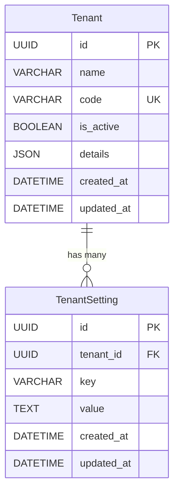
```mermaid
erDiagram
    Tenant {
        UUID id PK
        VARCHAR name
        VARCHAR code UK
        BOOLEAN is_active
        JSON details
        DATETIME created_at
        DATETIME updated_at
    }

    TenantSetting {
        UUID id PK
        UUID tenant_id FK
        VARCHAR key
        TEXT value
        DATETIME created_at
        DATETIME updated_at
    }

    Tenant ||--o{ TenantSetting : "has many"
```

**Constraints:**

| Model | Constraint | Fields |
|-------|-----------|--------|
| TenantSetting | unique_setting_per_tenant | (tenant, key) |

**Design decisions:**
- `details` stores general tenant metadata (description, industry, contact info) — not behavioral configuration.
- `TenantSetting` stores configurable behavior as queryable key-value rows (password policies, feature flags, rate limits).
- Unique constraint on (tenant, key) ensures no duplicate settings per tenant.

---

## Users (iam_users)

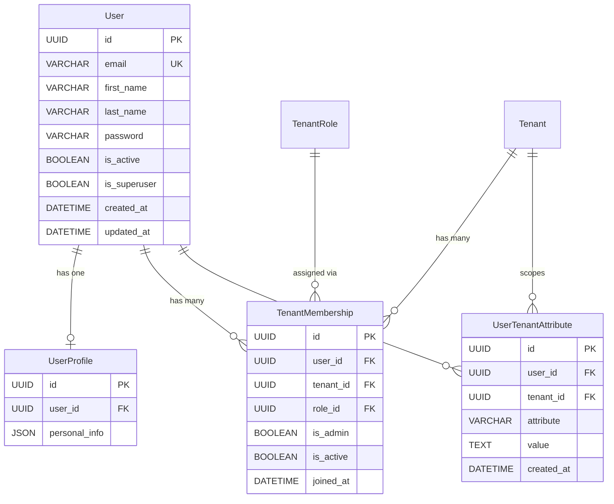
```mermaid
erDiagram
    User {
        UUID id PK
        VARCHAR email UK
        VARCHAR first_name
        VARCHAR last_name
        VARCHAR password
        BOOLEAN is_active
        BOOLEAN is_superuser
        DATETIME created_at
        DATETIME updated_at
    }

    UserProfile {
        UUID id PK
        UUID user_id FK
        JSON personal_info
    }

    TenantMembership {
        UUID id PK
        UUID user_id FK
        UUID tenant_id FK
        UUID role_id FK
        BOOLEAN is_admin
        BOOLEAN is_active
        DATETIME joined_at
    }

    UserTenantAttribute {
        UUID id PK
        UUID user_id FK
        UUID tenant_id FK
        VARCHAR attribute
        TEXT value
        DATETIME created_at
    }

    User ||--o| UserProfile : "has one"
    User ||--o{ TenantMembership : "has many"
    User ||--o{ UserTenantAttribute : "has many"
    Tenant ||--o{ TenantMembership : "has many"
    Tenant ||--o{ UserTenantAttribute : "scopes"
    TenantRole ||--o{ TenantMembership : "assigned via"
```

**Tables:** `iam_users`, `iam_users_profiles`, `iam_users_memberships`, `iam_users_tenant_attributes`

**Constraints:**

| Model | Constraint | Fields |
|-------|-----------|--------|
| TenantMembership | unique_user_tenant | (user, tenant) |
| UserTenantAttribute | unique_user_tenant_attribute | (user, tenant, attribute) |

**Design decisions:**
- `User` exists at the platform level — not scoped to any tenant. A user can belong to multiple tenants.
- Tenant association is modeled through `TenantMembership`, which assigns exactly one `TenantRole` per membership.
- `UserProfile` separates mutable personal data from the auth-critical `User` table.
- `is_admin` on `TenantMembership` provides a fast-path check — admins bypass permission checks entirely.
- `UserTenantAttribute` stores arbitrary per-user, per-tenant state as text key-value rows. Delete the row to clear an attribute.
- `is_superuser` and `is_staff` are provided by Django's `PermissionsMixin`; `groups` and `user_permissions` are also available through the mixin.

---

## Roles (iam_roles)

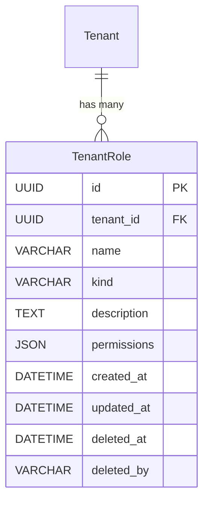
```mermaid
erDiagram
    TenantRole {
        UUID id PK
        UUID tenant_id FK
        VARCHAR name
        VARCHAR kind
        TEXT description
        JSON permissions
        DATETIME created_at
        DATETIME updated_at
        DATETIME deleted_at
        VARCHAR deleted_by
    }

    Tenant ||--o{ TenantRole : "has many"
```

**Table:** `iam_roles`

**Constraints:**

| Model | Constraint | Fields |
|-------|-----------|--------|
| TenantRole | unique_role_per_tenant | (tenant, name) |

**Design decisions:**
- `TenantRole` inherits from `TenantAwareModel` (soft-delete, tenant-scoped manager).
- Defined per tenant — each tenant manages its own role definitions independently.
- `kind` is an internal, immutable semantic type (owner, admin, member, viewer, custom). Business rules check `kind`, not `name`, so users can rename roles freely.
- `permissions` stores a dict mapping codenames to grant values (e.g., `{"tenants.tenants.view": 1, "tenants.teams.create": 0}`). Codenames are defined in app-level `permissions.json` catalogs. Missing codename = denied.
- Default roles (Owner, Admin, Member, Viewer) are seeded automatically when a tenant is created.

---

## Authentication (iam_auth)

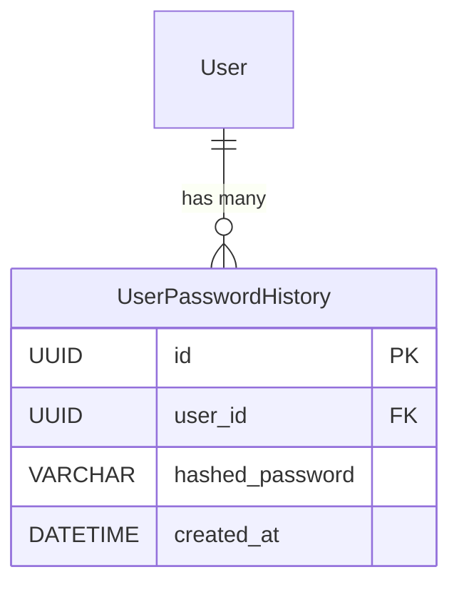
```mermaid
erDiagram
    UserPasswordHistory {
        UUID id PK
        UUID user_id FK
        VARCHAR hashed_password
        DATETIME created_at
    }

    User ||--o{ UserPasswordHistory : "has many"
```

**Table:** `iam_auth_password_history`

**Design decisions:**
- Stores the hashed password (never plaintext) each time a user changes their password.
- On password change, the current hash is saved to history before the new password is set.
- Validation rejects any new password that matches the last 5 entries (configurable via `PASSWORD_HISTORY_LIMIT`).

---

## MFA (iam_mfa)

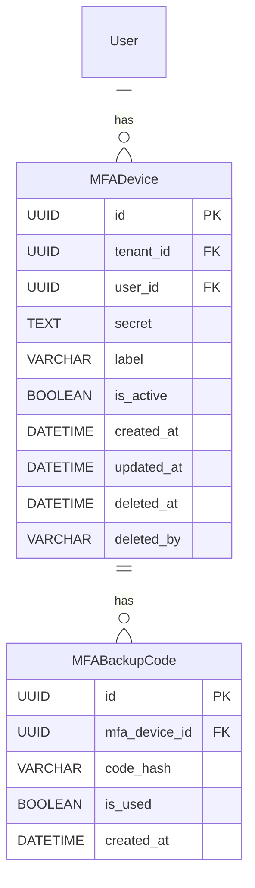
```mermaid
erDiagram
    User ||--o{ MFADevice : "has"
    MFADevice ||--o{ MFABackupCode : "has"

    MFADevice {
        UUID id PK
        UUID tenant_id FK
        UUID user_id FK
        TEXT secret
        VARCHAR label
        BOOLEAN is_active
        DATETIME created_at
        DATETIME updated_at
        DATETIME deleted_at
        VARCHAR deleted_by
    }

    MFABackupCode {
        UUID id PK
        UUID mfa_device_id FK
        VARCHAR code_hash
        BOOLEAN is_used
        DATETIME created_at
    }
```

**Tables:** `iam_mfa_devices`, `iam_mfa_backup_codes`

**Design decisions:**
- `MFADevice` is `TenantAwareModel` — scoped to a tenant, soft-deletable.
- `MFABackupCode` inherits from `BaseModel` (not tenant-scoped) — backup codes are tied to a specific MFA device rather than directly to a tenant boundary.
- `MFADevice.secret` stores the encrypted TOTP secret (encrypted at rest using Fernet).
- `MFABackupCode.code_hash` stores the hashed backup code (never plaintext).
- `MFABackupCode.is_used` tracks whether a backup code has been consumed; once used, it cannot be reused.

---

## OAuth2 (iam_oauth)

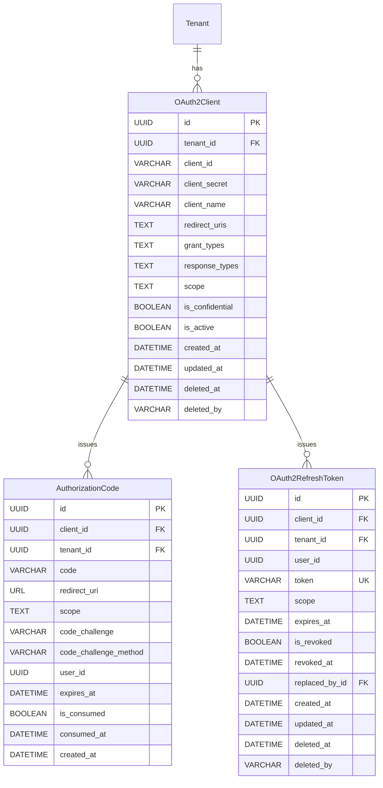
```mermaid
erDiagram
    Tenant ||--o{ OAuth2Client : "has"
    OAuth2Client ||--o{ AuthorizationCode : "issues"
    OAuth2Client ||--o{ OAuth2RefreshToken : "issues"

    OAuth2Client {
        UUID id PK
        UUID tenant_id FK
        VARCHAR client_id
        VARCHAR client_secret
        VARCHAR client_name
        TEXT redirect_uris
        TEXT grant_types
        TEXT response_types
        TEXT scope
        BOOLEAN is_confidential
        BOOLEAN is_active
        DATETIME created_at
        DATETIME updated_at
        DATETIME deleted_at
        VARCHAR deleted_by
    }

    AuthorizationCode {
        UUID id PK
        UUID client_id FK
        UUID tenant_id FK
        VARCHAR code
        URL redirect_uri
        TEXT scope
        VARCHAR code_challenge
        VARCHAR code_challenge_method
        UUID user_id
        DATETIME expires_at
        BOOLEAN is_consumed
        DATETIME consumed_at
        DATETIME created_at
    }

    OAuth2RefreshToken {
        UUID id PK
        UUID client_id FK
        UUID tenant_id FK
        UUID user_id
        VARCHAR token UK
        TEXT scope
        DATETIME expires_at
        BOOLEAN is_revoked
        DATETIME revoked_at
        UUID replaced_by_id FK
        DATETIME created_at
        DATETIME updated_at
        DATETIME deleted_at
        VARCHAR deleted_by
    }
```

**Tables:** `iam_oauth_clients`, `iam_oauth_authorization_codes`, `iam_oauth_refresh_tokens`

**Design decisions:**
- `OAuth2Client` inherits from `TenantAwareModel` but overrides the `tenant` FK with `related_name="oauth2_clients"`.
- `AuthorizationCode.user_id` is a plain `UUIDField`, not a FK to `User` — authorization codes may reference users that no longer exist.
- `OAuth2RefreshToken.user_id` is a plain `UUIDField`, not a FK to `User` — refresh tokens may reference users that no longer exist.
- `OAuth2RefreshToken.replaced_by` is a self-referencing `OneToOneField` that supports refresh token rotation. When a refresh token is rotated, a new token is created and linked via `replaced_by`.
- `AuthorizationCode` has a unique constraint on `(client, code)`.
- `OAuth2RefreshToken` has a unique constraint on `token`.

---

## Event Bus (sys_eventbus)

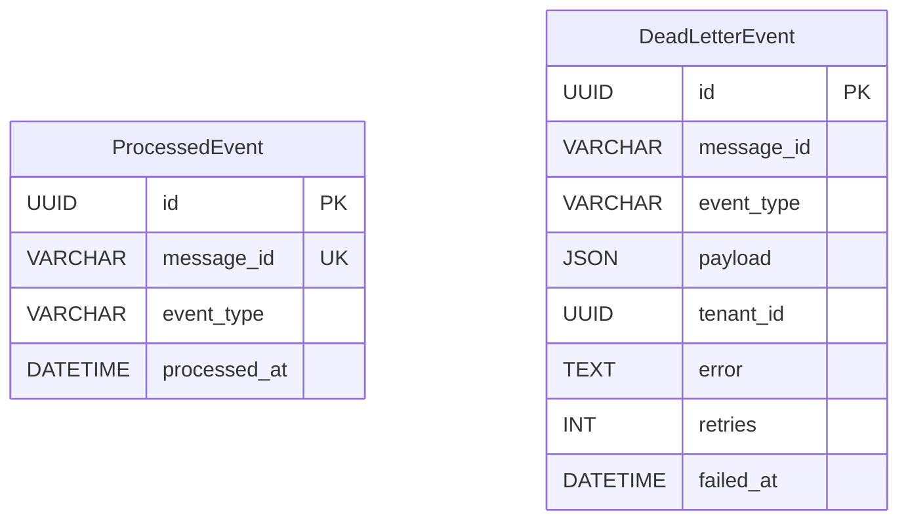
```mermaid
erDiagram
    ProcessedEvent {
        UUID id PK
        VARCHAR message_id UK
        VARCHAR event_type
        DATETIME processed_at
    }

    DeadLetterEvent {
        UUID id PK
        VARCHAR message_id
        VARCHAR event_type
        JSON payload
        UUID tenant_id
        TEXT error
        INT retries
        DATETIME failed_at
    }
```

**Tables:** `sys_eventbus_processed_event`, `sys_eventbus_dead_letter_event`

**Constraints:**

| Model | Constraint | Fields |
|-------|-----------|--------|
| ProcessedEvent | unique message_id | (message_id) |

**Design decisions:**
- `ProcessedEvent` enforces idempotency — the consumer checks this table before dispatching a handler. If the message ID is already present, execution is skipped.
- `DeadLetterEvent` preserves the full envelope payload for manual inspection and potential reprocessing. Never deleted by application logic.
- `tenant_id` on `DeadLetterEvent` is nullable to support platform-level (non-tenant-scoped) events.

---

## Teams (iam_teams)

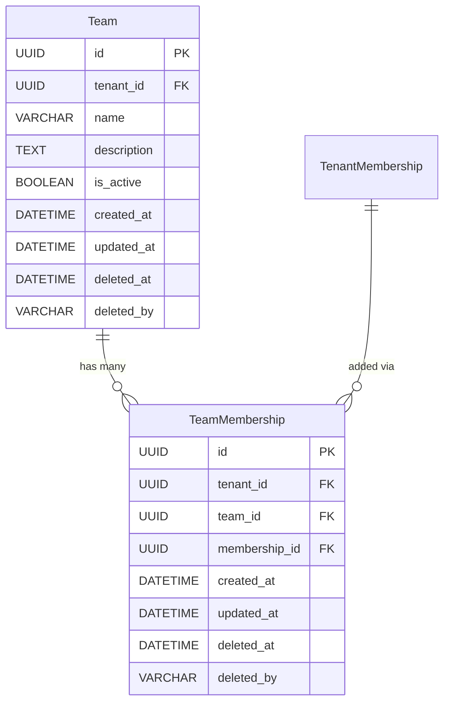
```mermaid
erDiagram
    Team {
        UUID id PK
        UUID tenant_id FK
        VARCHAR name
        TEXT description
        BOOLEAN is_active
        DATETIME created_at
        DATETIME updated_at
        DATETIME deleted_at
        VARCHAR deleted_by
    }

    TeamMembership {
        UUID id PK
        UUID tenant_id FK
        UUID team_id FK
        UUID membership_id FK
        DATETIME created_at
        DATETIME updated_at
        DATETIME deleted_at
        VARCHAR deleted_by
    }

    Team ||--o{ TeamMembership : "has many"
    TenantMembership ||--o{ TeamMembership : "added via"
```

**Tables:** `iam_teams`, `iam_teams_memberships`

**Constraints:**

| Model | Constraint | Fields |
|-------|-----------|--------|
| Team | unique_team_per_tenant | (tenant, name) |
| TeamMembership | unique_member_per_team | (team, membership) |

**Design decisions:**
- `TeamMembership.membership` is a FK to `TenantMembership`, not directly to `User` — this enforces that only users with an active tenant membership can be added to teams within that tenant.
- Teams are `TenantAwareModel` — soft-deletable and tenant-scoped.

---

## Audit Log (sys_audit)

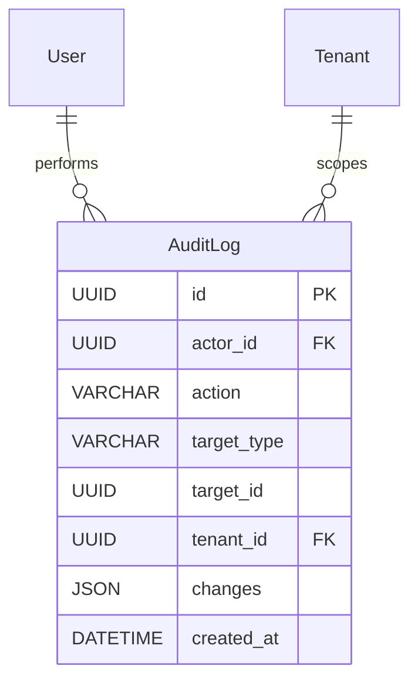
```mermaid
erDiagram
    AuditLog {
        UUID id PK
        UUID actor_id FK
        VARCHAR action
        VARCHAR target_type
        UUID target_id
        UUID tenant_id FK
        JSON changes
        DATETIME created_at
    }

    User ||--o{ AuditLog : "performs"
    Tenant ||--o{ AuditLog : "scopes"
```

**Table:** `sys_audit_log`

**Indexes:**

| Name | Fields |
|------|--------|
| idx_audit_tenant_time | (tenant, created_at) |
| idx_audit_target | (target_type, target_id) |

**Design decisions:**
- `AuditLog` does not inherit from `BaseModel` — it defines its own `id` and `created_at` only. No `updated_at`, no soft-delete: records are immutable by design (ADR-009).
- `update` and `delete` are blocked at both the manager and instance level — any attempt raises `NotImplementedError`.
- `tenant` is nullable to support platform-level (non-tenant-scoped) operations.
- `changes` stores the full payload on create, a field diff on update, and is empty on delete.
- `target_type` stores the model label (e.g., `"tenants.Team"`) for cross-model querying without FK constraints.

---

## User Events (sys_user_event)

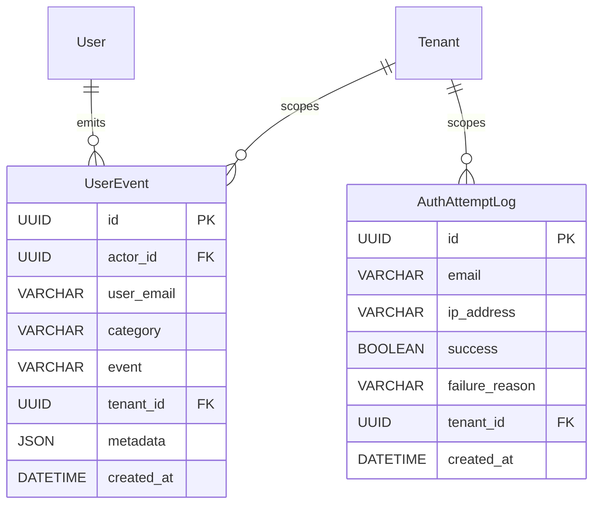
```mermaid
erDiagram
    UserEvent {
        UUID id PK
        UUID actor_id FK
        VARCHAR user_email
        VARCHAR category
        VARCHAR event
        UUID tenant_id FK
        JSON metadata
        DATETIME created_at
    }

    AuthAttemptLog {
        UUID id PK
        VARCHAR email
        VARCHAR ip_address
        BOOLEAN success
        VARCHAR failure_reason
        UUID tenant_id FK
        DATETIME created_at
    }

    User ||--o{ UserEvent : "emits"
    Tenant ||--o{ UserEvent : "scopes"
    Tenant ||--o{ AuthAttemptLog : "scopes"
```

**Tables:** `sys_user_events`, `sys_auth_attempts`

**Indexes:**

| Table | Name | Fields |
|-------|------|--------|
| UserEvent | idx_user_event_actor_time | (actor, created_at) |
| UserEvent | idx_user_event_tenant_time | (tenant, created_at) |
| UserEvent | idx_user_event_category_event | (category, event) |
| AuthAttemptLog | idx_auth_attempt_email_time | (email, created_at) |
| AuthAttemptLog | idx_auth_attempt_ip_time | (ip_address, created_at) |

**Design decisions:**
- `UserEvent.actor` uses `SET_NULL` — events survive user deletion. `user_email` is denormalized to preserve identity context after the actor is removed.
- `AuthAttemptLog` has no FK to `User` — attempts may come from unknown or deleted users; `email` is stored as plain text.
- Both models are append-only by convention: no update or delete operations are performed by application logic.
- `tenant` is nullable on both models to support platform-level events.

---

## DMS Documents

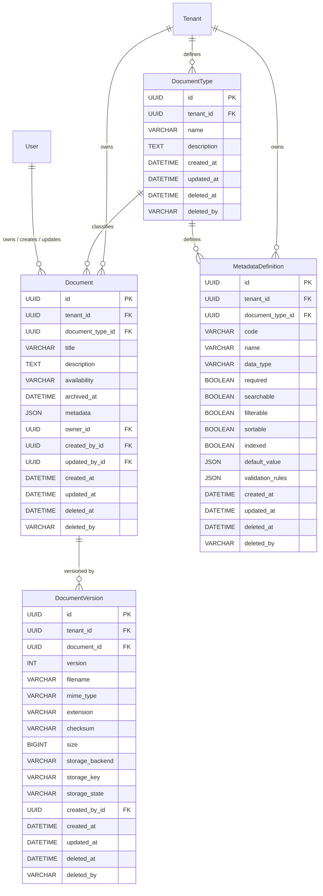
```mermaid
erDiagram
    Tenant ||--o{ DocumentType : "defines"
    Tenant ||--o{ Document : "owns"
    Tenant ||--o{ MetadataDefinition : "owns"
    DocumentType ||--o{ Document : "classifies"
    DocumentType ||--o{ MetadataDefinition : "defines"
    User ||--o{ Document : "owns / creates / updates"
    Document ||--o{ DocumentVersion : "versioned by"

    DocumentType {
        UUID id PK
        UUID tenant_id FK
        VARCHAR name
        TEXT description
        DATETIME created_at
        DATETIME updated_at
        DATETIME deleted_at
        VARCHAR deleted_by
    }

    Document {
        UUID id PK
        UUID tenant_id FK
        UUID document_type_id FK
        VARCHAR title
        TEXT description
        VARCHAR availability
        DATETIME archived_at
        JSON metadata
        UUID owner_id FK
        UUID created_by_id FK
        UUID updated_by_id FK
        DATETIME created_at
        DATETIME updated_at
        DATETIME deleted_at
        VARCHAR deleted_by
    }

    MetadataDefinition {
        UUID id PK
        UUID tenant_id FK
        UUID document_type_id FK
        VARCHAR code
        VARCHAR name
        VARCHAR data_type
        BOOLEAN required
        BOOLEAN searchable
        BOOLEAN filterable
        BOOLEAN sortable
        BOOLEAN indexed
        JSON default_value
        JSON validation_rules
        DATETIME created_at
        DATETIME updated_at
        DATETIME deleted_at
        VARCHAR deleted_by
    }

    DocumentVersion {
        UUID id PK
        UUID tenant_id FK
        UUID document_id FK
        INT version
        VARCHAR filename
        VARCHAR mime_type
        VARCHAR extension
        VARCHAR checksum
        BIGINT size
        VARCHAR storage_backend
        VARCHAR storage_key
        VARCHAR storage_state
        UUID created_by_id FK
        DATETIME created_at
        DATETIME updated_at
        DATETIME deleted_at
        VARCHAR deleted_by
    }
```

**Tables:** `dms_document_types`, `dms_documents`, `dms_metadata_definitions`, `dms_document_versions`

**Constraints:**

| Model | Constraint | Fields |
|-------|-----------|--------|
| DocumentType | unique_document_type_per_tenant | (tenant, name) |
| Document | unique_document_title_per_tenant | (tenant, title) |
| MetadataDefinition | unique_metadata_definition_per_tenant_and_document_type | (tenant, document_type, code) |
| DocumentVersion | unique_version_per_document | (document, version) |

**Design decisions:**
- `document_type` on `Document` is nullable — documents can exist without a type classification.
- `Document.metadata` is a `JSONField` storing values only. The schema is defined by `MetadataDefinition` records for the assigned type. Validation is performed by `MetadataValidationService` when `document_type` is set.
- `MetadataDefinition` is `TenantAwareModel` — it carries a direct `tenant` FK in addition to `document_type`, enabling tenant-level isolation independent of the document type.
- `MetadataDefinition.validation_rules` structure is standardized per `data_type` and validated at both the API and model layers.
- `DocumentVersion.version` is a monotonically increasing integer scoped to the document, assigned by the serializer at creation time — not editable via the API.
- `DocumentVersion` storage fields (`checksum`, `extension`, `size`, `storage_key`, `storage_state`) are all `editable=False` — populated by the ingestion pipeline, not by direct API input.
- `StorageState` lifecycle: `UPLOADING` → `PROCESSING` → `AVAILABLE` (or `CORRUPTED` / `QUARANTINED` / `ARCHIVED`).

---

## DMS Ingestion (dms_ingestion)

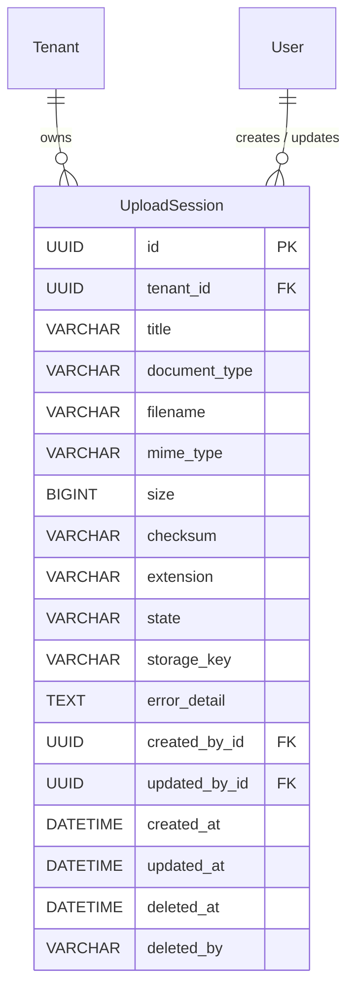
```mermaid
erDiagram
    Tenant ||--o{ UploadSession : "owns"
    User ||--o{ UploadSession : "creates / updates"

    UploadSession {
        UUID id PK
        UUID tenant_id FK
        VARCHAR title
        VARCHAR document_type
        VARCHAR filename
        VARCHAR mime_type
        BIGINT size
        VARCHAR checksum
        VARCHAR extension
        VARCHAR state
        VARCHAR storage_key
        TEXT error_detail
        UUID created_by_id FK
        UUID updated_by_id FK
        DATETIME created_at
        DATETIME updated_at
        DATETIME deleted_at
        VARCHAR deleted_by
    }
```

**Table:** `dms_ingestion_upload_sessions`

**Design decisions:**
- `UploadSession` has no FK to `Document` — it is decoupled from `dms_documents` by design. Once the pipeline completes, a `document.created` event is published and `dms_documents` owns document creation.
- `document_type` is a `CharField`, not a FK — it stores the canonical `DocumentType.name` validated at session creation. This avoids a hard dependency between `dms_ingestion` and `dms_document_types`.
- `checksum` and `extension` are populated by the pipeline (`ChecksumProcessor`, `MetadataProcessor`) after the file is uploaded — they are null until the pipeline runs.
- `storage_key` is the opaque path returned by the configured storage backend after the file is written.
- `error_detail` is set on transition to `FAILED` and records the human-readable failure reason.
