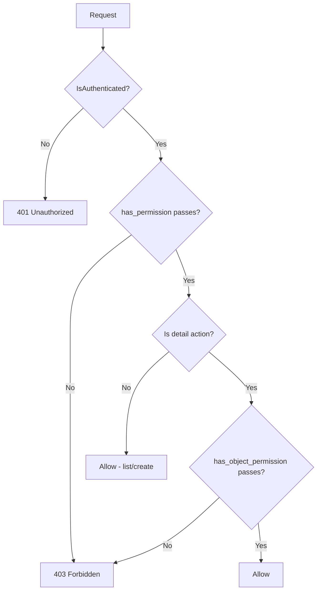
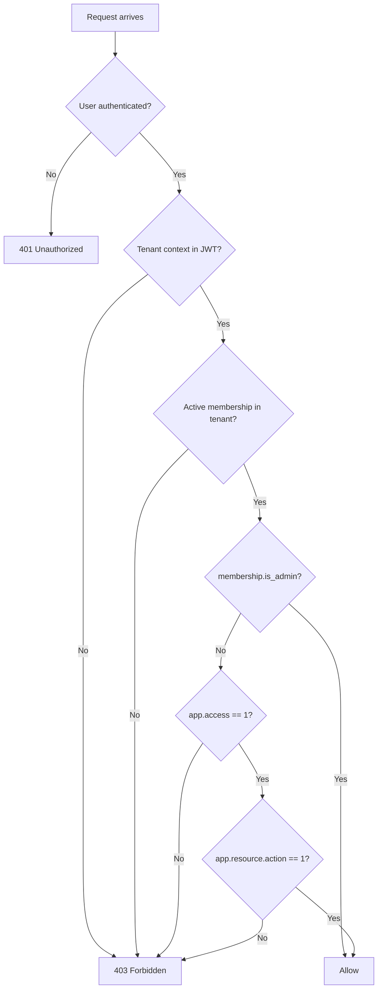
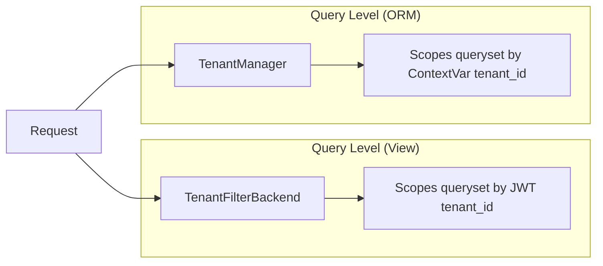

# Access Control

This document describes how to implement access control on API endpoints — from declarative attributes to custom permission classes and common pitfalls.

---

## Overview

All endpoints require authentication by default (`IsAuthenticated`). Authorization is layered on top via permission classes that check roles, ownership, and tenant membership.



---

## Permission Evaluation: How DRF Calls Permissions

Understanding when each method is called is critical:

| Method | Called On | Purpose |
|--------|-----------|---------|
| `has_permission(request, view)` | Every request (list, create, retrieve, update, destroy) | View-level access (role checks, action checks) |
| `has_object_permission(request, view, obj)` | Detail actions only (retrieve, update, partial_update, destroy) | Object-level access (ownership, tenant membership) |

**Key rule:** `has_object_permission` is only called when the view calls `self.get_object()`. This means:

- List actions (`list`) never trigger object-level checks
- Create actions (`create`) never trigger object-level checks
- If you need per-object filtering on lists, use queryset filtering (e.g., `TenantFilterBackend`), not permissions

---

## Available Permission Classes

| Class | Scope | Checks |
|-------|-------|--------|
| `IsSuperUser` | Platform | `request.user.is_superuser` |
| `IsTenantAdmin` | Tenant | `is_admin=True` on membership for current tenant (bypasses all permission checks) |
| `HasTenantPermission(codename)` | Tenant | Codename in role's `permissions` list |
| `IsOwnerOrReadOnly` | Object | Object's `created_by` matches user (writes only) |
| `BasePermission` | Foundation | Helper methods for subclasses |

`IsSuperUser`, `IsOwnerOrReadOnly`, and `BasePermission` live in `core.permissions.base`. `IsTenantAdmin` lives in `apps.tenants.permissions`. `HasTenantPermission` lives in `apps.sys_permissions.permissions`.

---

## BasePermission Helpers

### check_ownership(request, obj, owner_field="created_by")

Returns `True` if `obj.<owner_field> == request.user`.

---

## Granular Permissions (RBAC)

Domain apps automatically get default CRUD permissions (view, create, update, delete) derived from their app label. Apps can customize via `permissions.json` — override, extend, or disable specific actions.

`TenantRole.permissions` stores a dict mapping codenames to `0`/`1`:

```json
{"tenants.tenants.view": 1, "tenants.teams.create": 1, "tenants.teams.delete": 0}
```

- `1` = granted
- `0` = denied
- Missing codename = denied (default zero)

For codename-based permission checks, use `HasTenantPermission`:

```python
from apps.sys_permissions.permissions import HasTenantPermission
from core.base.views import BaseViewSet


class TeamViewSet(BaseViewSet):
    queryset = Team.objects.all()
    serializer_class = TeamSerializer
    write_permission_classes = [HasTenantPermission("tenants.teams.create")]
```

This checks whether the user's role in the current tenant has `"tenants.teams.create"` in its `permissions` list. Users with `is_admin=True` bypass the check.

For per-action granularity with different codenames:

```python
from apps.sys_permissions.permissions import HasTenantPermission
from core.base.views import BaseViewSet


class TeamViewSet(BaseViewSet):
    queryset = Team.objects.all()
    serializer_class = TeamSerializer

    def get_permissions(self):
        if self.action == "create":
            return [IsAuthenticated(), HasTenantPermission("tenants.teams.create")()]
        if self.action in ("update", "partial_update"):
            return [IsAuthenticated(), HasTenantPermission("tenants.teams.update")()]
        if self.action == "destroy":
            return [IsAuthenticated(), HasTenantPermission("tenants.teams.delete")()]
        return [IsAuthenticated()]
```

---

## Permission Catalog

The RBAC system is config-driven. Each domain app can declare permissions in a `permissions.json` file at its root. The catalog system lives in `apps.sys_permissions`.

### Access Permission

Every domain app automatically gets an `app.access` permission (e.g., `tenants.access`, `users.access`). This acts as a gate: if a role does not have `app.access == 1`, all actions within that app are denied regardless of individual action permissions.

- Granted to all default roles (Owner, Admin, Member, Viewer)
- Set `"access": false` in `permissions.json` to remove it from the catalog — no role can access the app (except `is_admin`)
- Useful for restricting entire apps to admins only

### Default CRUD Permissions

Domain apps (under `apps/` without `sys_` prefix) automatically get CRUD permissions derived from their app label:

| Action | Readonly | Owner | Admin | Member | Viewer |
|--------|----------|-------|-------|--------|--------|
| `view` | Yes | 1 | 1 | 1 | 1 |
| `create` | No | 1 | 1 | 0 | 0 |
| `update` | No | 1 | 1 | 0 | 0 |
| `delete` | No | 1 | 1 | 0 | 0 |

The resource name is the app label (e.g., `apps.tenants` -> `tenants.tenants`). Each app also gets an `app.access` permission that gates all actions within it.

### Catalog Format

Each app places a `permissions.json` at its root. The catalog merges with the auto-generated defaults.

**Minimal (use all defaults, add a custom resource):**

```json
{
  "resources": {
    "teams": {
      "label": "Teams"
    }
  }
}
```

Result: `teams` gets default CRUD (view, create, update, delete).

**Disable specific actions:**

```json
{
  "resources": {
    "tenants": {
      "label": "Tenants",
      "actions": {
        "create": false,
        "delete": false
      }
    }
  }
}
```

Result: `tenants` has only `view` and `update`.

**Disable a resource entirely:**

```json
{
  "resources": {
    "users": false
  }
}
```

Result: no permissions generated for `users` resource.

**Disable all resources in an app:**

```json
{
  "resources": false
}
```

Result: app has no permissions at all.

**Custom actions (merged with CRUD defaults):**

```json
{
  "resources": {
    "members": {
      "label": "Members",
      "actions": {
        "create": false,
        "update": false,
        "delete": false,
        "view": {
          "label": "View members",
          "readonly": true,
          "default_roles": { "owner": 1, "admin": 1, "member": 1, "viewer": 1 }
        },
        "invite": {
          "label": "Invite members",
          "readonly": false,
          "default_roles": { "owner": 1, "admin": 1, "member": 0, "viewer": 0 }
        }
      }
    }
  }
}
```

Result: `members` has `view` and `invite` only (CRUD defaults disabled, custom action added).

### Field Reference

| Field | Type | Description |
|-------|------|-------------|
| `resources` | object or `false` | Top-level container. `false` disables all permissions |
| `resources.<name>` | object or `false` | Resource definition. `false` disables the resource |
| `resources.<name>.label` | string | Human-readable resource name (optional if using defaults) |
| `resources.<name>.actions` | object | Action overrides/additions (optional) |
| `actions.<name>` | object or `false` | Action definition. `false` removes the action |
| `actions.<name>.label` | string | Human-readable action description |
| `actions.<name>.readonly` | boolean | Whether this is a read-only action |
| `actions.<name>.default_roles` | object | Default grant per role: `0` = denied, `1` = granted |

### Codename Convention

Codenames are derived as `app.resource.action`:

- `tenants.tenants.view`
- `tenants.tenants.update`
- `users.members.invite`
- `tenants.teams.create`

Codenames must be unique across all apps.

### Validation Rules

| Rule | Enforced By |
|------|-------------|
| Valid JSON structure matching schema | JSON Schema (`permissions_schema.json`) |
| Resource names are snake_case | JSON Schema pattern |
| Action names are snake_case | JSON Schema pattern |
| All required fields present (`label`, `readonly`, `default_roles`) | JSON Schema |
| `default_roles` contains exactly `owner`, `admin`, `member`, `viewer` | JSON Schema |
| `default_roles` values are `0` or `1` only | JSON Schema |
| Viewer roles cannot have `1` on `readonly: false` permissions | Business rule in `catalog.py` |
| Codenames are unique across all apps | Uniqueness check in `catalog.py` |

### Enforcement Flow



### Default Role Seeding

When a new `Tenant` is created, a `post_save` signal in `apps/tenants/signals.py` automatically creates four roles:

| Role | Permissions |
|------|-------------|
| Owner | All permissions granted (`codename: 1` for all) |
| Admin | All permissions granted (`codename: 1` for all) |
| Member | Read + limited write (only where `member: 1` in catalog) |
| Viewer | Read-only permissions only (only where `viewer: 1` and `readonly: true`) |

Tenants can later customize role permissions by modifying `TenantRole.permissions`.

### Adding Permissions to a New App

1. (Optional) Create `apps/<app_name>/permissions.json` to customize — without it, default CRUD applies
2. Run `uv run python manage.py check_permission_catalog` to validate
3. Reference codenames in views via `HasTenantPermission`

### CI Validation

```bash
uv run python manage.py check_permission_catalog
```

Exits with code `1` on failure. Runs in CI alongside `ruff` and `mypy`.

---

## Declarative Write Permissions

The most common pattern is "authenticated for reads, elevated for writes." Use `write_permission_classes`:

```python
from apps.tenants.permissions import IsTenantAdmin
from core.base.views import BaseViewSet


class TenantViewSet(BaseViewSet):
    write_permission_classes = [IsTenantAdmin]
```

This automatically applies `[IsAuthenticated, IsSuperUser]` to write actions (`create`, `update`, `partial_update`, `destroy`) while reads use only `IsAuthenticated`.

### When to Use

- Simple read/write split → `write_permission_classes`
- Per-action granularity → override `get_permissions()`
- Both read and write need elevation → set `permission_classes` directly

---

## Public Endpoints (Opting Out of Authentication)

Use `AllowAny` for endpoints that don't require authentication:

```python
from rest_framework.permissions import AllowAny

class LoginView(TokenObtainPairView):
    permission_classes = (AllowAny,)
```

Convention:
- Only use `AllowAny` on authentication endpoints (login, refresh) and public-facing read endpoints
- Document public endpoints in `docs/security.md` under "Public Endpoints"
- Never combine `AllowAny` with other permission classes — it makes the others meaningless

---

## Combining Permission Classes

### AND Semantics (default)

When you list multiple classes, ALL must pass:

```python
permission_classes = [IsAuthenticated, IsTenantAdmin]
# User must be authenticated AND a tenant admin
```

### OR Semantics

DRF doesn't natively support OR. Use a composite permission class:

```python
class IsTenantAdminOrOwner(BasePermission):
    """Allow access if user is a tenant admin OR the object owner."""

    message = "You must be a tenant admin or the object owner."

    def has_permission(self, request, view) -> bool:
        return request.user and request.user.is_authenticated

    def has_object_permission(self, request, view, obj) -> bool:
        from apps.tenants.utils import get_tenant_id

        tenant_id = get_tenant_id(request)
        is_admin = (
            tenant_id
            and request.user.memberships.filter(
                tenant_id=tenant_id, is_active=True, is_admin=True
            ).exists()
        )
        return is_admin or self.check_ownership(request, obj)
```

---

## Custom Permission Classes

Inherit from `BasePermission` and implement `has_permission` and/or `has_object_permission`:

```python
from core.permissions.base import BasePermission

class IsInvoiceApprover(BasePermission):
    message = "Only invoice approvers can perform this action."

    def has_object_permission(self, request, view, obj) -> bool:
        return obj.approver == request.user
```

### Rules

- Always set a descriptive `message` attribute
- Return `True`/`False` — never raise exceptions inside permission classes
- Keep checks fast — avoid expensive queries; prefer cached or pre-fetched data
- Use `has_permission` for role-based checks (runs on every request)
- Use `has_object_permission` for ownership/relationship checks (runs on detail actions only)

---

## Permissions on Custom Actions

`@action` decorators inherit the viewset's permissions by default. Override with `permission_classes` on the decorator:

```python
class MembershipViewSet(BaseViewSet):
    write_permission_classes = [IsTenantAdmin]

    @action(detail=True, methods=["post"], permission_classes=[IsAuthenticated, IsSuperUser])
    def force_deactivate(self, request, pk=None):
        """Only superusers can force-deactivate (stricter than default write perms)."""
        ...

    @action(detail=False, methods=["get"])
    def my_memberships(self, request):
        """Inherits viewset's read permissions (IsAuthenticated)."""
        ...
```

---

## Tenant Isolation

Tenant isolation is enforced at three levels:



1. **Query level (view)** — `TenantFilterBackend` scopes querysets from JWT claims (see multi-tenancy guideline)
2. **Query level (ORM)** — `TenantManager` scopes querysets from the ContextVar bound by `TenantJWTAuthentication`

Both layers must fail simultaneously for data to leak across tenants (ADR-004).

---

## Superuser Bypass

Superusers bypass:
- `TenantFilterBackend` — when `tenant_scoping = False`

Superusers do NOT bypass:
- `TenantInjectionSerializerPlugin` — must still select a tenant context for writes
- Custom permission classes — unless you explicitly check `request.user.is_superuser`

If your custom permission should allow superusers through:

```python
class IsDocumentOwner(BasePermission):
    def has_object_permission(self, request, view, obj) -> bool:
        if request.user.is_superuser:
            return True
        return obj.created_by == request.user
```

---

## Permission Denied Messages

The `message` attribute surfaces in the API error envelope:

```json
{
  "status": "ERROR",
  "code": "permission_denied",
  "data": {
    "detail": "Only invoice approvers can perform this action."
  }
}
```

Guidelines for messages:
- Write user-facing messages — they reach the client
- Be specific about what's required ("You must be a tenant admin") not what failed ("Permission denied")
- Don't leak internal details ("User has no membership with is_admin=True in tenant abc-123")

---

## Testing Access Control

Test each permission boundary explicitly:

```python
class TestInvoicePermissions:
    def test_unauthenticated_rejected(self, api_client):
        response = api_client.get("/api/invoices/")
        assert response.status_code == 401

    def test_wrong_tenant_cannot_access(self, auth_client, other_tenant_invoice):
        response = auth_client.get(f"/api/invoices/{other_tenant_invoice.pk}/")
        assert response.status_code == 404  # Filtered out by TenantFilterBackend

    def test_non_admin_cannot_create(self, auth_client):
        response = auth_client.post("/api/invoices/", {"number": "INV-001"})
        assert response.status_code == 403

    def test_admin_can_create(self, admin_auth_client):
        response = admin_auth_client.post("/api/invoices/", {"number": "INV-001"})
        assert response.status_code == 201

    def test_owner_can_update(self, auth_client, own_invoice):
        response = auth_client.patch(
            f"/api/invoices/{own_invoice.pk}/", {"number": "INV-002"}
        )
        assert response.status_code == 200

    def test_non_owner_cannot_update(self, auth_client, other_user_invoice):
        response = auth_client.patch(
            f"/api/invoices/{other_user_invoice.pk}/", {"number": "INV-002"}
        )
        assert response.status_code == 403
```

Key testing patterns:
- Test both the "allowed" and "denied" paths
- For tenant isolation, expect 404 (not 403) because `TenantFilterBackend` hides the object entirely
- Use separate fixtures for different roles (regular user, admin, superuser, other-tenant user)

---

## Common Pitfalls

| Pitfall | Problem | Solution |
|---------|---------|----------|
| Expecting object checks on list | `has_object_permission` never runs on list actions | Use queryset filtering for list-level isolation |
| Raising exceptions in permissions | DRF expects `True`/`False` return | Return `False`; DRF raises `PermissionDenied` with your `message` |
| Forgetting `get_object()` | Object permissions only run when `get_object()` is called | Ensure custom actions call `self.get_object()` if they need object checks |
| Leaking existence via 403 | Returning 403 confirms the object exists | Use queryset filtering (returns 404) for tenant isolation instead of object permissions |
| `AllowAny` with other classes | `AllowAny` makes all other classes irrelevant | Use `AllowAny` alone, never combined |
| Expensive permission checks | Queries in `has_permission` run on every request | Cache results or use `select_related` in the queryset |

---

## Decision Guide

| Scenario | Approach |
|----------|----------|
| All reads public, writes authenticated | `permission_classes = [AllowAny]` + `write_permission_classes = [IsAuthenticated]` |
| Reads authenticated, writes elevated | `write_permission_classes = [IsTenantAdmin]` |
| Per-action granularity | Override `get_permissions()` |
| Object ownership on writes | `IsOwnerOrReadOnly` in `permission_classes` |
| Tenant isolation on queries | `TenantFilterBackend` (automatic) |
| Custom action with different perms | `@action(permission_classes=[...])` |
| OR logic between roles | Composite permission class |
| Superuser bypass in custom perm | Explicit `if request.user.is_superuser: return True` |
