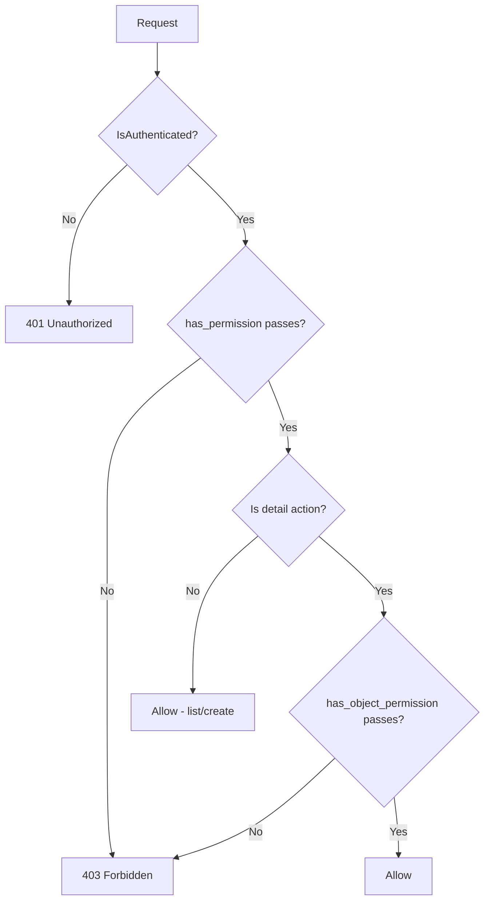
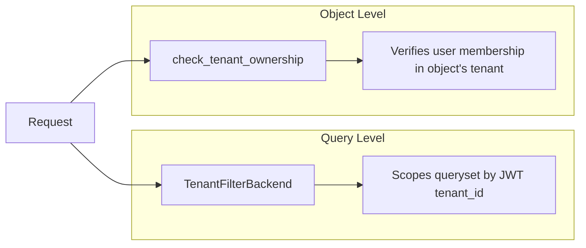

# Access Control

This document describes how to implement access control on API endpoints — from declarative attributes to custom permission classes and common pitfalls.

---

## Overview

All endpoints require authentication by default (`IsAuthenticated`). Authorization is layered on top via permission classes that check roles, ownership, and tenant membership.



---

## Permission Evaluation: How DRF Calls Permissions

Understanding when each method is called is critical:

| Method | Called On | Purpose |
|--------|-----------|---------|
| `has_permission(request, view)` | Every request (list, create, retrieve, update, destroy) | View-level access (role checks, action checks) |
| `has_object_permission(request, view, obj)` | Detail actions only (retrieve, update, partial_update, destroy) | Object-level access (ownership, tenant membership) |

**Key rule:** `has_object_permission` is only called when the view calls `self.get_object()`. This means:

- List actions (`list`) never trigger object-level checks
- Create actions (`create`) never trigger object-level checks
- If you need per-object filtering on lists, use queryset filtering (e.g., `TenantFilterBackend`), not permissions

---

## Available Permission Classes

| Class | Scope | Checks |
|-------|-------|--------|
| `IsSuperUser` | Platform | `request.user.is_superuser` |
| `IsTenantOwner` | Tenant | `is_owner=True` on any membership |
| `IsTenantAdmin` | Tenant | `is_admin=True` on any membership |
| `IsOwnerOrReadOnly` | Object | Object's `created_by` matches user (writes only) |
| `IsTeamMember` | Tenant | User has any team membership |
| `BasePermission` | Foundation | Helper methods for subclasses |

All classes live in `core.permissions.base`.

---

## BasePermission Helpers

### check_ownership(request, obj, owner_field="created_by")

Returns `True` if `obj.<owner_field> == request.user`.

### check_tenant_ownership(request, obj, tenant_field="tenant")

Returns `True` if the requesting user has an active membership in the object's tenant. Superusers bypass this check automatically.

---

## Declarative Write Permissions

The most common pattern is "authenticated for reads, elevated for writes." Use `write_permission_classes`:

```python
class TenantViewSet(BaseViewSet):
    write_permission_classes = [IsSuperUser]
```

This automatically applies `[IsAuthenticated, IsSuperUser]` to write actions (`create`, `update`, `partial_update`, `destroy`) while reads use only `IsAuthenticated`.

### When to Use

- Simple read/write split → `write_permission_classes`
- Per-action granularity → override `get_permissions()`
- Both read and write need elevation → set `permission_classes` directly

---

## Public Endpoints (Opting Out of Authentication)

Use `AllowAny` for endpoints that don't require authentication:

```python
from rest_framework.permissions import AllowAny

class LoginView(TokenObtainPairView):
    permission_classes = (AllowAny,)
```

Convention:
- Only use `AllowAny` on authentication endpoints (login, refresh) and public-facing read endpoints
- Document public endpoints in `docs/security.md` under "Public Endpoints"
- Never combine `AllowAny` with other permission classes — it makes the others meaningless

---

## Combining Permission Classes

### AND Semantics (default)

When you list multiple classes, ALL must pass:

```python
permission_classes = [IsAuthenticated, IsTenantAdmin]
# User must be authenticated AND a tenant admin
```

### OR Semantics

DRF doesn't natively support OR. Use a composite permission class:

```python
class IsTenantAdminOrOwner(BasePermission):
    """Allow access if user is a tenant admin OR the object owner."""

    message = "You must be a tenant admin or the object owner."

    def has_permission(self, request, view) -> bool:
        return request.user and request.user.is_authenticated

    def has_object_permission(self, request, view, obj) -> bool:
        is_admin = (
            hasattr(request.user, "tenant_memberships")
            and request.user.tenant_memberships.filter(is_admin=True).exists()
        )
        return is_admin or self.check_ownership(request, obj)
```

---

## Custom Permission Classes

Inherit from `BasePermission` and implement `has_permission` and/or `has_object_permission`:

```python
from core.permissions.base import BasePermission

class IsInvoiceApprover(BasePermission):
    message = "Only invoice approvers can perform this action."

    def has_object_permission(self, request, view, obj) -> bool:
        return obj.approver == request.user
```

### Rules

- Always set a descriptive `message` attribute
- Return `True`/`False` — never raise exceptions inside permission classes
- Keep checks fast — avoid expensive queries; prefer cached or pre-fetched data
- Use `has_permission` for role-based checks (runs on every request)
- Use `has_object_permission` for ownership/relationship checks (runs on detail actions only)

---

## Permissions on Custom Actions

`@action` decorators inherit the viewset's permissions by default. Override with `permission_classes` on the decorator:

```python
class MembershipViewSet(BaseViewSet):
    write_permission_classes = [IsTenantAdmin]

    @action(detail=True, methods=["post"], permission_classes=[IsAuthenticated, IsSuperUser])
    def force_deactivate(self, request, pk=None):
        """Only superusers can force-deactivate (stricter than default write perms)."""
        ...

    @action(detail=False, methods=["get"])
    def my_memberships(self, request):
        """Inherits viewset's read permissions (IsAuthenticated)."""
        ...
```

---

## Tenant Isolation

Tenant isolation is enforced at two levels:



1. **Query level** — `TenantFilterBackend` scopes querysets automatically (see multi-tenancy guideline)
2. **Object level** — `check_tenant_ownership` verifies the user belongs to the object's tenant

For object-level checks in custom permissions:

```python
class IsTenantMemberForObject(BasePermission):
    message = "You do not have access to this resource."

    def has_object_permission(self, request, view, obj) -> bool:
        return self.check_tenant_ownership(request, obj)
```

---

## Superuser Bypass

Superusers bypass:
- `check_tenant_ownership` — implicit in the helper method
- `TenantFilterBackend` — when `tenant_scoping = False`

Superusers do NOT bypass:
- `TenantInjectionSerializerPlugin` — must still select a tenant context for writes
- Custom permission classes — unless you explicitly check `request.user.is_superuser`

If your custom permission should allow superusers through:

```python
class IsDocumentOwner(BasePermission):
    def has_object_permission(self, request, view, obj) -> bool:
        if request.user.is_superuser:
            return True
        return obj.created_by == request.user
```

---

## Permission Denied Messages

The `message` attribute surfaces in the API error envelope:

```json
{
  "status": "ERROR",
  "code": "permission_denied",
  "data": {
    "detail": "Only invoice approvers can perform this action."
  }
}
```

Guidelines for messages:
- Write user-facing messages — they reach the client
- Be specific about what's required ("You must be a tenant admin") not what failed ("Permission denied")
- Don't leak internal details ("User has no membership with is_admin=True in tenant abc-123")

---

## Testing Access Control

Test each permission boundary explicitly:

```python
class TestInvoicePermissions:
    def test_unauthenticated_rejected(self, api_client):
        response = api_client.get("/api/invoices/")
        assert response.status_code == 401

    def test_wrong_tenant_cannot_access(self, auth_client, other_tenant_invoice):
        response = auth_client.get(f"/api/invoices/{other_tenant_invoice.pk}/")
        assert response.status_code == 404  # Filtered out by TenantFilterBackend

    def test_non_admin_cannot_create(self, auth_client):
        response = auth_client.post("/api/invoices/", {"number": "INV-001"})
        assert response.status_code == 403

    def test_admin_can_create(self, admin_auth_client):
        response = admin_auth_client.post("/api/invoices/", {"number": "INV-001"})
        assert response.status_code == 201

    def test_owner_can_update(self, auth_client, own_invoice):
        response = auth_client.patch(
            f"/api/invoices/{own_invoice.pk}/", {"number": "INV-002"}
        )
        assert response.status_code == 200

    def test_non_owner_cannot_update(self, auth_client, other_user_invoice):
        response = auth_client.patch(
            f"/api/invoices/{other_user_invoice.pk}/", {"number": "INV-002"}
        )
        assert response.status_code == 403
```

Key testing patterns:
- Test both the "allowed" and "denied" paths
- For tenant isolation, expect 404 (not 403) because `TenantFilterBackend` hides the object entirely
- Use separate fixtures for different roles (regular user, admin, superuser, other-tenant user)

---

## Common Pitfalls

| Pitfall | Problem | Solution |
|---------|---------|----------|
| Expecting object checks on list | `has_object_permission` never runs on list actions | Use queryset filtering for list-level isolation |
| Raising exceptions in permissions | DRF expects `True`/`False` return | Return `False`; DRF raises `PermissionDenied` with your `message` |
| Forgetting `get_object()` | Object permissions only run when `get_object()` is called | Ensure custom actions call `self.get_object()` if they need object checks |
| Leaking existence via 403 | Returning 403 confirms the object exists | Use queryset filtering (returns 404) for tenant isolation instead of object permissions |
| `AllowAny` with other classes | `AllowAny` makes all other classes irrelevant | Use `AllowAny` alone, never combined |
| Expensive permission checks | Queries in `has_permission` run on every request | Cache results or use `select_related` in the queryset |

---

## Decision Guide

| Scenario | Approach |
|----------|----------|
| All reads public, writes authenticated | `permission_classes = [AllowAny]` + `write_permission_classes = [IsAuthenticated]` |
| Reads authenticated, writes elevated | `write_permission_classes = [IsTenantAdmin]` |
| Per-action granularity | Override `get_permissions()` |
| Object ownership on writes | `IsOwnerOrReadOnly` in `permission_classes` |
| Tenant isolation on queries | `TenantFilterBackend` (automatic) |
| Tenant isolation on objects | `check_tenant_ownership` in custom permission |
| Custom action with different perms | `@action(permission_classes=[...])` |
| OR logic between roles | Composite permission class |
| Superuser bypass in custom perm | Explicit `if request.user.is_superuser: return True` |
