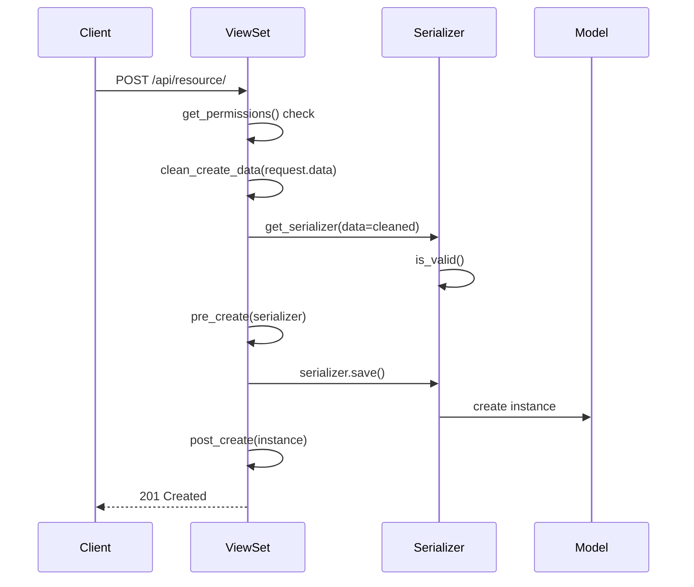

# Building Endpoints

How to build API endpoints — from choosing the right base class and configuring per-action dispatch to lifecycle hooks, URL registration, pagination, and response format.

---

## Overview

Two base classes cover all endpoint types:

| Class | Use Case |
|-------|----------|
| `BaseViewSet` | CRUD resources (routed via `DefaultRouter`) |
| `APIView` | Single-action endpoints (login, logout, password change) |

---

## BaseViewSet

### Request Lifecycle



### Per-Action Serializer Dispatch

Use `serializer_classes` to map actions to serializers without overriding `get_serializer_class`:

```python
from core.base.views import BaseViewSet

from .models import Tenant
from .serializers import TenantCreateSerializer, TenantListSerializer, TenantSerializer


class TenantViewSet(BaseViewSet):
    queryset = Tenant.objects.all()
    serializer_class = TenantSerializer          # Default fallback
    serializer_classes = {
        "list": TenantListSerializer,            # Lightweight for lists
        "create": TenantCreateSerializer,        # Stricter for creation
    }
```

### Per-Action Queryset Dispatch

Use `querysets` for action-specific querysets:

```python
from core.base.views import BaseViewSet

from .models import Invoice


class InvoiceViewSet(BaseViewSet):
    queryset = Invoice.objects.all()
    querysets = {
        "list": Invoice.objects.select_related("tenant").only("id", "number", "created_at"),
    }
```

### Data Cleaning

`clean_create_data` and `clean_update_data` transform raw request data before the serializer is instantiated. Use them for request-level manipulation that doesn't belong in the serializer:

```python
from typing import Any

from core.base.views import BaseViewSet


class DocumentViewSet(BaseViewSet):
    def clean_create_data(self, data: dict[str, Any]) -> dict[str, Any]:
        if "title" in data:
            data["title"] = data["title"].strip()
        return data
```

### Lifecycle Hooks

View-level hooks wrap `serializer.save()`:

```
perform_create(serializer)
  → pre_create(serializer)
  → serializer.save()
  → post_create(instance)

perform_update(serializer)
  → pre_update(serializer)
  → serializer.save()
  → post_update(instance)

perform_destroy(instance)
  → pre_destroy(instance)
  → instance.delete()
  → post_destroy(instance)
```

Use these for side effects that depend on the view context (e.g., logging, notifications):

```python
from django.db.models import Model

from core.base.views import BaseViewSet


class OrderViewSet(BaseViewSet):
    def post_create(self, instance: Model) -> None:
        notify_warehouse(instance)
```

### Common Attributes

```python
from core.base.views import BaseViewSet
from apps.tenants.permissions import IsTenantAdmin

from .models import Invoice
from .serializers import InvoiceSerializer


class InvoiceViewSet(BaseViewSet):
    queryset = Invoice.objects.all()
    serializer_class = InvoiceSerializer
    search_fields = ["number", "description"]       # SearchFilter fields
    ordering_fields = ["created_at", "amount"]      # OrderingFilter fields
    ordering = ["-created_at"]                      # Default ordering
    write_permission_classes = [IsTenantAdmin]      # Elevated write perms
    tenant_scoping = True                           # Default, auto-filters by tenant
```

---

## APIView

Use for endpoints that don't map to a model's CRUD lifecycle:

```python
from rest_framework.permissions import IsAuthenticated
from rest_framework.views import APIView

class PasswordChangeView(APIView):
    permission_classes = [IsAuthenticated]

    def post(self, request: Request) -> Response:
        serializer = PasswordChangeSerializer(
            data=request.data, context={"request": request}
        )
        serializer.is_valid(raise_exception=True)
        serializer.save()
        return Response(status=status.HTTP_200_OK)
```

### When to Use APIView

- Login, logout, token refresh
- Password change/reset
- Custom actions that don't fit CRUD semantics
- Webhooks, health checks

---

## URL Registration

### ViewSets (router-based)

```python
# apps/invoices/urls.py
from rest_framework.routers import DefaultRouter
from . import views

app_name = "invoices"

router = DefaultRouter()
router.register("", views.InvoiceViewSet, basename="invoice")

urlpatterns = router.urls
```

### APIViews (manual paths)

```python
# apps/authentication/urls.py
from django.urls import path
from . import views

app_name = "authentication"

urlpatterns = [
    path("login/", views.LoginView.as_view(), name="login"),
    path("logout/", views.LogoutView.as_view(), name="logout"),
]
```

### Including in Root

```python
# config/urls.py
urlpatterns = [
    path("api/invoices/", include("apps.invoices.urls")),
    path("api/auth/", include("apps.authentication.urls")),
]
```

---

## Overriding get_queryset

The `querysets` dict handles static per-action querysets. Override `get_queryset` when filtering depends on runtime state (e.g., the current user):

```python
from django.db.models import QuerySet

from core.base.views import BaseViewSet

from .models import Tenant
from .serializers import TenantSerializer


class TenantViewSet(BaseViewSet):
    queryset = Tenant.objects.all()
    serializer_class = TenantSerializer
    tenant_scoping = False

    def get_queryset(self) -> QuerySet[Tenant]:
        qs = super().get_queryset()
        if self.request.user.is_superuser:
            return qs
        return qs.filter(
            memberships__user=self.request.user,
            memberships__is_active=True,
        )
```

Always call `super().get_queryset()` first — it resolves the `querysets` dict and applies filter backends.

---

## Overriding get_serializer_context

Pass extra data to serializers via context when it comes from the request/view layer:

```python
from typing import Any

from apps.tenants.utils import get_tenant_id
from core.base.views import BaseViewSet
from core.exceptions.api import PermissionDeniedError


class MembershipViewSet(BaseViewSet):
    def get_serializer_context(self) -> dict[str, Any]:
        context: dict[str, Any] = super().get_serializer_context()
        if self.action == "create":
            tenant_id = get_tenant_id(self.request)
            if not tenant_id:
                raise PermissionDeniedError("No tenant context in token.")
            context["tenant_id"] = tenant_id
        return context
```

The serializer accesses it via `self.context["tenant_id"]`.

---

## Extending Third-Party Views

For endpoints backed by library views (e.g., simplejwt), inherit from the library class directly — not from `BaseViewSet`:

```python
from rest_framework.permissions import AllowAny
from rest_framework_simplejwt.views import TokenObtainPairView, TokenRefreshView

from .serializers import LoginSerializer, RefreshSerializer


class LoginView(TokenObtainPairView):
    permission_classes = (AllowAny,)
    serializer_class = LoginSerializer


class RefreshView(TokenRefreshView):
    permission_classes = (AllowAny,)
    serializer_class = RefreshSerializer
```

Use this pattern when the library provides the full action logic and you only need to swap the serializer or permissions. Register these with `path()`, not a router.

---

## Response Envelope

`APIRenderer` (configured globally) wraps all successful responses automatically:

```json
{
  "status": "OK",
  "data": { ... }
}
```

Views return data normally — the envelope is applied by the renderer. Do not wrap responses manually:

```python
# Correct — renderer wraps it
return Response({"id": instance.id}, status=status.HTTP_201_CREATED)

# Wrong — double-wrapped
return Response({"status": "OK", "data": {"id": instance.id}})
```

Error responses (status >= 400) are wrapped by the exception handler instead, so the renderer passes them through unchanged.

---

## Pagination

Pagination is configured globally via `CustomPagination` in settings. All list actions are paginated automatically.

| Parameter | Default | Max |
|-----------|---------|-----|
| `page_size` | 10 | 100 |
| `page` (query param) | 1 | — |

Clients can override page size with `?page_size=25`. To use a different pagination class on a specific viewset:

```python
from core.base.views import BaseViewSet
from core.pagination.page import LargeResultsSetPagination


class AuditLogViewSet(BaseViewSet):
    pagination_class = LargeResultsSetPagination  # page_size=100, max=1000
```

Available classes in `core.pagination.page`:

| Class | Page Size | Max | Use Case |
|-------|-----------|-----|----------|
| `CustomPagination` | 10 | 100 | Default (global) |
| `StandardResultsSetPagination` | 20 | 100 | Slightly larger lists |
| `LargeResultsSetPagination` | 100 | 1000 | Admin/export endpoints |
| `OptimizedPagination` | 50 | 500 | Performance-sensitive endpoints |

---

## Read-Only ViewSets

Restrict a viewset to read operations with `http_method_names`:

```python
from core.base.views import BaseViewSet

from .models import AuditLog
from .serializers import AuditLogSerializer


class AuditLogViewSet(BaseViewSet):
    queryset = AuditLog.objects.all()
    serializer_class = AuditLogSerializer
    http_method_names = ["get", "head", "options"]
```

---

## Custom ViewSet Actions

Use `@action` for non-standard operations on a resource:

```python
from rest_framework import status
from rest_framework.decorators import action
from rest_framework.request import Request
from rest_framework.response import Response

from core.base.views import BaseViewSet


class MembershipViewSet(BaseViewSet):
    @action(detail=True, methods=["post"])
    def deactivate(self, request: Request, pk: str | None = None) -> Response:
        membership = self.get_object()
        membership.is_active = False
        membership.save(update_fields=["is_active"])
        return Response(status=status.HTTP_204_NO_CONTENT)
```

---

## Decision Guide

| Scenario | Use |
|----------|-----|
| Standard CRUD on a model | `BaseViewSet` |
| Read-only resource | `BaseViewSet` with `http_method_names = ["get", "head", "options"]` |
| Single POST action (login, webhook) | `APIView` |
| Wrapping a library view (simplejwt, etc.) | Inherit from the library view directly |
| Extra action on a resource (activate, deactivate) | `@action` on the ViewSet |
| Different serializers per action | `serializer_classes` dict |
| Different querysets per action (static) | `querysets` dict |
| Queryset depends on current user/request | Override `get_queryset` |
| Pass request-derived data to serializer | Override `get_serializer_context` |
| Large dataset with custom page size | Set `pagination_class` on the viewset |

---

## Common Pitfalls

| Mistake | Consequence | Fix |
|---------|-------------|-----|
| Overriding `get_serializer_class` manually | Bypasses the `serializer_classes` dispatch and breaks plugin hooks | Use the `serializer_classes` dict instead |
| Putting business logic in `clean_create_data` | Data cleaning runs before validation — invalid data may cause unexpected errors | Use `pre_create` (runs after validation) or serializer-level validation |
| Overriding `create`/`update`/`destroy` directly | Skips lifecycle hooks (`pre_*`, `post_*`) and plugin execution | Override the specific hook you need, not the action method |
| Registering a ViewSet with `path()` instead of a router | Loses automatic URL naming, trailing-slash handling, and action routing | Use `DefaultRouter` for ViewSets; reserve `path()` for APIViews |
| Forgetting `basename` in `router.register` | Django can't reverse URLs if the queryset is dynamic or overridden | Always pass `basename` explicitly |
| Using `@action` for operations that deserve their own resource | URL structure becomes unclear, permissions get tangled | If the action has its own lifecycle or permissions, extract to a separate ViewSet |
