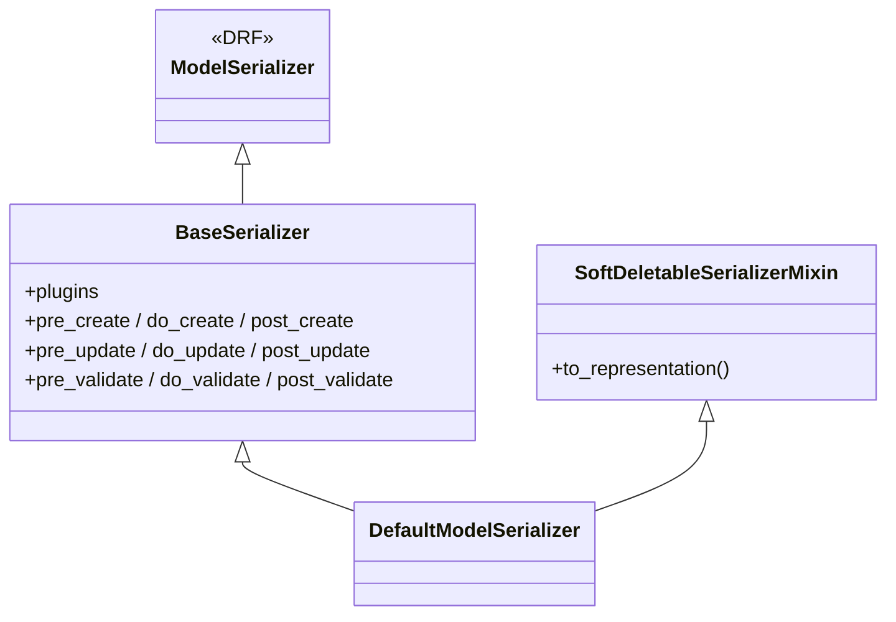
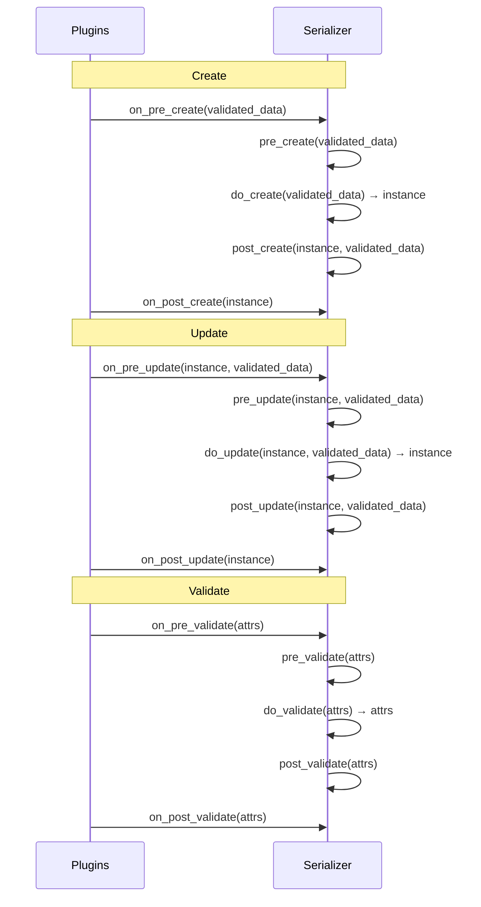
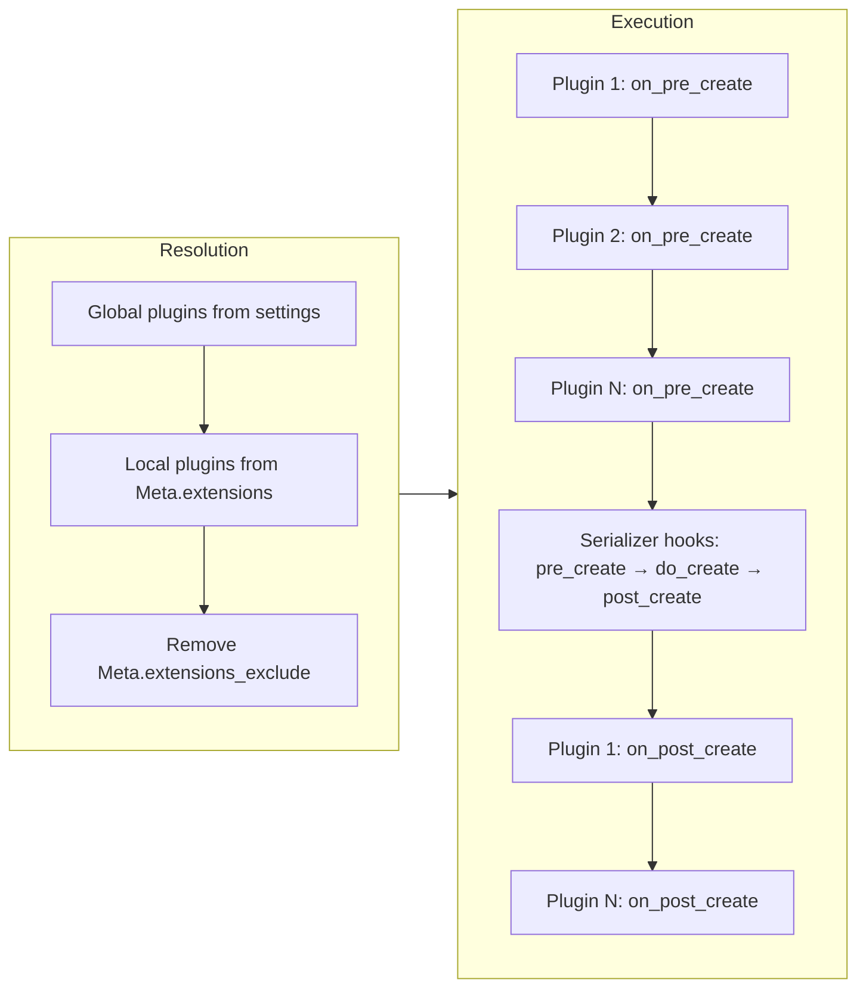

# Building Serializers

How to build serializers — from choosing the right base class and declaring fields to lifecycle hooks, plugins, output transformation, and custom relational fields.

---

## Overview

Three base classes cover all serializer use cases:

| Class | Use Case |
|-------|----------|
| `DefaultModelSerializer` | Tenant-scoped models with soft-delete (most common) |
| `BaseSerializer` | Platform-level models or models without soft-delete |
| `serializers.Serializer` | Non-model serializers (login, actions, commands) |



---

## Choosing a Base Class

```python
from core.base.serializers import BaseSerializer, DefaultModelSerializer
```

Use `DefaultModelSerializer` for tenant-scoped, soft-deletable models:

```python
from core.base.serializers import DefaultModelSerializer

from .models import Invoice


class InvoiceSerializer(DefaultModelSerializer):
    class Meta:
        model = Invoice
        fields = ["id", "number", "amount", "created_at", "updated_at"]
        read_only_fields = ["id", "created_at", "updated_at"]
```

Use `BaseSerializer` for platform-level models (no soft-delete representation):

```python
from core.base.serializers import BaseSerializer

from .models import Tenant


class TenantSerializer(BaseSerializer):
    class Meta:
        model = Tenant
        fields = ["id", "name", "code", "is_active", "created_at", "updated_at"]
        read_only_fields = ["id", "created_at", "updated_at"]
```

Use plain `serializers.Serializer` for non-model operations:

```python
from rest_framework import serializers


class PasswordChangeSerializer(serializers.Serializer):
    old_password = serializers.CharField(write_only=True)
    new_password = serializers.CharField(write_only=True)
```

---

## Lifecycle Hooks (Template Methods)

`BaseSerializer` orchestrates create/update/validate through hooks. Override only the step you need — never override `create`, `update`, or `validate` directly.

### Execution Order



### Hook Reference

| Lifecycle | Hook | Signature | Purpose |
|-----------|------|-----------|---------|
| Create | `pre_create` | `(validated_data)` | Prepare/enrich data before save |
| Create | `do_create` | `(validated_data) → Model` | Perform the actual save |
| Create | `post_create` | `(instance, validated_data)` | Side effects after creation |
| Update | `pre_update` | `(instance, validated_data)` | Prepare data before save |
| Update | `do_update` | `(instance, validated_data) → Model` | Perform the actual save |
| Update | `post_update` | `(instance, validated_data)` | Side effects after update |
| Validate | `pre_validate` | `(attrs)` | Pre-checks before validation |
| Validate | `do_validate` | `(attrs) → attrs` | Core validation logic |
| Validate | `post_validate` | `(attrs)` | Post-checks after validation |

### Example

```python
from core.base.serializers import DefaultModelSerializer

from .models import Invitation
from .utils import generate_token, send_invitation_email


class InvitationSerializer(DefaultModelSerializer):
    class Meta:
        model = Invitation
        fields = ["id", "email", "token", "created_at"]
        read_only_fields = ["id", "token", "created_at"]

    def pre_create(self, validated_data: dict) -> None:
        validated_data["token"] = generate_token()

    def post_create(self, instance, validated_data: dict) -> None:
        send_invitation_email(instance)
```

---

## Plugins

Plugins are stateless classes that participate in the serializer lifecycle across many serializers. Use them for cross-cutting concerns (tenant injection, audit trails, feature flags).

### Creating a Plugin

Subclass `SerializerPlugin` and override only the hooks you need:

```python
from typing import Any

from core.base.serializers import BaseSerializer, SerializerPlugin


class AuditPlugin(SerializerPlugin):
    """Stamps created_by/updated_by from the authenticated user."""

    def on_pre_create(self, serializer: BaseSerializer, validated_data: dict[str, Any]) -> None:
        request = serializer.context.get("request")
        if request and request.user:
            validated_data["created_by"] = str(request.user)

    def on_pre_update(
        self, serializer: BaseSerializer, instance: Any, validated_data: dict[str, Any]
    ) -> None:
        request = serializer.context.get("request")
        if request and request.user:
            validated_data["updated_by"] = str(request.user)
```

### Plugin Hooks

| Hook | Signature | Purpose |
|------|-----------|---------|
| `on_pre_create` | `(serializer, validated_data)` | Mutate data before creation |
| `on_post_create` | `(serializer, instance)` | Side effects after creation |
| `on_pre_update` | `(serializer, instance, validated_data)` | Mutate data before update |
| `on_post_update` | `(serializer, instance)` | Side effects after update |
| `on_pre_validate` | `(serializer, data)` | Inspect/mutate before validation |
| `on_post_validate` | `(serializer, validated_data)` | Inspect/mutate after validation |
| `on_representation` | `(serializer, instance, representation)` | Transform output (must return dict) |

### Plugin Contract

1. **Stateless** — no instance attributes. All context comes from the serializer argument.
2. **Self-guarding** (for global plugins) — check applicability and no-op if not relevant:
   ```python
   def on_pre_create(self, serializer, validated_data):
       if not hasattr(serializer.Meta.model, "tenant_id"):
           return
       ...
   ```
3. **No inter-plugin dependencies** — plugins must not assume another plugin has run.
4. **Short-circuit via exceptions** — raise to abort the operation:
   ```python
   from core.exceptions.api import PermissionDeniedError

   def on_pre_create(self, serializer, validated_data):
       if not feature_enabled("invoices"):
           raise PermissionDeniedError("Invoices feature is disabled.")
   ```

### Registration

#### Global (all serializers)

Add the dotted path to `settings.DEFAULT_SERIALIZER_PLUGINS`:

```python
# config/settings/base.py — inside REST_FRAMEWORK dict
"DEFAULT_SERIALIZER_PLUGINS": [
    "apps.tenants.plugins.TenantInjectionSerializerPlugin",
    "apps.sys_audit.plugins.AuditSerializerPlugin",
]
```

Global plugins MUST be self-guarding since they run on every serializer.

#### Local (per-serializer)

Declare in `Meta.extensions`:

```python
from core.base.serializers import DefaultModelSerializer

from .plugins import InvoiceNumberPlugin


class InvoiceSerializer(DefaultModelSerializer):
    class Meta:
        model = Invoice
        fields = [...]
        extensions = [InvoiceNumberPlugin]
```

#### Excluding

Opt out of a global or local plugin via `Meta.extensions_exclude`:

```python
from apps.tenants.plugins import TenantInjectionSerializerPlugin
from core.base.serializers import BaseSerializer


class SystemReportSerializer(BaseSerializer):
    class Meta:
        model = SystemReport
        fields = [...]
        extensions_exclude = [TenantInjectionSerializerPlugin]
```

### Resolution and Execution Order



Global plugins execute first, then local plugins, left to right within each group.

---

## ForeignKeyField

Use `ForeignKeyField` instead of `PrimaryKeyRelatedField` for tenant-scoped lookups with soft-delete awareness:

```python
from core.fields import ForeignKeyField
from apps.iam_roles.models import TenantRole, User


class MembershipCreateSerializer(serializers.Serializer):
    user_id = ForeignKeyField(
        queryset=User.objects.all(),
        base_filters={"is_active": True},
        context_filters={},
        exclude_deleted=False,
        error_message="User not found or inactive.",
    )
    role_id = ForeignKeyField(
        queryset=TenantRole.objects.all(),
        error_message="Role not found in this tenant.",
    )
```

### Parameters

| Parameter | Default | Purpose |
|-----------|---------|---------|
| `base_filters` | `{}` | Static queryset filters applied unconditionally |
| `context_filters` | `{"tenant_id": "tenant_id"}` | Mapping of lookup keys to serializer context keys, resolved at validation time |
| `exclude_deleted` | `True` | Filter out soft-deleted records |
| `error_message` | `"Object not found."` | Custom "does not exist" error message |

By default, `ForeignKeyField` scopes lookups to the current tenant (via `context_filters`) and excludes soft-deleted records. Pass `context_filters={}` to disable tenant scoping, or `exclude_deleted=False` to include deleted records.

---

## Field Visibility (read_only / write_only)

Control which fields are readable vs. writable:

```python
from rest_framework import serializers


class UserSerializer(serializers.ModelSerializer):
    password = serializers.CharField(write_only=True)       # Accepted on input, never in response
    email = serializers.EmailField(read_only=True)          # Shown in response, rejected on input

    class Meta:
        model = User
        fields = ["id", "email", "password", "first_name", "created_at"]
        read_only_fields = ["id", "created_at"]             # Bulk read-only via Meta
```

| Mechanism | Use When |
|-----------|----------|
| `Meta.read_only_fields` | Multiple model fields that are always read-only (timestamps, IDs) |
| `read_only=True` on field | Computed/derived fields declared explicitly on the serializer |
| `write_only=True` on field | Sensitive input that should never appear in responses (passwords, tokens) |

---

## Accessing Context

The serializer receives context from the viewset (automatically includes `request`, `view`, `format`). Access it via `self.context`:

```python
from rest_framework import serializers


class AuditSerializer(serializers.Serializer):
    def save(self, **kwargs):
        user = self.context["request"].user
        tenant_id = self.context.get("tenant_id")  # Custom context from viewset
        ...
```

Custom context is injected by overriding `get_serializer_context` on the viewset (see [Building Endpoints](building-endpoints.md#overriding-get_serializer_context)).

Use context for data that comes from the request layer (current user, tenant, feature flags). Do not use it to pass model data — that belongs in `validated_data` or on the instance.

---

## Non-Model Serializers with save()

For `serializers.Serializer` subclasses that perform actions (not CRUD), override `save()` directly:

```python
from typing import Any

from rest_framework import serializers
from rest_framework_simplejwt.tokens import RefreshToken


class LogoutSerializer(serializers.Serializer):
    refresh = serializers.CharField()

    def validate_refresh(self, value: str) -> str:
        try:
            self._token = RefreshToken(value)
        except Exception as e:
            raise serializers.ValidationError("Invalid or expired token.") from e
        return value

    def save(self, **kwargs: Any) -> None:
        self._token.blacklist()
```

This pattern applies when there's no model instance to create/update. The viewset calls `serializer.save()` after validation, and the serializer performs the side effect.

Do not use this pattern on `BaseSerializer` or `DefaultModelSerializer` — those use the lifecycle hooks instead.

---

## List vs. Detail Serializers

Use lightweight serializers for list actions and full serializers for detail/write actions. Register them via `serializer_classes` on the viewset (see [Building Endpoints](building-endpoints.md)):

```python
from rest_framework import serializers

from .models import Team


class TeamListSerializer(serializers.ModelSerializer):
    class Meta:
        model = Team
        fields = ["id", "name", "description", "is_active"]


class TeamSerializer(serializers.ModelSerializer):
    class Meta:
        model = Team
        fields = ["id", "tenant", "name", "description", "is_active", "created_at", "updated_at"]
        read_only_fields = ["id", "created_at", "updated_at"]
```

List serializers omit expensive nested data and write-only fields. They can use `serializers.ModelSerializer` directly when they don't need lifecycle hooks or plugins.

---

## Nested Read-Only Fields

Flatten related data for read operations using `source`:

```python
from rest_framework import serializers

from apps.iam_users.models import TenantMembership


class MembershipListSerializer(serializers.ModelSerializer):
    email = serializers.EmailField(source="user.email", read_only=True)
    first_name = serializers.CharField(source="user.first_name", read_only=True)
    role_name = serializers.CharField(source="role.name", read_only=True)

    class Meta:
        model = TenantMembership
        fields = ["id", "user", "email", "first_name", "role", "role_name", "is_active"]
```

Pair with `select_related` on the viewset's queryset to avoid N+1 queries.

---

## Extending Third-Party Serializers

For library-backed operations (e.g., simplejwt), inherit from the library serializer — not from `BaseSerializer`:

```python
from typing import Any

from rest_framework_simplejwt.serializers import TokenObtainPairSerializer
from rest_framework_simplejwt.tokens import RefreshToken


class LoginSerializer(TokenObtainPairSerializer):
    @classmethod
    def get_token(cls, user: Any) -> RefreshToken:
        return super().get_token(user)

    def validate(self, attrs: dict[str, Any]) -> dict[str, Any]:
        data: dict[str, Any] = super().validate(attrs)
        # Add custom claims or response data
        data["user"] = {"id": str(self.user.pk), "email": self.user.email}
        return data
```

Use this when the library provides the core logic and you only need to extend the output or add claims.

---

## Testing Plugins

Test plugins in isolation by calling hooks with a mock serializer:

```python
from unittest.mock import MagicMock

from apps.audit.plugins import AuditPlugin


class TestAuditPlugin:
    def test_on_pre_create_sets_created_by(self):
        plugin = AuditPlugin()
        serializer = MagicMock()
        serializer.context = {"request": MagicMock(user="admin@test.com")}

        validated_data = {}
        plugin.on_pre_create(serializer, validated_data)

        assert validated_data["created_by"] == "admin@test.com"

    def test_skips_without_request(self):
        plugin = AuditPlugin()
        serializer = MagicMock()
        serializer.context = {}

        validated_data = {}
        plugin.on_pre_create(serializer, validated_data)

        assert "created_by" not in validated_data
```

For self-guarding plugins, test the skip path:

```python
def test_skips_model_without_tenant(self):
    plugin = TenantInjectionSerializerPlugin()
    serializer = MagicMock()
    serializer.Meta.model = ModelWithoutTenant

    validated_data = {}
    plugin.on_pre_create(serializer, validated_data)

    assert "tenant_id" not in validated_data
```

---

## Common Pitfalls

| Mistake | Consequence | Fix |
|---------|-------------|-----|
| Overriding `create`/`update`/`validate` directly | Skips plugin execution and breaks the lifecycle | Override `do_create`, `do_update`, or `do_validate` instead |
| Including `tenant` as a writable field | Client can forge tenant ownership | Omit it — `TenantInjectionSerializerPlugin` handles it |
| Using `PrimaryKeyRelatedField` for tenant-scoped lookups | No tenant filtering, no soft-delete exclusion | Use `ForeignKeyField` with appropriate filters |
| Forgetting `context_filters={}` on non-tenant-scoped ForeignKeyField | Lookup fails because `tenant_id` is not in context | Explicitly pass `context_filters={}` |
| Adding stateful attributes to a plugin | Shared state across serializer instances causes bugs | Plugins are stateless — read everything from the serializer argument |
| Using `Meta.extensions` for a concern shared across 3+ serializers | Repetitive, easy to forget | Register as a global plugin in settings instead |
| Declaring a list serializer with `BaseSerializer` | Unnecessary plugin overhead for read-only operations | Use plain `serializers.ModelSerializer` for list serializers |
| Using `self.context` to pass model data between hooks | Fragile coupling, hard to trace | Pass data via `validated_data` or instance attributes |
| Overriding `save()` on a `BaseSerializer` subclass | Bypasses the entire lifecycle (plugins + hooks) | Use `do_create`/`do_update` for custom save logic |

---

## Decision Guide

| Scenario | Approach |
|----------|----------|
| Tenant-scoped model with soft-delete | `DefaultModelSerializer` |
| Platform-level model (no tenant, no soft-delete) | `BaseSerializer` |
| Non-model operation (login, password change) | `serializers.Serializer` with `save()` override |
| Wrapping a library serializer (simplejwt) | Inherit from the library serializer |
| Lightweight list representation | `serializers.ModelSerializer` (no hooks needed) |
| Enrich data before save | `pre_create` / `pre_update` hook |
| Custom save logic | `do_create` / `do_update` hook |
| Side effects after save | `post_create` / `post_update` hook |
| Cross-field validation | `do_validate` hook (see [Input Validation](input-validation.md)) |
| Field-level validation | `validate_<field>` method (see [Input Validation](input-validation.md)) |
| Behavior shared across 3+ serializers | Plugin (global if universal, local if selective) |
| Behavior specific to one serializer | Template method hook |
| FK lookup with tenant scoping | `ForeignKeyField` (default `context_filters`) |
| FK lookup without tenant scoping | `ForeignKeyField` with `context_filters={}` |
| Transform API output shape | Plugin with `on_representation` hook |
| Block operation conditionally | Plugin that raises an exception |
| Soft-delete representation in responses | `DefaultModelSerializer` (see [Soft-Delete](soft-delete.md)) |
| Need request user/tenant inside serializer | `self.context["request"]` |
