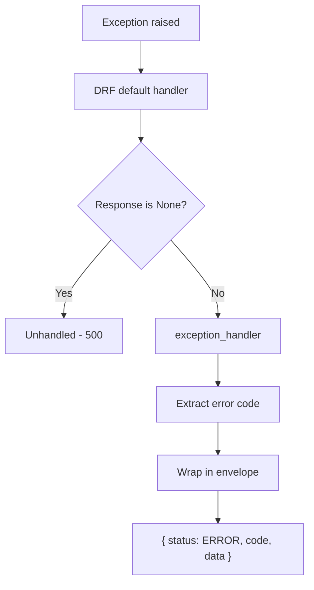
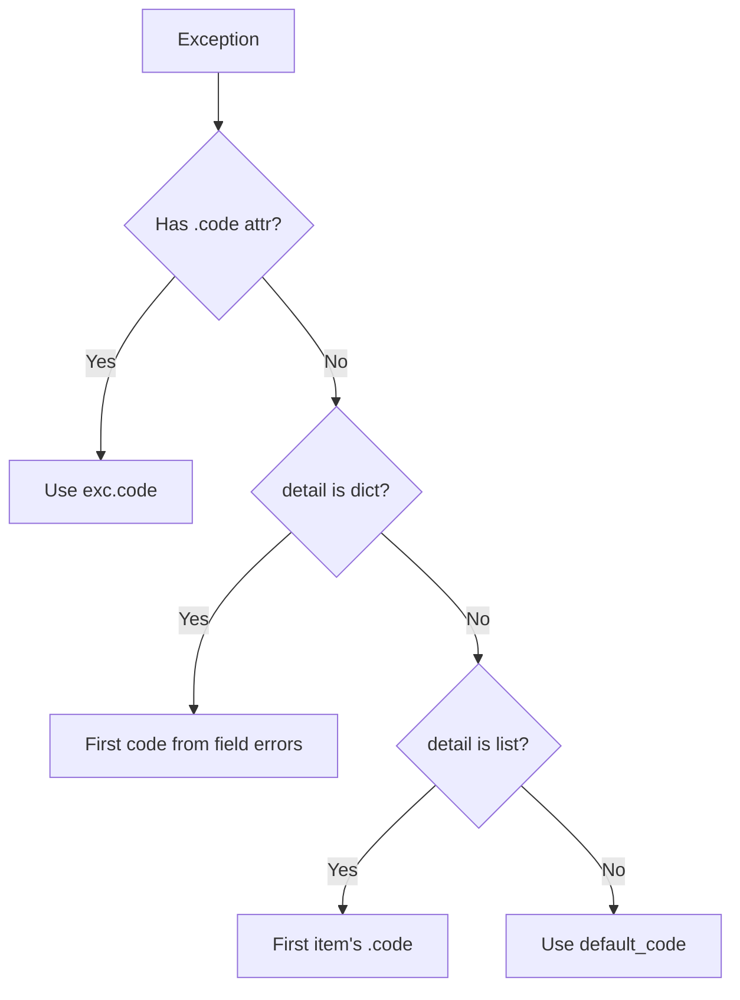

# Error Handling

This document describes how to raise and handle errors consistently across the platform.

---

## Overview

All errors flow through a custom exception handler that wraps them into the standard API envelope:

```json
{"status": "ERROR", "code": "<error_code>", "data": { ... }}
```

The handler (`core.exceptions.handler.exception_handler`) intercepts DRF's default response and restructures it.



---

## Exception Hierarchy

All custom exceptions live in `core.exceptions.api` and inherit from `APIException`:

| Exception | Status | Default Code | When to Use |
|-----------|--------|--------------|-------------|
| `ValidationError` | 400 | `validation_error` | Invalid input, business rule violations |
| `AuthenticationError` | 401 | `authentication_error` | Failed credentials, expired tokens |
| `PermissionDeniedError` | 403 | `permission_denied` | Authenticated but not authorized |
| `NotFoundError` | 404 | `not_found` | Resource does not exist or is soft-deleted |
| `ThrottlingError` | 429 | `throttling_error` | Rate limit exceeded |

---

## Usage Rules

### In Views and Services

Always use the custom exceptions — never raise raw DRF exceptions:

```python
from core.exceptions.api import NotFoundError, PermissionDeniedError, ValidationError

# Business rule violation
if invoice.is_finalized:
    raise ValidationError("Cannot modify a finalized invoice.")

# Authorization failure
if not user_can_approve(request.user, invoice):
    raise PermissionDeniedError("Only managers can approve invoices.")

# Resource not found
tenant = Tenant.objects.filter(pk=tenant_id).first()
if not tenant:
    raise NotFoundError("Tenant not found.")
```

### Custom Error Codes

Pass a `code` argument to override the default:

```python
raise ValidationError("Duplicate entry.", code="duplicate_resource")
# Response: {"status": "ERROR", "code": "duplicate_resource", "data": "Duplicate entry."}
```

### In Serializers

For field-level and cross-field validation, raise DRF's `serializers.ValidationError` — the handler normalizes it into the standard envelope automatically:

```python
from rest_framework import serializers

def validate_email(self, value: str) -> str:
    if not value.endswith("@company.com"):
        raise serializers.ValidationError("Must use a company email.")
    return value
```

---

## Error Code Extraction

The handler extracts the most specific error code from the exception:



This means the `code` field in the response envelope always contains a machine-readable identifier that clients can switch on.

---

## Response Examples

### Single error (custom exception):

```json
{
  "status": "ERROR",
  "code": "permission_denied",
  "data": "Only managers can approve invoices."
}
```

### Field validation errors (serializer):

```json
{
  "status": "ERROR",
  "code": "required",
  "data": {
    "name": ["This field is required."],
    "email": ["Enter a valid email address."]
  }
}
```

---

## Decision Guide

| Scenario | Raise |
|----------|-------|
| Serializer field validation | `serializers.ValidationError` |
| Business logic violation (view/service) | `core.exceptions.api.ValidationError` |
| User not authenticated | `AuthenticationError` |
| User lacks permission | `PermissionDeniedError` |
| Object not found | `NotFoundError` |
| Rate limit hit | `ThrottlingError` |
| Plugin short-circuit | Any of the above (typically `ValidationError` or `PermissionDeniedError`) |
