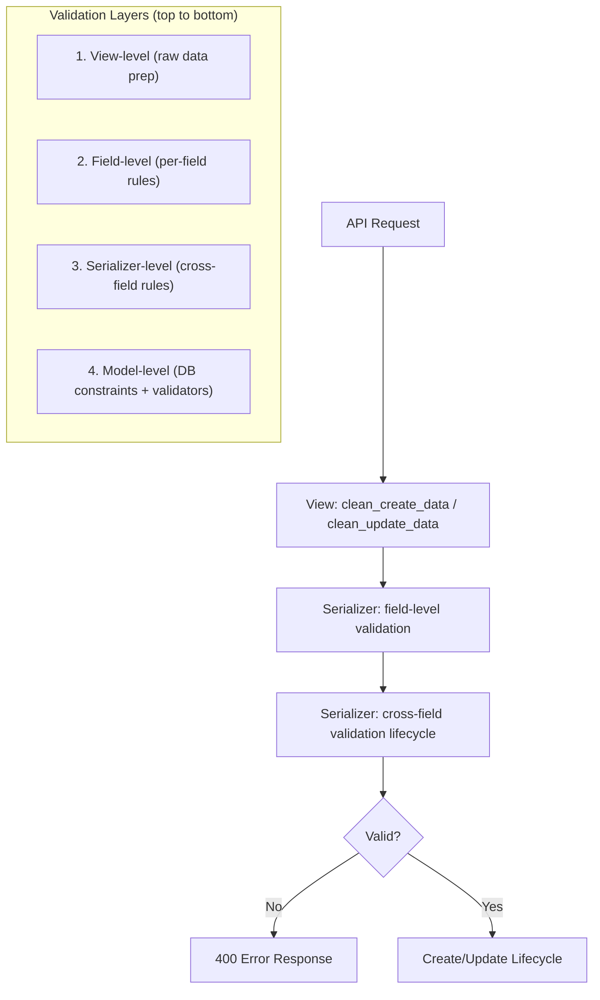
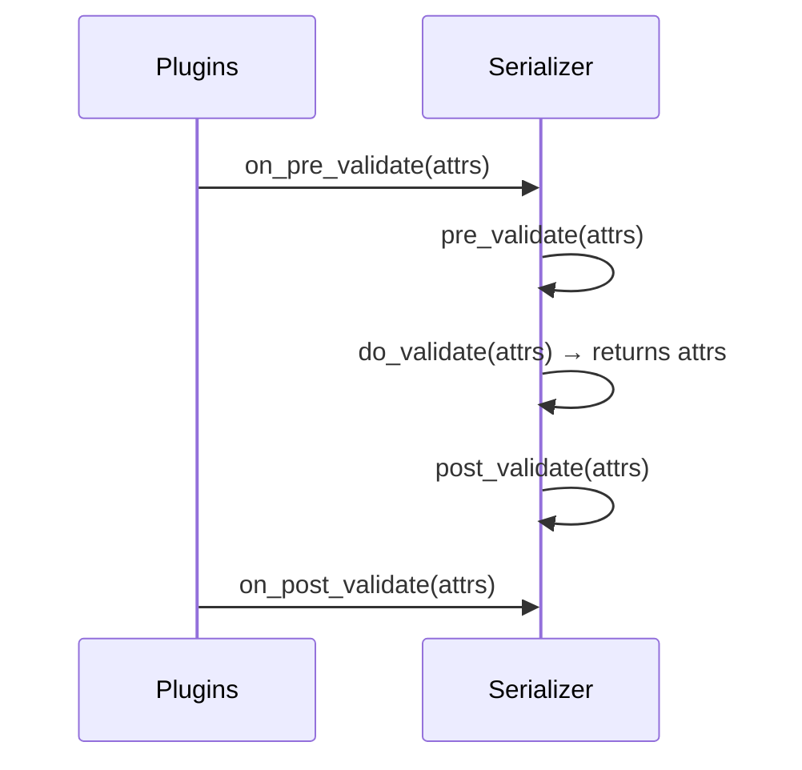

# Input Validation

This document describes how to validate incoming data at each layer of the platform — from declarative field constraints to cross-field business rules.

---

## Overview

Validation happens at multiple levels, each with a distinct purpose:



| Layer | Runs When | Purpose |
|-------|-----------|---------|
| View (`clean_*_data`) | Before serializer instantiation | Strip, normalize, or reject raw request data |
| Field-level | During `serializer.is_valid()` | Per-field format, type, and range checks |
| Serializer-level | During `serializer.is_valid()` | Cross-field rules, business logic |
| Model-level | On `full_clean()` / migrations | Database-enforced constraints |

---

## Field-Level Validation

### Declarative Constraints (Meta.extra_kwargs)

Use `extra_kwargs` for simple constraints without writing code:

```python
class InvoiceSerializer(DefaultModelSerializer):
    class Meta:
        model = Invoice
        fields = ["id", "number", "amount", "description"]
        extra_kwargs = {
            "number": {"max_length": 50, "required": True},
            "amount": {"min_value": 0, "max_value": 999999.99},
            "description": {"allow_blank": True, "max_length": 500},
        }
```

### validate_<field> Methods

For per-field logic that goes beyond declarative constraints:

```python
class InvoiceSerializer(DefaultModelSerializer):
    class Meta:
        model = Invoice
        fields = ["id", "number", "email", "amount"]

    def validate_number(self, value: str) -> str:
        """Ensure invoice number follows the expected format."""
        if not value.startswith("INV-"):
            raise serializers.ValidationError("Must start with 'INV-'.")
        return value

    def validate_email(self, value: str) -> str:
        """Normalize email to lowercase."""
        return value.lower()
```

Rules for `validate_<field>`:
- Must return the validated (possibly transformed) value
- Raise `serializers.ValidationError` on failure
- Runs after the field's built-in validators (type coercion, `max_length`, etc.)
- Use for: format checks, normalization, single-field business rules

### Built-in Django/DRF Validators

Use Django's built-in validators on serializer fields or model fields:

```python
from django.core.validators import MaxLengthValidator, MinValueValidator, RegexValidator

class ProductSerializer(DefaultModelSerializer):
    sku = serializers.CharField(validators=[
        RegexValidator(r"^[A-Z]{3}-\d{4}$", message="SKU must match format AAA-0000."),
    ])
    price = serializers.DecimalField(
        max_digits=10, decimal_places=2,
        validators=[MinValueValidator(0.01)],
    )
```

Common built-in validators:
- `RegexValidator` — pattern matching
- `MinValueValidator` / `MaxValueValidator` — numeric bounds
- `MinLengthValidator` / `MaxLengthValidator` — string length
- `EmailValidator` — email format (already applied by `EmailField`)
- `URLValidator` — URL format
- `FileExtensionValidator` — allowed file extensions

---

## Serializer-Level Validation (Lifecycle Hooks)

`BaseSerializer` provides a three-phase validation lifecycle for cross-field rules:



### When to Use Each Hook

| Hook | Use Case | Example |
|------|----------|---------|
| `pre_validate` | Strip, normalize, or inject data before rules run | Remove whitespace, set defaults |
| `do_validate` | Cross-field validation, business rules | Date range checks, conditional requirements |
| `post_validate` | Derived field computation after validation passes | Auto-generate slugs, compute totals |

### Example

```python
class InvoiceSerializer(DefaultModelSerializer):
    class Meta:
        model = Invoice
        fields = ["id", "number", "amount", "due_date", "issued_date"]

    def pre_validate(self, attrs: dict[str, Any]) -> None:
        # Default due_date to 30 days after issued_date if not provided
        if attrs.get("issued_date") and not attrs.get("due_date"):
            attrs["due_date"] = attrs["issued_date"] + timedelta(days=30)

    def do_validate(self, attrs: dict[str, Any]) -> dict[str, Any]:
        if attrs.get("due_date") and attrs.get("issued_date"):
            if attrs["due_date"] < attrs["issued_date"]:
                raise serializers.ValidationError(
                    {"due_date": "Due date cannot be before issued date."}
                )
        return attrs

    def post_validate(self, attrs: dict[str, Any]) -> None:
        if not attrs.get("number"):
            attrs["number"] = generate_next_invoice_number()
```

### Meta.validators (Serializer-Level Validators)

For reusable cross-field validators, declare them in `Meta.validators`:

```python
class TenantRoleSerializer(DefaultModelSerializer):
    class Meta:
        model = TenantRole
        fields = ["id", "name", "description"]
        validators = [
            UniqueTogetherContextValidator(
                fields={"name": "name"},
                message="A role with this name already exists in this tenant.",
            ),
        ]
```

---

## UniqueTogetherContextValidator

For tenant-scoped uniqueness constraints that combine serializer fields with context values:

```python
from core.validators import UniqueTogetherContextValidator

class SettingSerializer(DefaultModelSerializer):
    class Meta:
        model = TenantSetting
        fields = ["id", "key", "value"]
        validators = [
            UniqueTogetherContextValidator(
                fields={"key": "key"},                     # queryset lookup → serializer field
                context_fields={"tenant_id": "tenant_id"}, # queryset lookup → context key
                message="This setting key already exists for this tenant.",
            ),
        ]
```

### Parameters

| Parameter | Description | Default |
|-----------|-------------|---------|
| `fields` | `{lookup: serializer_field}` mapping | Required |
| `context_fields` | `{lookup: context_key}` mapping | `{"tenant_id": "tenant_id"}` |
| `queryset` | Explicit queryset | Inferred from `Meta.model` |
| `message` | Error message | `"This combination already exists."` |

The validator has `requires_context = True` and receives the serializer as second argument. On updates, exclude the current instance to avoid false positives by passing an explicit queryset or handling it in the validator.

---

## ForeignKeyField (Validated Lookups)

`core.fields.ForeignKeyField` provides tenant-scoped, soft-delete-aware FK validation:

```python
from core.fields import ForeignKeyField

class MembershipCreateSerializer(serializers.Serializer):
    role_id = ForeignKeyField(
        queryset=TenantRole.objects.all(),
        error_message="Role not found in this tenant.",
    )
```

By default it:
- Filters by `tenant_id` from serializer context
- Excludes soft-deleted records (`deleted_at__isnull=True`)
- Returns a custom error message on lookup failure

### Configuration

| Parameter | Description | Default |
|-----------|-------------|---------|
| `base_filters` | Static filters applied unconditionally | `{}` |
| `context_filters` | `{lookup: context_key}` resolved at runtime | `{"tenant_id": "tenant_id"}` |
| `exclude_deleted` | Filter out soft-deleted records | `True` |
| `error_message` | Custom "does not exist" message | `"Object not found."` |

Override `context_filters={}` to disable tenant scoping for platform-level lookups:

```python
user_id = ForeignKeyField(
    queryset=User.objects.all(),
    base_filters={"is_active": True},
    context_filters={},           # No tenant scoping for platform-level User
    exclude_deleted=False,        # User model doesn't use soft-delete
    error_message="User not found or inactive.",
)
```

---

## View-Level Pre-Validation (clean_*_data)

Use `clean_create_data` / `clean_update_data` on the viewset for request-level manipulation before the serializer is instantiated. This is NOT validation per se, but a place to reject or transform raw data early:

```python
class DocumentViewSet(BaseViewSet):
    def clean_create_data(self, data: dict[str, Any]) -> dict[str, Any]:
        # Normalize title whitespace
        if "title" in data:
            data["title"] = " ".join(data["title"].split())
        return data

    def clean_update_data(self, data: dict[str, Any]) -> dict[str, Any]:
        # Prevent updating immutable fields
        data.pop("document_type", None)
        return data
```

Use this for:
- Stripping/normalizing raw input before serializer sees it
- Removing fields that should never be writable on update
- Injecting request-derived values (though plugins are preferred for this)

---

## Model-Level Validators

Deconstructible validators for use on model fields. Located in `core.validators.fields`:

| Validator | Purpose |
|-----------|---------|
| `UsernameValidator` | Alphanumeric + underscores, 3-30 chars |
| `PhoneNumberValidator` | 10-15 digits after stripping formatting |
| `EmailDomainValidator` | Restricts email to allowed domains |

### Usage on Models

```python
from core.validators.fields import EmailDomainValidator

class Employee(TenantAwareModel):
    email = models.EmailField(
        validators=[EmailDomainValidator(allowed_domains=["company.com"])]
    )
    # Corporate email, restricted to company domain.
```

### Creating Custom Model Validators

Follow the deconstructible pattern for migration compatibility:

```python
from django.core.exceptions import ValidationError as DjangoValidationError
from django.utils.deconstruct import deconstructible

@deconstructible
class InvoiceNumberValidator:
    """Validate invoice number format: INV-XXXXX."""

    regex = re.compile(r"^INV-\d{5}$")

    def __call__(self, value: str) -> None:
        if not self.regex.match(value):
            raise DjangoValidationError("Invoice number must match format INV-XXXXX.")

    def __eq__(self, other: object) -> bool:
        return isinstance(other, InvoiceNumberValidator)
```

Rules for model validators:
- Use `@deconstructible` so Django can serialize them in migrations
- Implement `__eq__` to avoid unnecessary migration generation
- Raise `DjangoValidationError` (not DRF's `ValidationError`)
- These run on `model.full_clean()` — DRF calls this automatically during serializer validation

---

## Utility Validation Functions

Standalone functions in `core.validators.functions` for use in services, serializers, or management commands:

| Function | Purpose |
|----------|---------|
| `validate_email_uniqueness(email, model_class, exclude_id?)` | Check email is unique |
| `validate_unique_slug(value, model_class, field_name?, exclude_id?)` | Check slug is unique |
| `validate_file_size(file, max_size_mb?)` | Validate file size limit |
| `validate_date_range(start, end, max_days?)` | Validate date range bounds |
| `validate_json_field(value, schema?)` | Parse and optionally validate JSON |

### Example

```python
from core.validators.functions import validate_date_range

result = validate_date_range(start_date, end_date, max_days=90)
if not result["is_valid"]:
    raise ValidationError(result["errors"][0])
```

---

## Error Message Conventions

### Field errors (dict format)

Raise with a dict to associate errors with specific fields:

```python
raise serializers.ValidationError({
    "due_date": "Due date cannot be before issued date.",
    "amount": "Amount must be positive.",
})
```

### Non-field errors (list/string format)

Raise with a string or list for errors not tied to a specific field:

```python
raise serializers.ValidationError("Cannot create invoice for inactive tenant.")
```

This surfaces under `non_field_errors` in the response.

### Error codes

DRF attaches codes to validation errors. Use them for machine-readable identification:

```python
raise serializers.ValidationError(
    "Invoice number already exists.",
    code="duplicate_invoice_number",
)
```

Clients receive the code in the envelope's `code` field for programmatic handling.

---

## Decision Guide

| Scenario | Approach |
|----------|----------|
| Required/optional, max_length, min_value | `Meta.extra_kwargs` |
| Format check on a single field | `validate_<field>` method or `RegexValidator` |
| Normalize/transform a field value | `validate_<field>` method (return transformed value) |
| Cross-field validation | `do_validate` hook |
| Default/derived values after validation | `post_validate` hook |
| Tenant-scoped uniqueness | `UniqueTogetherContextValidator` in `Meta.validators` |
| FK lookup with tenant + soft-delete filtering | `ForeignKeyField` |
| Strip/reject raw data before serializer | `clean_create_data` / `clean_update_data` |
| Reusable check callable from multiple places | Utility function in `core.validators.functions` |
| Plugin-driven validation (e.g., feature flags) | Plugin `on_pre_validate` hook |
| Database-enforced constraint | Model field validator (`@deconstructible`) |
| Pattern reusable across model fields | Custom deconstructible validator in `core.validators.fields` |
