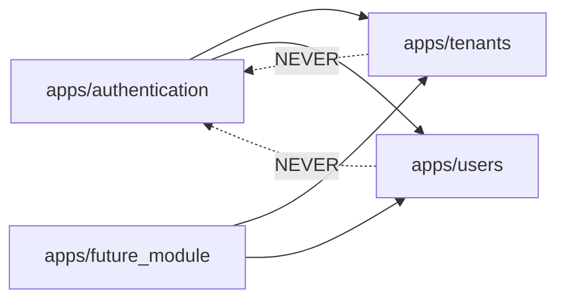

# Inter-Module Communication

How domain modules (`apps/`) interact with each other — allowed interfaces, forbidden patterns, and dependency direction.

---

## Overview

Each app in `apps/` is a self-contained domain module. Modules must communicate through explicit, narrow interfaces rather than reaching into each other's internals. This keeps modules independently evolvable and makes future service extraction possible.



Arrows represent allowed dependency direction. Dotted lines represent forbidden dependencies.

---

## Dependency Direction

### Rules

1. `core/` depends on nothing (foundation layer)
2. Any app can depend on `core/`
3. Any app can depend on `apps/tenants` and `apps/users` (shared domain models)
4. `apps/tenants` and `apps/users` must not depend on downstream apps
5. `apps/authentication` can depend on `apps/tenants` and `apps/users` (it orchestrates login)
6. No app may depend on `apps/authentication` (auth is a leaf consumer, not a provider)

### Dependency Matrix

| Module | Can depend on |
|--------|---------------|
| `core/` | Nothing |
| `apps/tenants` | `core/` |
| `apps/users` | `core/`, `apps/tenants` |
| `apps/authentication` | `core/`, `apps/tenants`, `apps/users` |
| Any new app | `core/`, `apps/tenants`, `apps/users` |

---

## Allowed Interfaces

When module A needs data or behavior from module B, use these patterns (in order of preference):

### 1. Foreign Key by UUID

Reference another module's model via UUID FK. This is the standard approach for relational data:

```python
from apps.users.models import User

class Document(TenantAwareModel):
    author = models.ForeignKey(User, on_delete=models.CASCADE, related_name="documents")
```

### 2. Public Utility Functions

The owning module exposes a function that returns plain data (dicts, dataclasses, or primitives) — not model instances:

```python
# apps/tenants/utils.py (public interface)
def get_tenant_setting(tenant_id: uuid.UUID, key: str) -> str | None:
    """Retrieve a single tenant setting value by key."""
    ...
```

```python
# apps/documents/views.py (consumer)
from apps.tenants.utils import get_tenant_setting

max_size = get_tenant_setting(tenant_id, "max_upload_size_mb")
```

### 3. Model Imports for Read-Only Queries

When you need to filter or join against another module's model in a queryset, import the model directly. This is acceptable for read-only access:

```python
from apps.users.models import User

users = User.objects.filter(is_active=True)
```

Do not call `.save()`, `.delete()`, or mutate instances from another module's model.

---

## Forbidden Patterns

| Pattern | Why It's Forbidden |
|---------|-------------------|
| Importing serializers from another app | Serializers encode API-layer concerns; coupling to them creates brittle dependencies |
| Importing views from another app | Views are entry points, not reusable components |
| Calling `.save()` or `.delete()` on another app's model instances | Mutations must go through the owning module's interface to preserve invariants |
| Importing from another app's `migrations/` | Migrations are internal implementation details |
| Circular dependencies between apps | If A depends on B and B depends on A, extract the shared concern into `core/` or a new app |

---

## Mutations Across Boundaries

When module A needs to *change* data owned by module B:

1. B exposes a public function (service function) that performs the mutation and enforces its own invariants
2. A calls that function — never manipulates B's models directly

```python
# apps/tenants/services.py (owner exposes mutation)
def deactivate_membership(membership_id: uuid.UUID, actor: User) -> None:
    """Deactivate a membership. Enforces state preconditions."""
    ...
```

```python
# apps/some_other_app/views.py (consumer)
from apps.tenants.services import deactivate_membership

deactivate_membership(membership_id=pk, actor=request.user)
```

---

## Future Evolution

These module boundaries map directly to service extraction:

- Each app's public interface (utility functions, service functions) becomes the service's API contract
- FK references become cross-service ID references (resolved via API calls or events)
- The dependency direction determines extraction order — leaf modules (no dependents) extract first

---

## Decision Guide

| Scenario | Approach |
|----------|----------|
| Need to reference another module's entity | FK by UUID |
| Need to read a setting or computed value from another module | Public utility function in the owning module |
| Need to filter/join against another module's model | Import the model, read-only queries only |
| Need to mutate another module's data | Call a service function exposed by the owning module |
| Shared logic needed by multiple apps | Put it in `core/` (if domain-agnostic) or extract a new shared app |
| Two apps depend on each other | Refactor — extract shared concern into `core/` or a third app |
