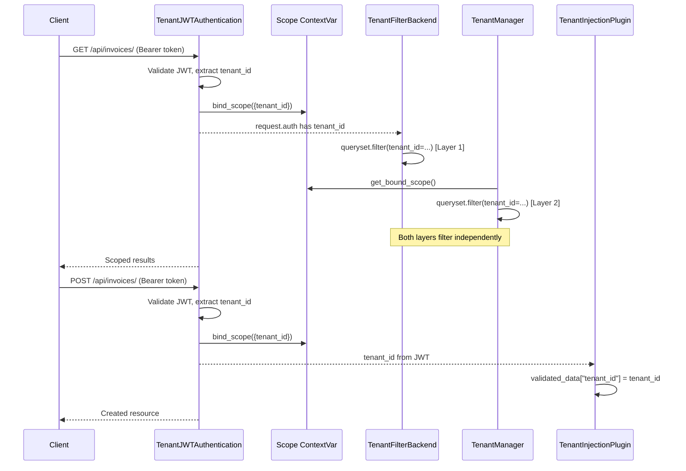
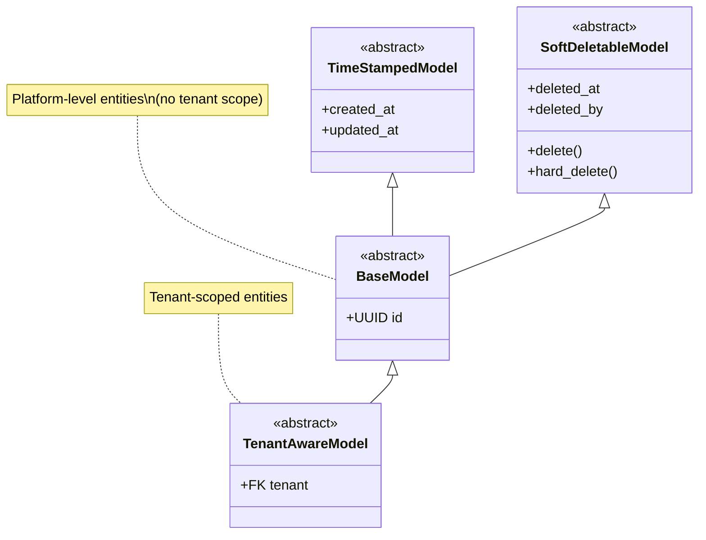
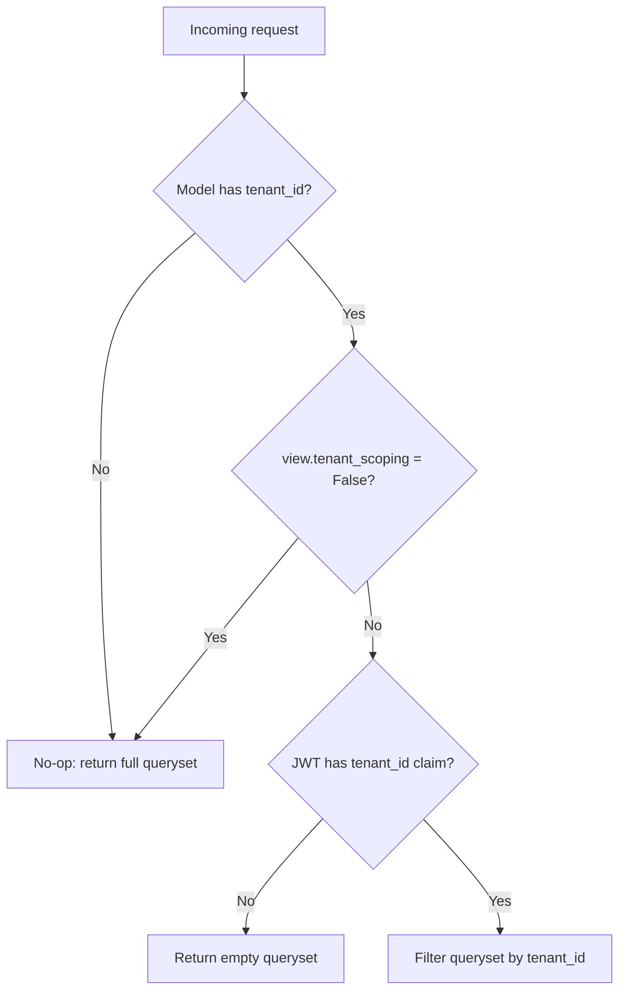
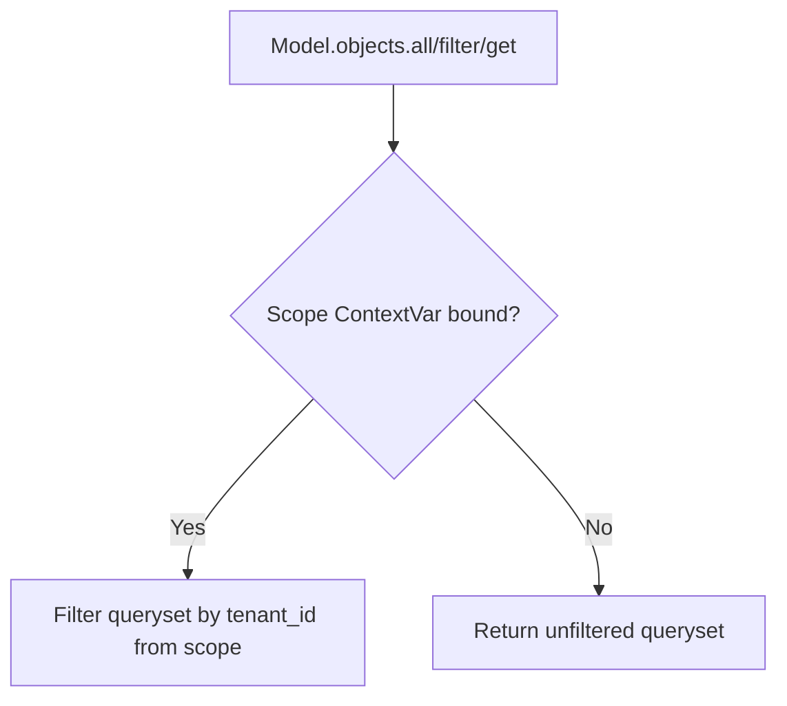
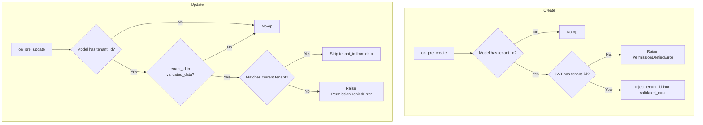

# Multi-Tenancy

How to implement tenant-scoped resources — from model inheritance and automatic query filtering to server-side tenant injection on writes and per-tenant runtime settings.

---

## Overview

Strategy: **shared database with tenant FK filtering, defense in depth per ADR-004.**

A single database holds all tenants' data. Isolation is enforced at runtime through two independent layers:

1. **View layer** — `TenantFilterBackend` reads `tenant_id` from the JWT and filters querysets
2. **ORM layer** — `TenantManager` reads `tenant_id` from a request-scoped ContextVar and filters querysets independently

Supporting mechanisms:

3. A `tenant` FK on every tenant-scoped model
4. Server-side tenant injection via `TenantInjectionSerializerPlugin`
5. Tenant context carried in JWT claims
6. `TenantJWTAuthentication` binds the scope ContextVar after token validation

---

## Tenant Context Flow



### Extracting Tenant Context

Use `apps.tenants.utils.get_tenant_id(request)` to read the tenant from the JWT:

```python
from apps.tenants.utils import get_tenant_id

tenant_id = get_tenant_id(request)  # str | None
```

---

## Model Layer



### Tenant-Scoped Models

Inherit from `TenantAwareModel` — includes UUID pk, timestamps, soft-delete, a `tenant` FK, and `TenantManager`:

```python
from apps.tenants.models import TenantAwareModel

class Invoice(TenantAwareModel):
    number = models.CharField(max_length=50)

    class Meta:
        abstract = False
        db_table = "invoices"
```

If a model defines its own schema but has a `tenant` FK (not inheriting `TenantAwareModel`), apply `TenantManager` directly:

```python
from apps.tenants.managers import TenantManager

class TenantRole(models.Model):
    tenant = models.ForeignKey("tenants.Tenant", on_delete=models.CASCADE)
    name = models.CharField(max_length=50)

    objects = TenantManager()
```

### Platform-Level Models

Inherit from `BaseModel` — same as `TenantAwareModel` but without the tenant FK:

```python
from core.base.models import BaseModel

class Tenant(BaseModel):
    name = models.CharField(max_length=255)
```

### Decision Rule

| The resource belongs to a tenant | Use |
|----------------------------------|-----|
| Yes | `TenantAwareModel` |
| No (platform-wide) | `BaseModel` |

---

## Query Filtering (Layer 1 — View)

`TenantFilterBackend` is registered globally and automatically scopes querysets.



- If the model has a `tenant_id` field → filters by the JWT's `tenant_id`
- If no `tenant_id` claim is present → returns an empty queryset (deny by default, per ADR-004)
- If the model has no `tenant_id` field → no-op

## Query Filtering (Layer 2 — ORM)

`TenantManager` reads the scope ContextVar (bound by `TenantJWTAuthentication`) and filters automatically:



- In API requests: scope is always bound → manager filters by tenant
- In CLI/admin/migrations: no scope bound → manager returns unfiltered results
- Use `.unscoped()` for explicit cross-tenant access in application code

Both layers operate independently. If either is bypassed, the other still enforces isolation.

### Opting Out

Set `tenant_scoping = False` on the viewset for platform-level resources:

```python
class TenantViewSet(BaseViewSet):
    tenant_scoping = False  # No automatic tenant filtering
```

### Conditional Scoping

Use a property for dynamic behavior (e.g., superusers see all):

```python
class TeamViewSet(BaseViewSet):
    @property
    def tenant_scoping(self) -> bool:
        if self.request.user.is_superuser:
            return False
        return True
```

---

## Write Operations

`TenantInjectionSerializerPlugin` (registered globally in settings) handles tenant assignment:



### On Create

- Injects `tenant_id` from the JWT into `validated_data`
- Raises `PermissionDeniedError` if the model requires a tenant but no claim is present
- The client never sends `tenant_id` — it's always derived server-side

### On Update

- Strips `tenant_id` from `validated_data` if it matches the current value
- Raises `PermissionDeniedError` if the client attempts to reassign to a different tenant

### Self-Guarding

The plugin checks `hasattr(model, "tenant_id")` and no-ops for models without a tenant FK. No exclusion needed for platform-level serializers.

---

## Superuser Bypass

- `TenantFilterBackend`: bypassed when `tenant_scoping = False` (set explicitly or via property)
- `BasePermission.check_tenant_ownership`: superusers skip tenant membership checks
- `TenantInjectionSerializerPlugin`: still requires a tenant context — superusers must select a tenant when creating tenant-scoped resources

---

## Adding a New Tenant-Scoped Resource (Checklist)

1. **Model** — inherit from `TenantAwareModel` (or add `objects = TenantManager()` if using a custom base)
2. **Serializer** — inherit from `BaseSerializer` or `DefaultModelSerializer`; exclude `tenant` from writable fields (the plugin handles it)
3. **ViewSet** — inherit from `BaseViewSet`; leave `tenant_scoping = True` (default)
4. **URLs** — register with the app's router
5. **No extra wiring needed** — the global plugin, filter backend, and manager handle isolation automatically

```python
# serializers.py
class InvoiceSerializer(DefaultModelSerializer):
    class Meta:
        model = Invoice
        fields = ["id", "number", "created_at", "updated_at"]
        read_only_fields = ["id", "created_at", "updated_at"]

# views.py
class InvoiceViewSet(BaseViewSet):
    queryset = Invoice.objects.all()
    serializer_class = InvoiceSerializer
```

---

## Tenant Settings

Behavioral configuration is stored in `TenantSetting` (key-value per tenant):

```python
from apps.tenants.utils import get_tenant_setting, get_tenant_settings

# Single setting
limit = get_tenant_setting(tenant_id, "password_min_length", default="8")

# All settings with a prefix
flags = get_tenant_settings(tenant_id, prefix="feature_flag_")
```

Use tenant settings for runtime-configurable behavior (password policies, feature flags, rate limits) — not for static metadata (that goes in `Tenant.details`).

---

## Common Pitfalls

| Mistake | Consequence | Fix |
|---------|-------------|-----|
| Including `tenant` or `tenant_id` as a writable serializer field | Client can forge tenant ownership | Omit it from `fields` — the plugin injects it server-side |
| Manually filtering by tenant in `get_queryset` | Double-filtering, or inconsistent behavior if the backend changes | Rely on `TenantFilterBackend`; only override for additional filters |
| Writing tests without tenant context in the JWT | `TenantFilterBackend` returns an empty queryset, tests fail silently | Use the test helpers that build tokens with `tenant_id` claim |
| Setting `tenant_scoping = False` to "fix" empty querysets | Disables isolation for all users | Investigate missing tenant claim instead; use the property pattern for conditional bypass |
| Passing `tenant_id` from the client on create | Plugin ignores client-sent values but it adds noise and confuses API consumers | Document that `tenant_id` is never accepted in request bodies |
| Storing per-tenant config in model fields on `Tenant` | Schema changes for every new setting | Use `TenantSetting` for runtime-configurable values |

---

## Decision Guide

| Scenario | Approach |
|----------|----------|
| Resource belongs to a single tenant | Inherit from `TenantAwareModel`; leave `tenant_scoping = True` (default) |
| Platform-level resource (no tenant) | Inherit from `BaseModel`; set `tenant_scoping = False` on viewset |
| Superuser needs cross-tenant read access | Use `tenant_scoping` as a property that returns `False` for superusers |
| Superuser creates a tenant-scoped resource | Superuser must select a tenant context — plugin still requires a claim |
| Endpoint is public (no auth) | Use `BaseModel` or set `tenant_scoping = False`; no JWT means no tenant claim |
| Need per-tenant runtime configuration | Use `TenantSetting` via `get_tenant_setting()` |
| Need to filter by additional fields beyond tenant | Override `get_queryset` for the extra filter; tenant filtering is still automatic |
| Migrating an existing model to tenant-scoped | Add `tenant` FK, inherit from `TenantAwareModel`, backfill existing rows, remove `tenant_scoping = False` |
