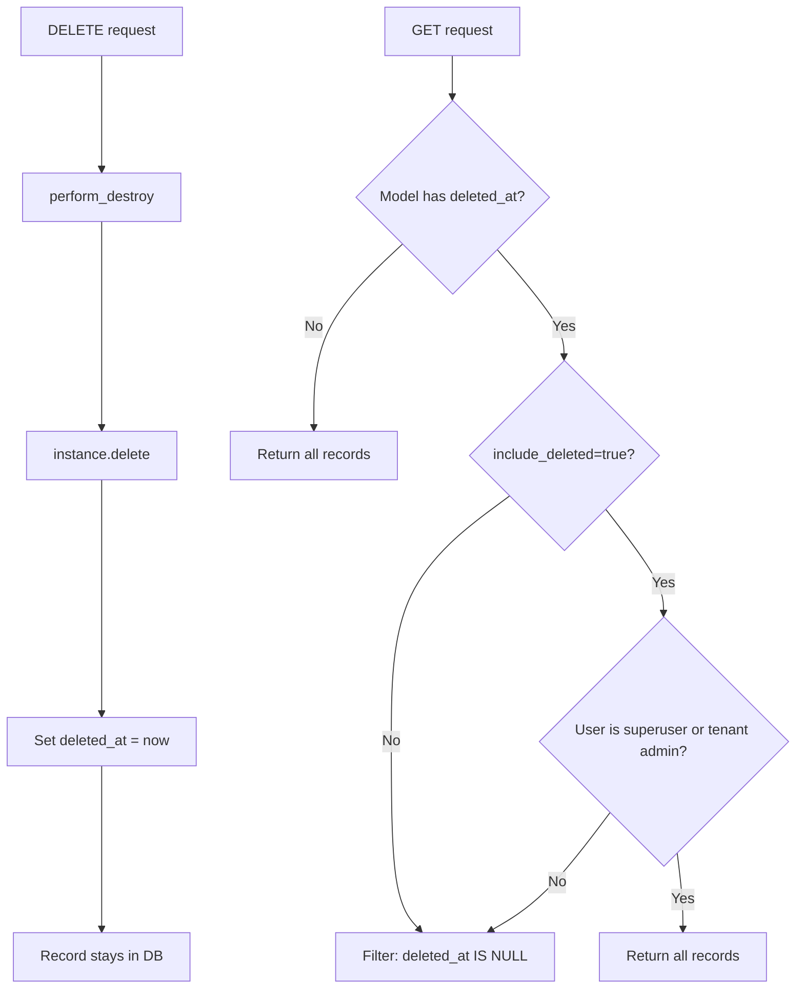
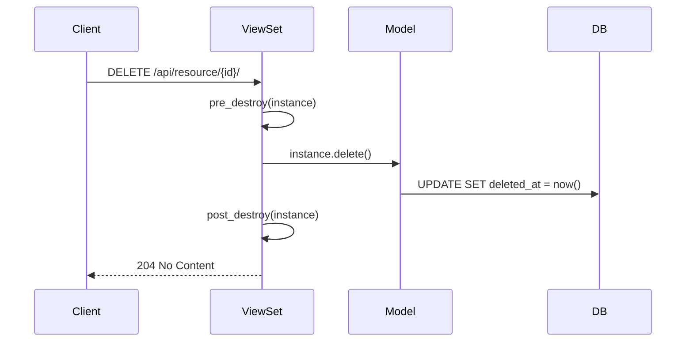

# Soft-Delete

This document describes how soft-delete works across the platform and how to correctly implement it in new resources.

---

## Overview

Soft-delete is the default deletion strategy. Records are never physically removed — they are marked with a timestamp and hidden from default queries.



---

## Model Layer

### Inheritance

Any model inheriting from `BaseModel` or `TenantAwareModel` automatically gets soft-delete fields:

```python
class SoftDeletableModel(models.Model):
    deleted_at = models.DateTimeField(null=True, blank=True, db_index=True)
    deleted_by = models.CharField(max_length=255, null=True, blank=True)
```

### API

| Method | Behavior |
|--------|----------|
| `instance.delete()` | Sets `deleted_at` to now (soft-delete) |
| `instance.hard_delete()` | Performs actual database deletion |
| `Model.get_active()` | Queryset excluding soft-deleted records |
| `Model.get_deleted()` | Queryset of only soft-deleted records |

### Example

```python
invoice = Invoice.objects.get(pk=pk)
invoice.delete()                    # Sets deleted_at, record still in DB
invoice.hard_delete()               # Permanently removes from DB
Invoice.get_active()                # All non-deleted invoices
Invoice.get_deleted()               # All soft-deleted invoices
```

---

## Query Filtering

`SoftDeleteFilterBackend` is registered globally and automatically excludes soft-deleted records from list/detail queries.

### Default Behavior

- If the model has a `deleted_at` field → filters to `deleted_at__isnull=True`
- If the model has no `deleted_at` field → no-op

### Including Deleted Records

Pass `?include_deleted=true` as a query parameter. Access is restricted:

- Superusers: always allowed
- Tenant admins (`is_admin=True` on an active membership): allowed
- Regular users: parameter is ignored, soft-deleted records remain hidden

---

## Serializer Layer

### SoftDeletableSerializerMixin

Adds an `is_deleted` flag to the response and hides delete metadata for active records:

```python
# Active record response
{"id": "...", "name": "Acme", "is_deleted": false}

# Soft-deleted record response (when visible)
{"id": "...", "name": "Acme", "is_deleted": true, "deleted_at": "...", "deleted_by": "..."}
```

### Usage

Use `DefaultModelSerializer` (which includes the mixin) for most resources:

```python
from core.base.serializers import DefaultModelSerializer

class InvoiceSerializer(DefaultModelSerializer):
    class Meta:
        model = Invoice
        fields = ["id", "number", "created_at", "updated_at"]
```

If you need the plugin system but not soft-delete representation, use `BaseSerializer` directly.

---

## View Layer

`BaseViewSet.perform_destroy` calls `instance.delete()`, which triggers soft-delete automatically. No extra wiring needed.



### Hard Delete

If a resource genuinely needs permanent deletion, override `perform_destroy`:

```python
def perform_destroy(self, instance: Model) -> None:
    self.pre_destroy(instance)
    instance.hard_delete()
    self.post_destroy(instance)
```

---

## Checklist for New Resources

1. Inherit from `TenantAwareModel` or `BaseModel` — soft-delete fields are included automatically
2. Use `DefaultModelSerializer` — adds `is_deleted` representation
3. No extra view configuration needed — `SoftDeleteFilterBackend` and `perform_destroy` handle it
4. Do not add `deleted_at`/`deleted_by` to serializer `fields` unless you want them visible on active records
