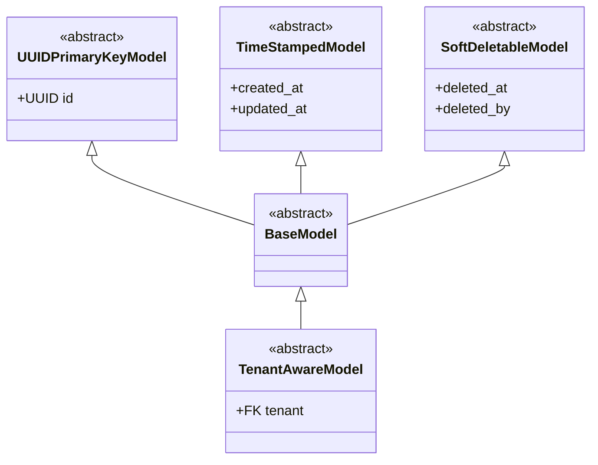

# Writing Models

How to define models correctly in this project — from choosing the right base class and declaring fields to FK conventions, `Meta` configuration, and docstrings.

---

## Overview

All models inherit from one of two abstract base classes:

| Base Class | Provides | Use When |
|------------|----------|----------|
| `TenantAwareModel` | UUID pk, timestamps, soft-delete, `tenant` FK, `TenantManager` | Resource belongs to a tenant |
| `BaseModel` | UUID pk, timestamps, soft-delete | Platform-level resource (no tenant) |



Do not inherit from `models.Model` directly — always use `TenantAwareModel` or `BaseModel`.

---

## Base Class Selection

```python
from apps.tenants.models import TenantAwareModel
from core.base.models import BaseModel
```

Tenant-scoped resource:

```python
from apps.tenants.models import TenantAwareModel


class Invoice(TenantAwareModel):
    """An invoice issued within a tenant's account."""

    number = models.CharField(max_length=50)
    # Unique invoice number within the tenant

    class Meta:
        db_table = "invoices"
        ordering = ["-created_at"]
```

Platform-level resource:

```python
from core.base.models import BaseModel


class Tenant(BaseModel):
    """A tenant organization on the platform."""

    name = models.CharField(max_length=255)
    # Display name of the tenant

    class Meta:
        db_table = "tenants"
        ordering = ["name"]
```

---

## Fields

### UUID Primary Key

Do not declare an `id` field — `BaseModel` provides it via `UUIDPrimaryKeyModel`:

```python
# Correct — id is inherited
class Invoice(TenantAwareModel):
    number = models.CharField(max_length=50)

# Wrong — redundant declaration
class Invoice(TenantAwareModel):
    id = models.UUIDField(primary_key=True, default=uuid.uuid4, editable=False)
    number = models.CharField(max_length=50)
```

### Field Comments

Add a comment on the line immediately after each field declaration explaining its purpose:

```python
class Document(TenantAwareModel):
    title = models.CharField(max_length=255)
    # Human-readable name of the document

    description = models.TextField(null=True, blank=True)
    # Optional long-form description of the document
```

### Nullability

Use `null=True, blank=True` together for all optional fields. Do not use `blank=True` alone on non-string fields:

```python
# Correct
archived_at = models.DateTimeField(null=True, blank=True)
description = models.TextField(null=True, blank=True)

# Wrong — blank=True alone on a non-string field
archived_at = models.DateTimeField(blank=True)
```

For `CharField` and `TextField`, prefer `null=True, blank=True` over `blank=True` alone to keep null semantics consistent across field types.

### Choices

Use `models.TextChoices` as an inner class. Reference `.choices` and the class constant for `default`:

```python
class Invoice(TenantAwareModel):
    class Status(models.TextChoices):
        DRAFT = "DRAFT", "Draft"
        ISSUED = "ISSUED", "Issued"
        PAID = "PAID", "Paid"

    status = models.CharField(
        max_length=20,
        choices=Status.choices,
        default=Status.DRAFT,
    )
    # Current lifecycle state of the invoice
```

Do not use plain lists of tuples — `TextChoices` integrates with DRF serializers and the admin automatically.

---

## Foreign Keys

### Deletion Behavior

Use `on_delete=models.SET_NULL` with `null=True, blank=True` for FKs to `User` and other nullable references. Use `on_delete=models.CASCADE` for ownership relationships where the child has no meaning without the parent:

```python
owner = models.ForeignKey(
    User,
    on_delete=models.SET_NULL,
    null=True,
    blank=True,
    related_name="+",
)
# User responsible for this document

document = models.ForeignKey(
    Document,
    on_delete=models.CASCADE,
    related_name="versions",
)
# The document this version belongs to
```

### related_name

Use `related_name="+"` to disable the reverse relation when reverse access from the related model is not needed. This is the default for FKs to `User`:

```python
# Correct — reverse access not needed
created_by = models.ForeignKey(User, on_delete=models.SET_NULL, null=True, blank=True, related_name="+")

# Correct — reverse access is meaningful
versions = models.ForeignKey(Document, on_delete=models.CASCADE, related_name="versions")

# Wrong — verbose and non-standard naming
created_by = models.ForeignKey(User, on_delete=models.SET_NULL, null=True, blank=True, related_name="documents_as_created_by")
```

### String References

Use string references (`"app.Model"`) for FKs that would create circular imports:

```python
tenant = models.ForeignKey(
    "tenants.Tenant",
    on_delete=models.CASCADE,
    related_name="%(class)s_set",
)
```

---

## Meta Class

Every model must define a `Meta` class with at minimum `db_table` and `ordering`:

```python
class Meta:
    db_table = "invoices"
    ordering = ["-created_at"]
```

### db_table

Use snake_case. Prefix with the app name for domain modules:

| App | Prefix | Example |
|-----|--------|---------|
| `dms_documents` | `dms_` | `dms_documents` |
| `dms_document_versions` | `dms_` | `dms_document_versions` |
| `iam_users` | `iam_` | `iam_users` |
| `tenants` | none | `tenants` |

### Constraints

Use `models.UniqueConstraint` instead of `unique_together`. Name constraints descriptively:

```python
constraints = [
    models.UniqueConstraint(
        fields=["tenant", "number"],
        name="unique_invoice_number_per_tenant",
    )
]
```

### Indexes

Add indexes for fields used in frequent filters or ordering. Name indexes with the `idx_` prefix followed by the table name and field(s):

```python
indexes = [
    models.Index(fields=["status"], name="idx_invoices_status"),
    models.Index(fields=["issued_at"], name="idx_invoices_issued_at"),
]
```

Do not add indexes on fields already covered by a `UniqueConstraint` — the constraint creates an index automatically.

---

## Docstrings

Every model must have a class-level docstring. Follow Google-style format. Describe what the model represents and any non-obvious constraints — not the list of fields:

```python
class Invoice(TenantAwareModel):
    """An invoice issued to a client within a tenant's account.
    """
```

Keep docstrings concise. Do not restate field names or describe the inheritance chain.

---

## Common Pitfalls

| Mistake | Consequence | Fix |
|---------|-------------|-----|
| Declaring `id` explicitly | Redundant, conflicts with `BaseModel` | Remove it — `BaseModel` provides it |
| `blank=True` without `null=True` on non-string fields | Inconsistent null semantics, DB constraint errors | Always pair `null=True, blank=True` for optional fields |
| Using a list of tuples for choices | No type safety, no DRF integration | Use `models.TextChoices` inner class |
| Using a raw string in the `default` argument of a `CharField` backed by a `TextChoices` class (e.g. `default="ACTIVE"` instead of `default=Status.ACTIVE`) | The default becomes decoupled from the choices — renaming a choice value leaves the default pointing to a string that no longer exists in the enum | Reference the `TextChoices` constant directly in `default` |
| Meaningful `related_name` on User FKs | Clutters the `User` model namespace | Use `related_name="+"` to disable reverse access |
| Missing field comments | Intent unclear, harder to review | Add a comment on the line after every field |
| `unique_together` in Meta | Deprecated Django pattern | Use `models.UniqueConstraint` instead |
| Indexing a field already covered by a unique constraint | Duplicate index, wasted storage | Remove the explicit index |

---

## Decision Guide

| Scenario | Approach |
|----------|----------|
| Resource belongs to a tenant | Inherit from `TenantAwareModel` |
| Platform-level resource | Inherit from `BaseModel` |
| Field is optional | `null=True, blank=True` |
| Field has a fixed set of values | `models.TextChoices` inner class |
| FK to `User` with no reverse access needed | `related_name="+"` |
| FK where reverse access is meaningful | Explicit `related_name` (e.g. `"versions"`) |
| Uniqueness across multiple fields | `models.UniqueConstraint` in `Meta.constraints` |
| Frequent filter or ordering field | `models.Index` in `Meta.indexes` |
