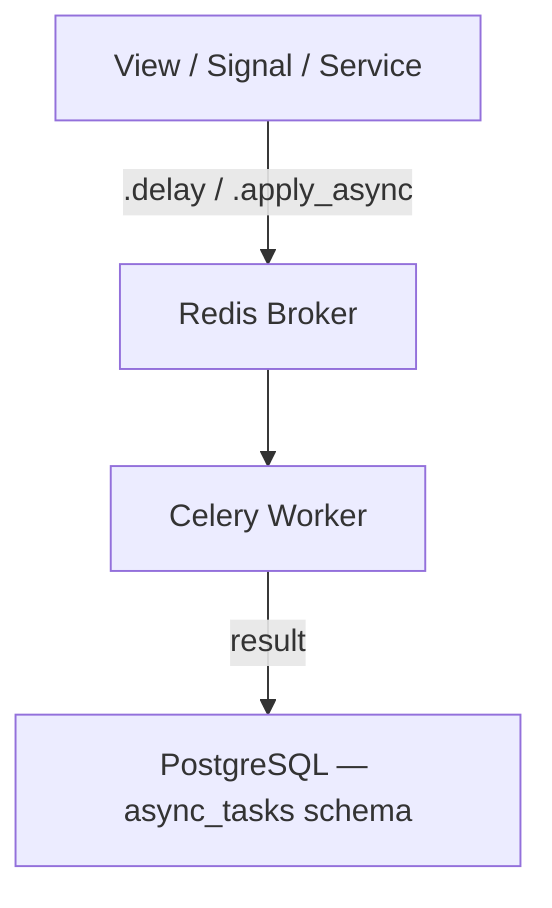

# Writing Tasks

How to define, register, and test Celery tasks in this project — from task structure and naming to error handling, retries, and test patterns.

---

## Overview

Tasks are the unit of work dispatched to the Celery worker. Each task is a Python function decorated with `@app.task` or `@shared_task`, registered under a module named `tasks.py` inside the relevant app.



The broker (Redis DB 1) decouples the caller from execution. Results are stored in PostgreSQL under the `async_tasks` schema via `core.celery.backend.TaskResultBackend`.

In tests, `CELERY_TASK_ALWAYS_EAGER = True` runs tasks synchronously in the calling thread — no worker or broker required.

---

## Task Location

Each app that defines tasks must have a `tasks.py` file at the app root:

```
apps/
  notifications/
    tasks.py      # Task definitions
    services.py   # Business logic called by tasks
    views.py
    ...
```

Do not define tasks inside `views.py`, `models.py`, or `services.py`. Tasks are an infrastructure concern — keep them separate from business logic.

---

## Defining a Task

Use `@shared_task` instead of `@app.task`. `shared_task` does not require a direct reference to the Celery app instance, which avoids circular imports between `config/celery.py` and app modules.

```python
# apps/notifications/tasks.py
import logging

from celery import shared_task

logger = logging.getLogger(__name__)


@shared_task(bind=True, max_retries=3, default_retry_delay=60, retry_backoff=True)
def send_email_notification(self, user_id: str, subject: str, body: str) -> None:
    """Send an email notification to a user.

    Args:
        user_id: UUID string of the target user.
        subject: Email subject line.
        body: Plain text email body.
    """
    from apps.iam_users.models import User

    logger.info("Sending email notification user_id=%s", user_id)
    try:
        user = User.objects.get(pk=user_id)
        # ... delivery logic
        logger.info("Email sent user_id=%s", user_id)
    except Exception as exc:
        logger.error("Email delivery failed user_id=%s error=%s", user_id, exc)
        raise self.retry(exc=exc)
```

Key rules:

- Use `bind=True` when you need access to `self` for retries or task metadata
- Always declare `max_retries`, `default_retry_delay`, and `retry_backoff=True` explicitly — never rely on Celery defaults
- Import Django models inside the task body, not at module level, to avoid app registry issues at import time
- Pass primitive arguments (strings, ints, UUIDs as strings) — never pass model instances or querysets

---

## Naming

Celery derives the task name from the module path and function name automatically:

```
apps.notifications.tasks.send_email_notification
```

Do not override the task name with the `name=` argument unless you have a specific reason (e.g., renaming a task without breaking in-flight messages). Overriding names creates a hidden contract that is easy to break.

---

## Dispatching Tasks

Use `.delay()` for simple calls and `.apply_async()` when you need control over routing, countdown, or ETA:

```python
# Simple dispatch
send_email_notification.delay(str(user.pk), subject="Welcome", body="...")

# With countdown (seconds)
send_email_notification.apply_async(
    args=[str(user.pk), "Welcome", "..."],
    countdown=30,
)
```

Never call the task function directly (e.g., `send_email_notification(...)`) in production code — it bypasses the broker and runs synchronously on the request thread.

---

## Error Handling and Retries

Use `self.retry(exc=exc)` to re-queue the task on failure. Celery will respect `max_retries` and `default_retry_delay`:

```python
@shared_task(bind=True, max_retries=3, default_retry_delay=60, retry_backoff=True)
def send_webhook(self, url: str, payload: dict) -> None:
    """Deliver a webhook payload to an external URL.

    Args:
        url: Target webhook URL.
        payload: JSON-serializable payload dict.
    """
    import httpx

    try:
        response = httpx.post(url, json=payload, timeout=10)
        response.raise_for_status()
    except Exception as exc:
        logger.warning("Webhook delivery failed url=%s attempt=%s", url, self.request.retries)
        raise self.retry(exc=exc)
```

Rules:

- Always log before retrying — include the attempt count via `self.request.retries`
- Do not catch `MaxRetriesExceededError` — let it propagate so the result backend records the failure
- For non-retryable errors (e.g., invalid input), raise the exception directly without calling `self.retry`

---

## Task Arguments

Tasks are serialized to JSON before being sent to the broker. Only JSON-serializable types are safe:

| Safe | Unsafe |
|------|--------|
| `str`, `int`, `float`, `bool` | Model instances |
| `list`, `dict` | Querysets |
| UUID as `str(uuid)` | `datetime` objects (use `.isoformat()`) |
| `None` | Arbitrary Python objects |

Always convert UUIDs and datetimes to strings before passing them as task arguments:

```python
# Correct
send_email_notification.delay(str(user.pk), subject, body)

# Wrong — UUID is not JSON-serializable
send_email_notification.delay(user.pk, subject, body)
```

---

## Testing Tasks

In tests, `CELERY_TASK_ALWAYS_EAGER = True` runs tasks synchronously. Call `.delay()` or `.apply_async()` as you would in production — the task executes immediately in the same thread.

### Unit test (no DB)

Test the task function logic directly when it does not require the database:

```python
from unittest.mock import MagicMock, patch

from apps.notifications.tasks import send_email_notification


class TestSendEmailNotification:
    @patch("apps.notifications.tasks.User")
    def test_sends_email(self, mock_user_cls) -> None:
        mock_user = MagicMock()
        mock_user_cls.objects.get.return_value = mock_user

        send_email_notification("user-uuid", "Subject", "Body")

        mock_user_cls.objects.get.assert_called_once_with(pk="user-uuid")
```

### Integration test (with DB)

Use `@pytest.mark.django_db` and dispatch via `.delay()`:

```python
import pytest

from apps.notifications.tasks import send_email_notification
from tests.factories.users import UserFactory


@pytest.mark.django_db
class TestSendEmailNotificationIntegration:
    def test_task_completes(self) -> None:
        user = UserFactory()

        result = send_email_notification.delay(str(user.pk), "Subject", "Body")

        assert result.successful()
```

### Testing retry behavior

Use `self.retry` side effects to assert retry logic without actually re-queuing:

```python
from unittest.mock import MagicMock, patch

from apps.notifications.tasks import send_webhook


class TestSendWebhookRetry:
    @patch("apps.notifications.tasks.httpx.post")
    def test_retries_on_failure(self, mock_post) -> None:
        mock_post.side_effect = ConnectionError("timeout")

        task = send_webhook
        task.push_request(retries=0)

        with pytest.raises(task.MaxRetriesExceededError):
            for _ in range(task.max_retries + 1):
                try:
                    task.run("https://example.com", {})
                except task.retry.__class__:
                    pass
```

---

## Common Pitfalls

| Mistake | Consequence | Fix |
|---------|-------------|-----|
| Importing models at module level in `tasks.py` | App registry not ready at import time — raises `AppRegistryNotReady` | Import models inside the task body |
| Passing model instances as arguments | Not JSON-serializable — raises `TypeError` at dispatch | Pass PKs as strings |
| Calling the task function directly in production | Runs synchronously on the request thread, bypasses broker | Always use `.delay()` or `.apply_async()` |
| Not setting `max_retries` | Task retries indefinitely on failure | Always declare `max_retries`, `default_retry_delay`, and `retry_backoff=True` explicitly |
| Catching all exceptions without retrying | Silent failures — task appears successful | Re-raise or call `self.retry(exc=exc)` |
| Putting business logic inside the task function | Hard to test and reuse | Put logic in a service function, call it from the task |

---

## Decision Guide

| Scenario | Approach |
|----------|----------|
| Simple async dispatch with no result needed | `@shared_task`, `.delay()` |
| Need retry on transient failure | `bind=True`, `self.retry(exc=exc)` |
| Need to schedule at a specific time | `.apply_async(eta=datetime)` |
| Need to delay execution | `.apply_async(countdown=seconds)` |
| Testing task logic in isolation | Call the function directly with mocked dependencies |
| Testing full dispatch + execution | `.delay()` with `CELERY_TASK_ALWAYS_EAGER = True` (set in test settings) |
| Business logic shared between tasks and views | Extract to a service function, call from both |
