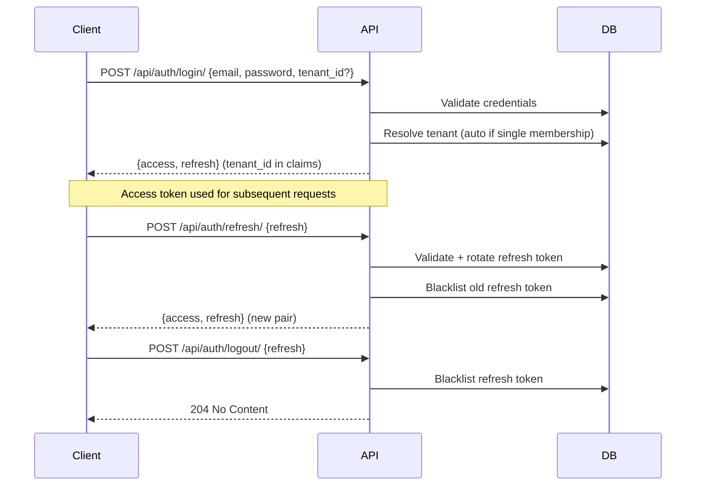

# Security

Security model, authentication flows, and access control for the platform.

---

## Principles

- **Authenticated by default** — all endpoints require authentication unless explicitly opted out (`AllowAny`)
- **Tenant isolation at the permission layer** — every tenant-scoped resource is checked via `check_tenant_ownership`
- **Short-lived tokens** — minimize exposure window for stolen credentials
- **Defense in depth** — multiple independent enforcement layers per ADR-004

---

## Authentication Flow (JWT)

Uses `djangorestframework-simplejwt` with token blacklisting enabled.



### Token Lifecycle

| Token | Lifetime | Rotation | Revocation |
|-------|----------|----------|------------|
| Access | 30 minutes | No | Expires naturally |
| Refresh | 7 days | Yes (on each use) | Blacklisted on logout |

### Tenant Context in JWT

- Login requires `tenant_id` when the user has multiple active memberships
- Single-membership users get automatic tenant resolution
- The resolved `tenant_id` is stored as a JWT claim
- Subsequent requests extract it from the token to scope queries

### Public Endpoints

These endpoints use `AllowAny` and do not require authentication:

- `POST /api/auth/login/`
- `POST /api/auth/refresh/`

---

## Permission Model

### Hierarchy

```
IsSuperUser          — platform-level admin (all tenants, all operations)
IsTenantOwner        — tenant owner (ownership flag on membership)
IsTenantAdmin        — tenant admin (is_admin flag on membership)
IsOwnerOrReadOnly    — object creator for writes, anyone for reads
IsTeamMember         — member of any team
BasePermission       — foundation class with helper methods
```

### Tenant Isolation

Enforced by two independent layers (ADR-004 defense in depth):

1. **View layer** — `TenantFilterBackend` reads `tenant_id` from the JWT and filters querysets in every API request.
2. **ORM layer** — `TenantJWTAuthentication` binds `tenant_id` into a request-scoped ContextVar. `TenantManager` (on all tenant-scoped models) reads the ContextVar and filters automatically.

Both layers must fail simultaneously for data to leak across tenants.

Additionally, `BasePermission.check_tenant_ownership(request, obj)`:

1. Extracts the object's `tenant` FK
2. Checks if the requesting user has an active membership in that tenant
3. Superusers bypass tenant checks

### View-Level Declaration

```python
class TenantViewSet(BaseViewSet):
    # Reads: IsAuthenticated (default)
    # Writes: IsAuthenticated + IsSuperUser
    write_permission_classes = [IsSuperUser]
```

Write actions (`create`, `update`, `partial_update`, `destroy`) automatically require `IsAuthenticated` plus any classes in `write_permission_classes`.

---

## Password Security

### Complexity Rules

Validated by `core.utils.security.validate_password_complexity`. Rules are tenant-configurable via `TenantSetting`:

| Rule | Default | Configurable |
|------|---------|--------------|
| Minimum length | 8 | Yes |
| Require uppercase | Yes | Yes |
| Require lowercase | Yes | Yes |
| Require digit | Yes | Yes |
| Require special character | Yes | Yes |
| Forbidden words | [] | Yes |

### Password History

- On change, the current hash is saved to `UserPasswordHistory` before the new password is set
- New passwords are rejected if they match any of the last 5 entries (`PASSWORD_HISTORY_LIMIT`)
- After a successful change, a new access token is issued so the user stays authenticated

### Change Flow

```
POST /api/auth/password/change/ {old_password, new_password}
  → Verify old_password matches current
  → Validate new_password complexity (tenant config)
  → Check against password history
  → Save current hash to history
  → Set new password
  → Return new access token
```

---

## Session Invalidation

| Action | Effect |
|--------|--------|
| `POST /api/auth/logout/` | Blacklists the provided refresh token |
| `POST /api/auth/logout-all/` | Blacklists all outstanding refresh tokens for the user |
| Token expiry | Access tokens expire naturally after 30 min |

`logout-all` is useful for "sign out everywhere" or after a password compromise.

---

## Sensitive Data Handling

- `core.utils.security.mask_sensitive_data` — masks strings preserving only first/last N characters
- `core.utils.security.generate_api_key` — cryptographically secure random key generation
- Passwords are never stored in plaintext — Django's `make_password`/`check_password` used throughout

---

## Audit Trail

Every state-changing operation (create, update, delete) produces an immutable audit record per ADR-009. See [Data Model](data-model.md#system-audit) for schema details.

- Recorded automatically via `AuditPlugin` (global serializer plugin)
- Records: actor, action, target resource, tenant boundary, timestamp, and changes
- Append-only — application code cannot modify or delete audit records
- Scoped to tenant boundary — one tenant's audit records are isolated from another's
