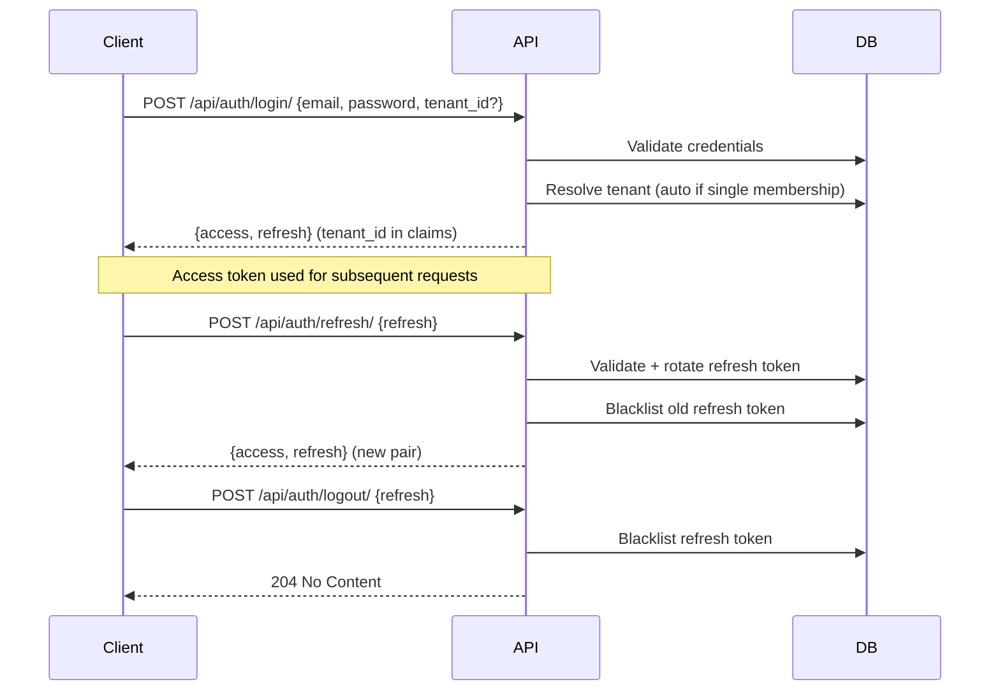
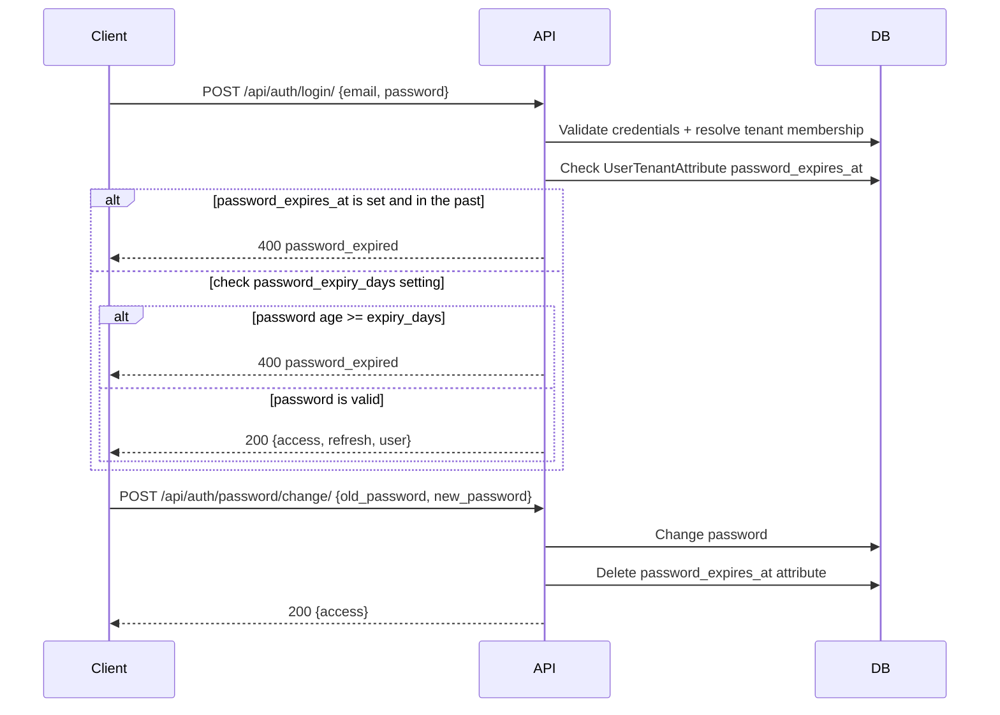
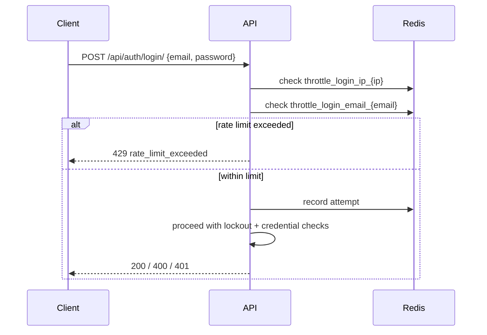
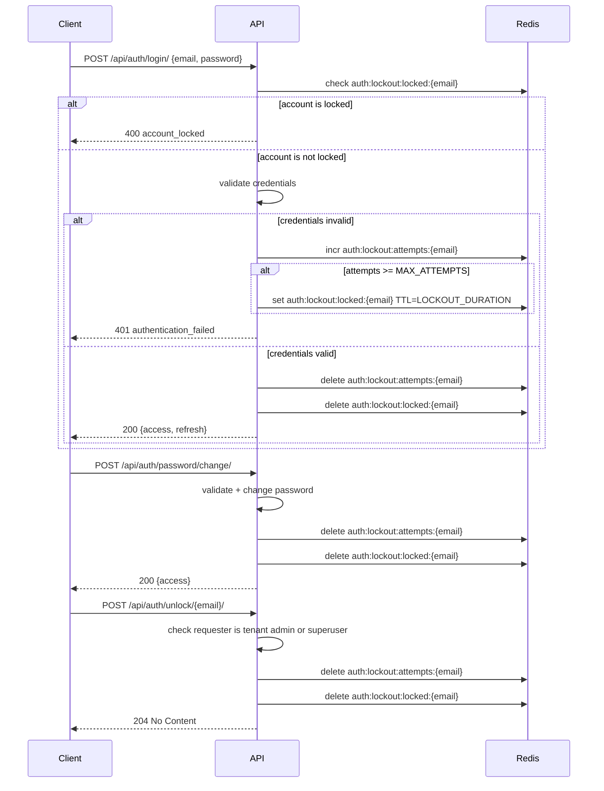
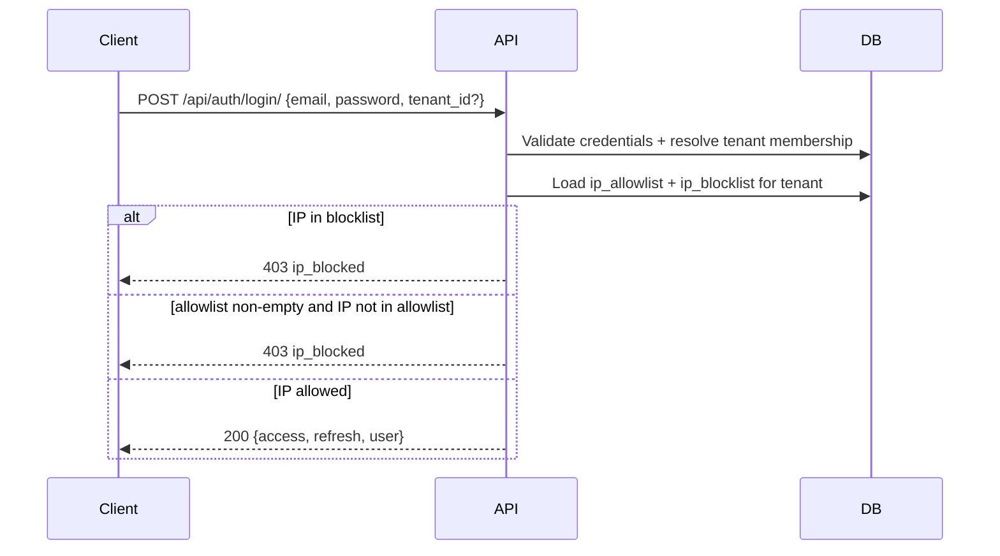
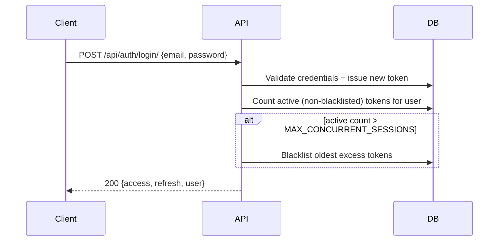

# Security

Security model, authentication flows, and access control for the platform.

---

## Principles

- **Authenticated by default** — all endpoints require authentication unless explicitly opted out (`AllowAny`)
- **Tenant isolation at the permission layer** — every tenant-scoped resource is filtered by tenant context from JWT
- **Short-lived tokens** — minimize exposure window for stolen credentials
- **Defense in depth** — multiple independent enforcement layers per ADR-004

---

## Authentication Flow (JWT)

Uses `djangorestframework-simplejwt` with token blacklisting enabled.



### Token Lifecycle

| Token | Lifetime | Rotation | Revocation |
|-------|----------|----------|------------|
| Access | 30 minutes | No | Expires naturally |
| Refresh | 7 days | Yes (on each use) | Blacklisted on logout |

### Tenant Context in JWT

- Login requires `tenant_id` when the user has multiple active memberships
- Single-membership users get automatic tenant resolution
- The resolved `tenant_id` is stored as a JWT claim
- Subsequent requests extract it from the token to scope queries

### Public Endpoints

These endpoints use `AllowAny` and do not require authentication:

- `POST /api/auth/login/`
- `POST /api/auth/refresh/`

---

## Permission Model

### Hierarchy

```
IsSuperUser              — platform-level admin (all tenants, all operations)
IsTenantAdmin            — tenant admin (is_admin flag, bypasses permission checks)
HasTenantPermission(x)   — granular codename check against role's permissions
IsOwnerOrReadOnly        — object creator for writes, anyone for reads
BasePermission           — foundation class with helper methods
```

### RBAC (Role-Based Access Control)

Permissions are defined declaratively in `permissions.json` catalog files per app. Each permission is a `resource.action` codename (e.g., `tenants.view`, `members.invite`). Domain apps without a catalog get default CRUD permissions automatically (view, create, update, delete).

`TenantRole.permissions` stores a dict mapping codenames to `0`/`1` values. Enforcement uses `HasTenantPermission`:

```python
from apps.sys_permissions.permissions import HasTenantPermission

class TeamViewSet(BaseViewSet):
    write_permission_classes = [HasTenantPermission("teams.create")]
```

Enforcement flow:
1. Get user's membership in current tenant (from JWT `tenant_id`)
2. If `membership.is_admin` is True, allow (bypass)
3. Otherwise, check if `role.permissions.get(codename) == 1`
4. Missing codename = denied (default zero)

Default roles (Owner, Admin, Member, Viewer) are seeded automatically when a tenant is created, with permissions derived from the catalog's `default_roles` declarations.

### Tenant Isolation

Enforced by two independent layers (ADR-004 defense in depth):

1. **View layer** — `TenantFilterBackend` reads `tenant_id` from the JWT and filters querysets in every API request.
2. **ORM layer** — `TenantJWTAuthentication` binds `tenant_id` into a request-scoped ContextVar. `TenantManager` (on all tenant-scoped models) reads the ContextVar and filters automatically.

Both layers must fail simultaneously for data to leak across tenants.


### View-Level Declaration

```python
class TenantViewSet(BaseViewSet):
    # Reads: IsAuthenticated (default)
    # Writes: IsAuthenticated + IsSuperUser
    write_permission_classes = [IsSuperUser]
```

Write actions (`create`, `update`, `partial_update`, `destroy`) automatically require `IsAuthenticated` plus any classes in `write_permission_classes`.

---

## Password Security

### Complexity Rules

Validated by `core.utils.security.validate_password_complexity`. Rules are tenant-configurable via the `password_policy` `TenantSetting` key (declared in `apps/iam_auth/tenant_settings.json`):

| Rule | Default | Configurable |
|------|---------|--------------|
| Minimum length | 8 | Yes |
| Require uppercase | Yes | Yes |
| Require lowercase | Yes | Yes |
| Require digit | Yes | Yes |
| Require special character | Yes | Yes |
| Forbidden words | [] | Yes |

### Password History

- On change, the current hash is saved to `UserPasswordHistory` before the new password is set
- New passwords are rejected if they match any of the last 5 entries (`PASSWORD_HISTORY_LIMIT`)
- After a successful change, a new access token is issued so the user stays authenticated

### Password Expiry

Passwords can expire in two ways:

**Natural expiry** — controlled by the `password_expiry_days` tenant setting. When greater than `0`, the age of the user's password is checked at every login. Age is calculated from the most recent `UserPasswordHistory` entry, or `User.created_at` if the user has never changed their password.

**Admin-forced expiry** — a tenant admin sets a `password_expires_at` attribute on `UserTenantAttribute` with a past ISO 8601 timestamp. This is checked first and takes precedence over natural expiry.

| Setting | Type | Default | Description |
|---------|------|---------|-------------|
| `password_expiry_days` | integer | `0` | Days before a password expires. `0` = disabled |

When expired, login returns `400 Bad Request` with code `password_expired`. The user must change their password via `POST /api/auth/password/change/` before they can log in again. After a successful change, the `password_expires_at` attribute is automatically deleted.

**Flow:**



Implementation: `_enforce_password_expiry()` in `apps/iam_auth/serializers.py`, `apps/iam_users/services.py`.

### Change Flow

```
POST /api/auth/password/change/ {old_password, new_password}
  → Verify old_password matches current
  → Validate new_password complexity (tenant config)
  → Check against password history
  → Save current hash to history
  → Set new password
  → Return new access token
```

---

## Login Protection

### Rate Limiting

Login attempts are throttled independently by IP address and by email to prevent brute force attacks. Throttling is enforced before lockout checks and credential validation. Throttle state is stored in Redis using the default cache backend.

**Redis keys:**
- `throttle_login_ip_{ip}` — request history for the client IP
- `throttle_login_email_{email}` — request history for the submitted email

**Flow:**



**Configuration** (`config/settings/base.py` under `AUTH_RATE_LIMIT`):

| Setting | Env var | Default | Description |
|---------|---------|---------|-------------|
| `IP_RATE` | `AUTH_RATE_LIMIT_IP` | `10/minute` | Max login attempts per IP. Set to `"0"` to disable |
| `EMAIL_RATE` | `AUTH_RATE_LIMIT_EMAIL` | `5/minute` | Max login attempts per email. Set to `"0"` to disable |

When a limit is exceeded, the response is `429 Too Many Requests` with error code `rate_limit_exceeded`:

```json
{
    "status": "ERROR",
    "code": "rate_limit_exceeded",
    "data": {
        "detail": "Too many login attempts. Please try again later."
    }
}
```

Implementation: `apps/iam_auth/throttling.py`.

### Account Lockout

Accounts are locked after a configurable number of consecutive failed login attempts. Lockout state is stored in Redis with no DB writes.

**Redis keys:**
- `auth:lockout:attempts:{email}` — failed attempt counter, TTL matches lockout duration
- `auth:lockout:locked:{email}` — lockout flag, TTL drives auto-unlock

**Flow:**



**Configuration** (`config/settings/base.py` under `AUTH_LOCKOUT`):

| Setting | Env var | Default | Description |
|---------|---------|---------|-------------|
| `MAX_ATTEMPTS` | `AUTH_LOCKOUT_MAX_ATTEMPTS` | 5 | Failed attempts before lockout. 0 = disabled |
| `LOCKOUT_DURATION` | `AUTH_LOCKOUT_DURATION` | 900 | Lockout duration in seconds. 0 = manual unlock only |

**Manual unlock:**

`POST /api/auth/unlock/{email}/` clears the lockout state for the given email.

- Tenant admins (`is_admin=True`) can unlock any account in their tenant except their own
- Superusers can unlock any account
- A user cannot unlock their own account (error code: `self_unlock_forbidden`)

---

## IP Access Control

Tenants can restrict login access by IP address using CIDR-based allowlists and blocklists, configured via `TenantSetting`.

### Settings

| Key | Type | Default | Description |
|-----|------|---------|-------------|
| `ip_allowlist` | JSON array of CIDR strings | `[]` | If non-empty, only matching IPs may log in |
| `ip_blocklist` | JSON array of CIDR strings | `[]` | Matching IPs are always denied |

Both IPv4 and IPv6 CIDR ranges are supported (e.g. `192.168.1.0/24`, `10.0.0.1/32`). Invalid entries are silently skipped.

### Evaluation Order

Blocklist takes precedence:

1. If the client IP matches any blocklist CIDR — deny
2. If the allowlist is non-empty and the IP matches no entry — deny
3. Otherwise — allow

An empty allowlist imposes no restriction.

### Flow



When blocked, the response is `403 Forbidden` with error code `ip_blocked`:

```json
{
    "status": "ERROR",
    "code": "ip_blocked",
    "data": {
        "detail": "Login not allowed from this IP address."
    }
}
```

Implementation: `apps/iam_auth/ip_filter.py`, `apps/iam_auth/serializers.py`.

---

## Session Invalidation

| Action | Effect |
|--------|--------|
| `POST /api/auth/logout/` | Blacklists the provided refresh token |
| `POST /api/auth/logout-all/` | Blacklists all outstanding refresh tokens for the user |
| Token expiry | Access tokens expire naturally after 30 min |
| Session limit exceeded | Oldest sessions are silently blacklisted at login time |

`logout-all` is useful for "sign out everywhere" or after a password compromise.

### Session Concurrency Control

Limits the number of active sessions a user can hold simultaneously. Enforced at login time — after the new token is issued, the oldest excess sessions are blacklisted. Pre-blacklisted tokens are excluded from the active count.

**Flow:**



**Configuration** (`config/settings/base.py` under `AUTH_SESSION`):

| Setting | Env var | Default | Description |
|---------|---------|---------|-------------|
| `MAX_CONCURRENT_SESSIONS` | `AUTH_MAX_CONCURRENT_SESSIONS` | `0` | Max active sessions per user. `0` = disabled |

Implementation: `apps/iam_auth/serializers.py`.

---

## Sensitive Data Handling

- `core.utils.security.mask_sensitive_data` — masks strings preserving only first/last N characters
- `core.utils.security.generate_api_key` — cryptographically secure random key generation
- Passwords are never stored in plaintext — Django's `make_password`/`check_password` used throughout

---

## Audit Trail

Every state-changing operation (create, update, delete) produces an immutable audit record per ADR-009. See [Data Model](data-model.md#system-audit) for schema details.

- Recorded automatically via `AuditPlugin` (global serializer plugin)
- Records: actor, action, target resource, tenant boundary, timestamp, and changes
- Append-only — application code cannot modify or delete audit records
- Scoped to tenant boundary — one tenant's audit records are isolated from another's
